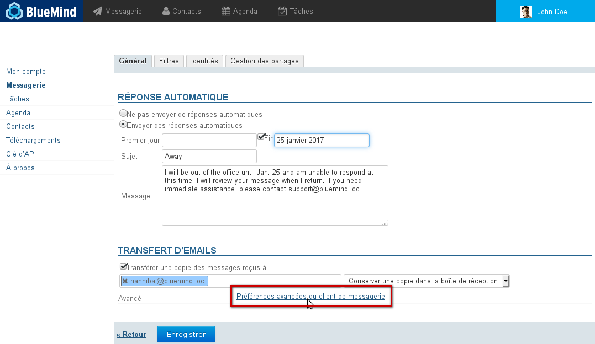
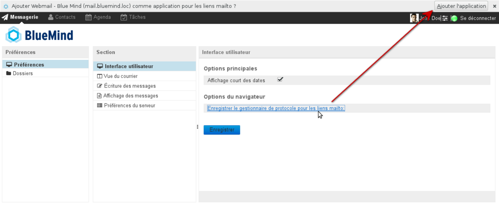
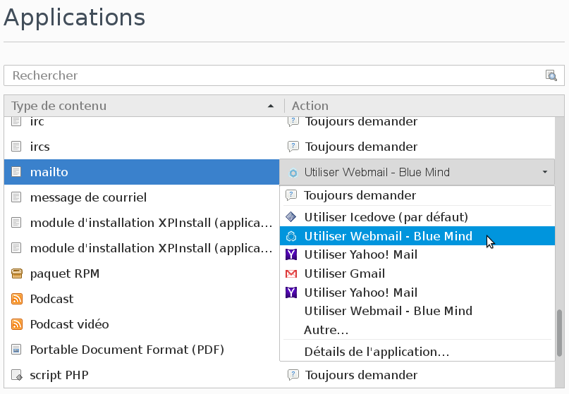
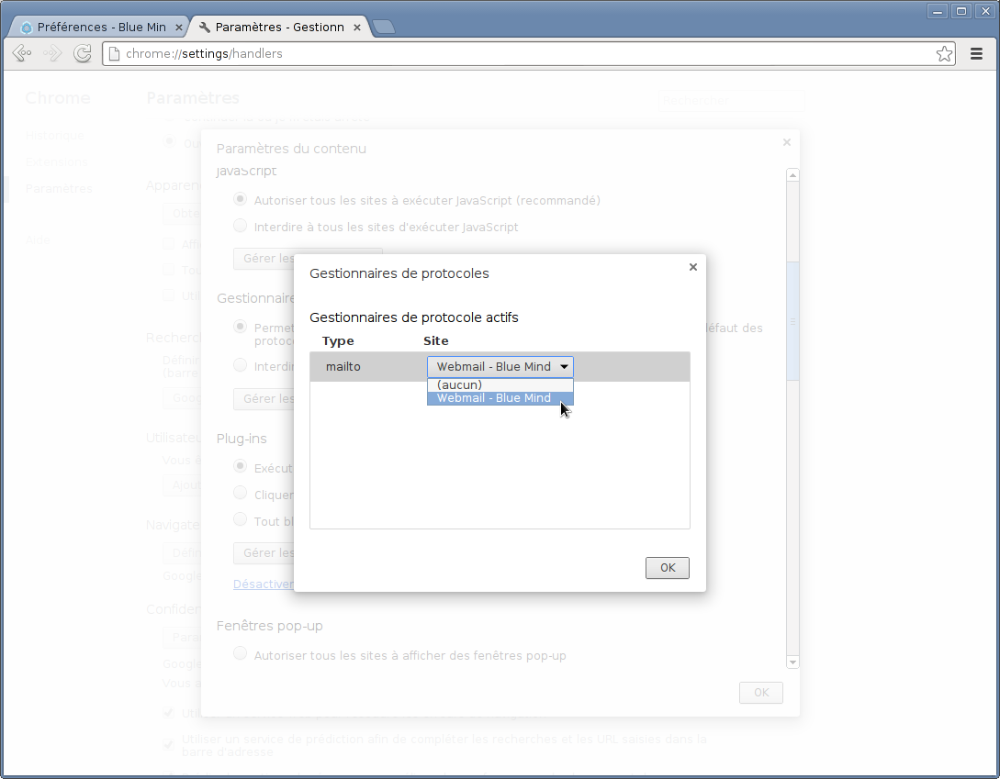
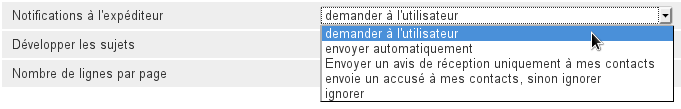
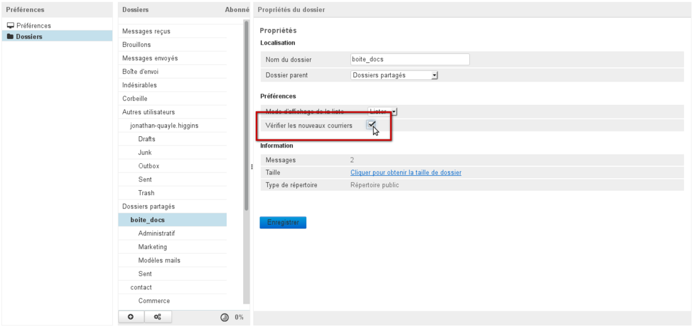
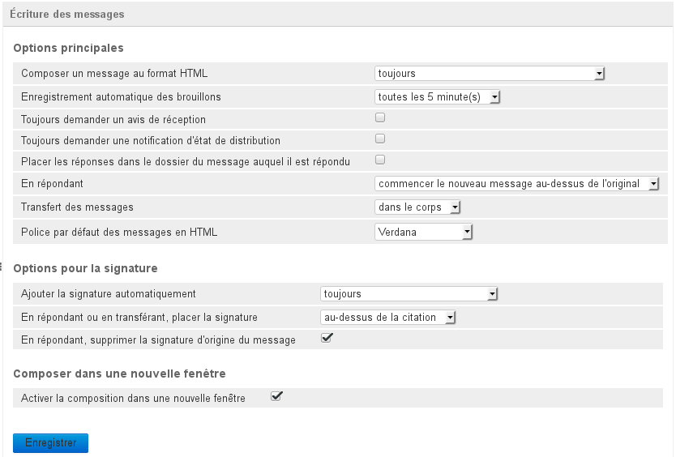
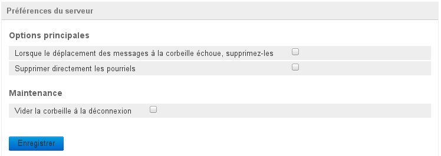

# Erweiterte Einstellungen

## Präsentation

Erweiterte Email-Einstellungen ermöglichen eine genauere Anpassung des Verhaltens und der Anzeige des BlueMind-E-Mail-Systems des Benutzers, insbesondere:

- Anzeige des E-Mail-Systems
- Integration in die Benutzerumgebung
- Intervall für die Überprüfung auf neue Nachrichten
- Datumsformate
- Nachrichtenformate (HTML oder Nur-Text)
- Verwaltung von Bestätigungen (Anforderungen und Antworten)
- Anpassung der Erstellung und der Anzeige von Nachrichten
- Serververhalten beim Löschen

Der Zugriff auf die Verwaltung dieser Einstellungen erfolgt über die Verwaltung der BlueMind-Einstellungen > Rubrik Email > Link *Erweiterte Email-Einstellungen*:

:::tip

Es ist auch möglich, die erweiterten Einstellungen direkt aus dem E-Mail-System über das Symbol der Zahnräder am unteren Rand der Ordnerliste > "Ordner verwalten" > "Einstellungen" aufzurufen.

:::

## Benutzeroberfläche

- Standardmäßig wird die kurze Datumsanzeige verwendet, d. h. die Daten werden im Format "Heute 13:37", "Mi. 11 Dez. 14:15" für die letzten 7 Tage oder auch "2013-11-24 10:03" für ältere Daten angezeigt.Um das vollständige Datumsformat zu verwenden, deaktivieren Sie das Kontrollkästchen und klicken Sie auf "Speichern", die Daten werden dann alle im Format "JJJJ-MM-TT HH:MM" dargestellt, z. B. "2013-12-31 13:37".
- Der Link *"Als Empfänger für mailto: Links einrichten*" gestattet, BlueMind im Browser so zu registrieren, dass sich das Fenster zur Nachrichtenerstellung öffnet, wenn der Benutzer auf einen "mailto:"-Link in einer Webseite oder Nachricht klickt.

:::info

Vergessen Sie nicht, nach dem Anklicken des Links die Bestätigungsanforderung des Browsers zu akzeptieren:

- Firefox:  Dieser Vorgang ist umkehrbar und kann in Einstellungen > Anwendungen > Dateityp: mailto angepasst werden:

- Chrome:  In Chrome ist dieses Verhalten über die Verwaltung der Einstellungen > Erweiterte Einstellungen anzeigen > Bereich Datenschutz > Inhaltseinstellungen > Bereich Handler> Handler verwalten umkehrbar und anpassbar: 

:::

## Mailbox-Ansicht

In diesem Bereich wird die Anzeige der Hauptansicht der E-Mail-Anwendung angepasst: Felder der Ansicht, Nachrichtenvorschau, Empfangsbestätigungen, Überprüfung auf neue Nachrichten usw.

- **Nachrichtenvorschau anzeigen**: Gestattet, die Vorschau einer Nachricht in der Hauptansicht der E-Mail-Anwendung zu aktivieren oder zu deaktivieren. Diese Option gestattet, von einer Ansicht mit drei Feldern (Ordnerliste links, Nachrichtenliste rechts oben, Vorschau rechts unten) auf eine Ansicht mit zwei Feldern (Ordnerliste links, Nachrichtenliste rechts) umzuschalten, in der eine Nachricht per Doppelklick angezeigt wird.
- **Nachricht in Vorschau als gelesen markieren**: Wartezeit, bevor eine Nachricht als gelesen markiert wird.
- **Empfangsbestätigung senden**: Hier geht es um das gewünschte Verhalten, wenn der Absender eine Empfangs- oder Lesebestätigung für die Nachricht angefordert hat: 
- **Konversationen aufklappen**: Gibt an, ob Konversationen in einer erweiterten Baumstruktur dargestellt werden sollen, wenn die Nachrichten in einer Ansicht nach Konversationen gezeigt werden (siehe [E-Mail-System, Abschnitt 4.5 Aktionen in der Nachrichtenliste](https://forge.blue-mind.net/confluence/display/BM35/La+messagerie#Lamessagerie-Actionssurlalistedemessages)).
- **Einträge pro Seite**: Gibt die Anzahl der Nachrichten an, die auf einer Seite der Nachrichtenliste aufgeführt werden sollen.
- **Alle Ordner auf neue Nachrichten prüfen**: Diese Option zwingt BlueMind, bei jedem Abruf der E-Mail alle Ordner (Standardordner, Unterordner, freigegebene Mailboxen usw.) zu prüfen, die der Benutzer abonniert hat. Standardmäßig wird in regelmäßigen Abständen nur der Posteingang überprüft.
Wenn diese Option aktiviert ist, werden die Ordner in Gruppen von ****maximal 20 Ordnern**** alle drei Minuten überprüft. Bei einer Mailbox mit weniger als 20 Ordnern (einschließlich der Standardordner wie Posteingang, Papierkorb usw.) werden daher sämtliche Ordner alle 3 Minuten überprüft. Bei einer Mailbox mit 40 Ordnern, wird jeder Ordner alle 6 Minuten überprüft, usw.

:::tip

Es ist möglich, die Prüfung eines Ordners bei jedem Abrufen der E-Mail wie folgt zu forcieren:

- Rufen Sie die Ordnerverwaltung auf: entweder über das Menü links auf demselben Bildschirm oder mit der Schaltfläche  am unteren Ende der Ordnerliste in der Webmailer.
- Wählen Sie den gewünschten Ordner.
- Aktivieren Sie die Option "Check for new mails: 

 Auch hier gilt die maximale Anzahl von 20 Ordnern, allerdings **kann nur die Überprüfung von 16 Ordnern forciert werden**, da 4 "Plätze" vom System für die Überprüfung der gesamten Baumstruktur mit 4 Ordnern pro Mailabruf reserviert werden.

:::

## Verfassen von Nachrichten

In diesem Bereich können Sie die Optionen für die Erstellung neuer Nachrichten festlegen: Verfassen im Format HTML oder nicht, Speichern von Entwürfen, Anforderung von Bestätigungen, Position der Antwort und der Unterschrift usw.

Hier werden insbesondere die Einstellungen für die Anforderung von Bestätigungen und die Optionen für Unterschriften definiert.

### Allgemein

- **HTML-Nachrichten verfassen**: Hier wird gewählt, ob Nachrichten immer, nie oder nur in bestimmten Fällen im HTML-Format verfasst werden sollen.
- **Entwurf automatisch speichern**: Frist der automatischen Speicherung von neu verfassten Nachrichten als Entwurf. Sie werden im Ordner "Entwürfe" des E-Mail-Systems gespeichert und können dort abgerufen werden.
- **Empfangsbestätigung (MSN) immer anfordern**: Wenn diese Option aktiviert ist, erhalten die Empfänger aller Nachrichten eine Aufforderung, eine Empfangsbestätigung für die Nachricht zu senden.
- **Übermittlungsbestätigung (DSN) immer anfordern**: Wenn diese Option aktiviert ist, erhält der Absender eine Benachrichtigung, wenn der Server die Nachricht erhalten und in der Mailbox des Empfängers abgelegt hat.

:::info

Achtung: Das bedeutet nicht, dass der Empfänger die Nachricht gesehen hat, sondern nur, dass sie an seine Mailbox zugestellt wurde.

:::

- **Antworten im selben Ordner wie Original speichern**: Wenn diese Option aktiviert ist, wird die Antwort auf eine Nachricht nicht im Ordner "Gesendet" abgelegt, sondern in dem Ordner, in dem sich die ursprüngliche Nachricht befand, auf die der Benutzer geantwortet hat.
- **Beantworten einer Nachricht**: Hier kann der Benutzer beim Beantworten einer Nachricht wählen, ob er seine  Antwort in der Nachrichtenerstellung über oder unter der ursprünglichen Nachricht verfassen möchte.
- **Messages forwarding**: Hier kann der Benutzer wählen, ob eine Nachricht als Anlage der neuen Nachricht oder als in die neue Nachricht eingebettetes Zitat weitergeleitet werden soll.
- **Standard Schrift von HTML Nachrichten**: Gestattet die Wahl der Schriftart für Nachrichten im HTML-Format.

### Unterschrift

- **Unterschrift automatisch einfügen**: Gibt an, in welchen Fällen die eigene Unterschrift automatisch integriert werden soll: immer, nie, nur bei neuen Nachrichten, nur bei Antworten und Weiterleitungen.
- **Beim Antworten die Unterschrift**: über der Originalnachricht einfügen/unter der Originalnachricht einfügen. Gibt an, wo in der Nachricht die Unterschrift platziert werden soll, wenn Nachrichten beantwortet oder weitergeleitet werden.
- **Beim Antworten Unterschrift der Originalnachricht entfernen**: Wenn diese Option aktiviert ist, wird die Unterschrift des Absenders der ursprünglichen Nachricht aus der Antwort gelöscht. Dies gestattet, Nachrichten von Konversationen zu verkleinern und ihre Lesbarkeit zu verbessern, insbesondere wenn der Thread lang ist.

### In neuem Fenster verfassen

- **Verfassen in neuem Fenster aktivieren**: Wenn diese Option aktiviert ist (standardmäßig), wird die Nachrichtenerstellung für die neue Nachricht in einem separaten Fenster geöffnet. Wenn diese Option nicht aktiviert ist, ersetzt die Nachrichtenerstellung die Ansicht der Mailbox.

## Nachrichtendarstellung

In diesem Bereich werden die allgemeinen Einstellungen für die Anzeige empfangener Nachrichten angepasst: HTML-Format oder nicht, Anzeige von Bildern und Verhalten nach dem Löschen.

- **HTML anzeigen**: Wenn diese Option nicht aktiviert ist, wird die Formatierung der Nachrichten entfernt und sie werden als "Nur-Text" angezeigt.
- **Eingebettete Bilder vom Internet laden**: Hier kann der Benutzer wählen, in welchen Fällen remote gespeicherte Bilder, die in eine Nachricht eingebettet sind, angezeigt werden sollen (nie, immer, bei bekannten Absendern).
- **Angehängte Bilder unter der Nachricht anzeigen**: Wenn diese Option aktiviert ist, werden Bilder, die an eine Nachricht angehängt sind, im Anzeigebereich der Nachrichten angezeigt.
- **Zeige nächste Nachricht nach Verschieben/Löschen**: Wenn diese Option aktiviert ist, wird beim Löschen einer Nachricht während der Anzeige die nächste Nachricht der Liste an ihrer Stelle im Vorschaubereich angezeigt. Ist diese Option nicht aktiviert, bleibt die Anzeige nach dem Löschen leer.

## Server-Einstellungen

In diesem Bereich wird das Verhalten von BlueMind beim Löschen von Nachrichten eingestellt.

Hier wird insbesondere eingestellt, wie sich der Papierkorb nach dem Abmelden des Benutzers verhält.

### Allgemein

- **Wenn Verschieben in den Papierkorb fehlschlägt, Nachricht löschen**: Wenn diese Option aktiviert ist, wird eine Nachricht, die nicht in den Papierkorb verschoben werden kann, direkt und endgültig gelöscht.
- **Nachrichten in Spam direkt löschen**: Wenn diese Option aktiviert ist, werden unerwünschte Nachrichten gelöscht und nicht in einem eigenen Ordner abgelegt.

### Wartung

- **Papierkorb beim Abmelden leeren**: Wenn diese Option aktiviert ist, wird der Papierkorb automatisch geleert, wenn sich der Benutzer abmeldet. Ist sie nicht aktiviert, wird der Papierkorb nur geleert, wenn der Benutzer diese Aktion selbst durchführt.

