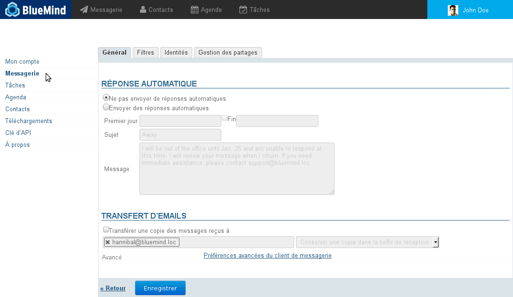
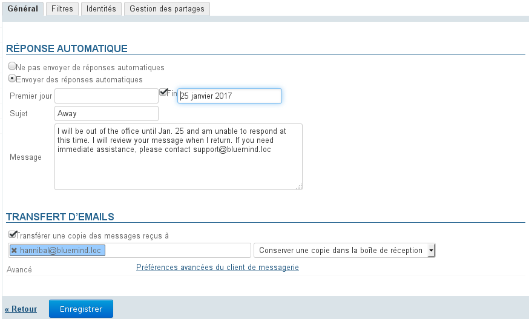
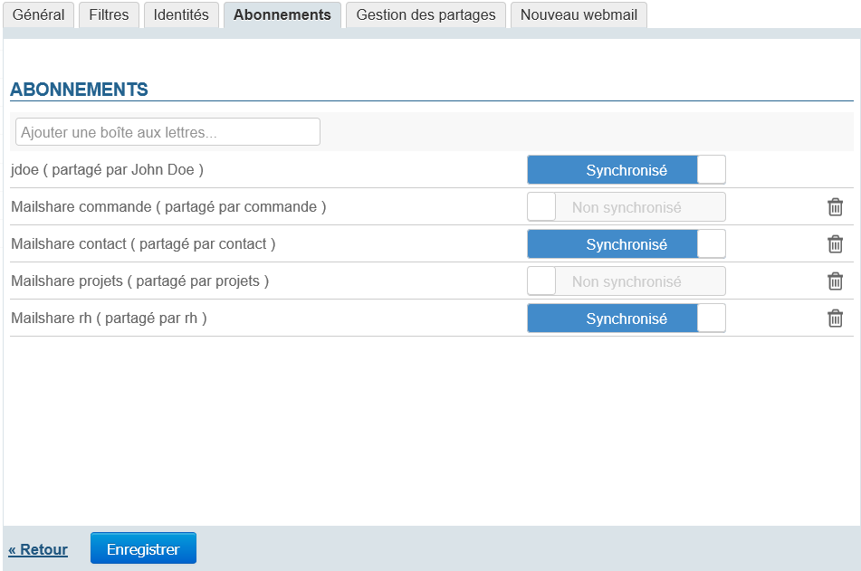
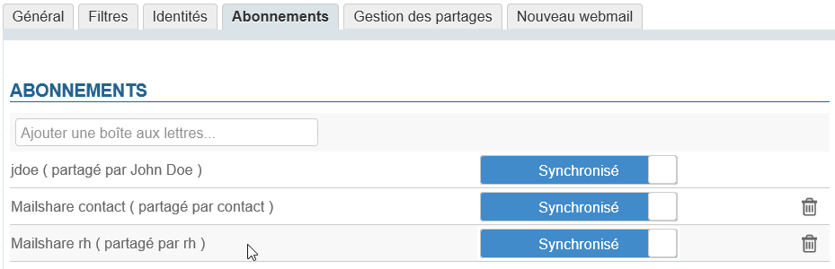
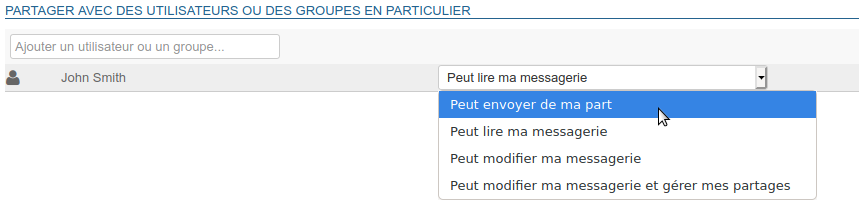

# Einstellungen für das E-Mail-System

## Präsentation

Um auf die E-Mail-Einstellungen zuzugreifen, rufen Sie "Mein Konto" auf, indem Sie auf den Benutzernamen auf der rechten Seite der Navigationsleiste klicken:

Wird dieser Schritt auf dem Webmailer durchgeführt, werden Sie automatisch an den entsprechenden Bereich weitergeleitet, klicken Sie dann im Menü links auf "Email":

## Allgemeine Einstellungen

Auf der ersten Registerkarte der Einstellungen können Sie eine automatische Antwort und eine Weiterleitung der Nachrichten einrichten.

### Automatische Antwort

Wenn Sie eine Nachricht erhalten, wird für den angegebenen Zeitraum automatisch eine E-Mail an den Absender gesendet.

Damit ist es z. B. möglich, Ihre Abwesenheit vom Büro im Urlaub anzuzeigen.

- Start- und Enddatum sind nicht zwingend erforderlich:
    - Wenn kein Startdatum angegeben ist, wird die automatische Antwort aktiviert, sobald die neuen Einstellungen gespeichert sind.
    - Wenn kein Enddatum angegeben ist, bleibt die automatische Antwort so lange aktiv, bis die Einstellungen geändert und "Abwesenheitsnotiz AUS" gewählt wird.
Wenn Sie auf das Eingabefeld für ein Datum klicken, wird ein Kalender angezeigt, der bei der Auswahl des Datums hilft:- Der Betreff ist optional: Wenn er nicht ausgefüllt wird, wird eine Nachricht mit leerem Betreff gesendet
- Der Inhalt der Nachricht ist obligatorisch, er wird im Textkörper der gesendeten Nachricht angezeigt.

:::tip

Wird die automatische Antwort deaktiviert, werden die letzten Einstellungen gespeichert und können abgerufen werden, wenn die automatische Antwort wieder aktiviert werden soll.

:::

:::info

Innerhalb eines Zeitraums von 3 Tagen wird eine einzige Abwesenheitsnotiz als Antwort an dieselbe Person (E-Mail-Adresse) gesendet.

Wenn der Benutzer die automatische Antwort während dieses Zeitraums deaktiviert und wieder aktiviert,** ohne den Betreff oder den Inhalt seiner Nachricht zu ändern**, erhalten Personen, die bereits eine automatische Antwort erhalten haben, keine neue Antwort. Der Countdown für den Zeitraum wird fortgesetzt.

Beispiel:

- Benutzer A aktiviert die automatische Antwort.
- Er erhält am Tag T eine E-Mail von Benutzer B. Die Abwesenheitsnotiz wird gesendet und der Countdown der 3 Tage beginnt.
- Der Benutzer deaktiviert die automatische Antwort am Tag T+1.
- Er erhält eine neue E-Mail von B. Es wird keine Abwesenheitsnotiz gesendet.
- Der Benutzer aktiviert die automatische Antwort unverändert am Tag  T+2 erneut.
- Er erhält erneut eine E-Mail von B. Es wird keine Abwesenheitsnotiz gesendet, da für den Countdown von T+2 ausgegangen wird.

:::

### Weiterleitung

Dieses Formular gestattet, alle eingehenden Nachrichten an eine oder mehrere interne oder externe Adressen weiterzuleiten und, falls erwünscht, eine Kopie jeder Nachricht in Ihrem Posteingang zu speichern.

Um die Weiterleitung zu aktivieren, müssen Sie das Kontrollkästchen aktivieren und die Adressen der gewünschten Empfänger eingeben:

:::tip

Die Autovervollständigung durchsucht alle Verzeichnisse des Benutzers und schlägt Adressen vor (Telefonbuch, persönliche Verzeichnisse usw.)

:::

:::info

Sie müssen auf die von der automatischen Vervollständigung vorgeschlagene Adresse klicken, damit sie verwendet wird, ein einfaches Drücken der Eingabetaste nach der Eingabe der Adresse reicht nicht aus, um sie zu bestätigen.

Eine Adresse, die vom System ordnungsgemäß berücksichtigt wurde, wird blau hinterlegt und mit einem Kreuz versehen, damit sie gelöscht werden kann.

:::

## Filter

Filter gestatten die Anwendung von Sortierregeln und von Aktionen, die automatisch für neu eingehende Nachrichten ausgeführt werden.

Sie ermöglichen z. B. das Ablegen in einem Unterordner anhand des Absenders oder das Löschen anhand des Betreffs, ohne dass Sie diese Aktion selbst manuell durchführen müssen.

Weitere Informationen über die Verwaltung von Nachrichtenfiltern finden Sie auf der Seite [Nachrichtenfilter](/old/Guide_de_l_utilisateur/La_messagerie/Les_filtres_de_messages/)

## Identitäten

Auf dieser Registerkarte kann der Benutzer seine Identitäten und die mit ihnen verbundenen Unterschriften verwalten.

Weitere Informationen finden Sie auf der Seite [Identitäten](/old/Guide_de_l_utilisateur/La_messagerie/Les_identités/).

## Abonnements

Dieser neue Abschnitt, der ab Version 4.3 zur Verfügung steht, gestattet die Verwaltung von Abonnements für freigegebene Mailboxen, um sie in einem [Outlook-Client, der mit MAPI angebunden ist](/old/Guide_de_l_utilisateur/Configuration_des_clients_lourds/Synchronisation_avec_Outlook/), oder auf [mobilen Geräten, die per EAS verbunden sind](/old/Guide_de_l_utilisateur/Configuration_des_périphériques_mobiles/), anzuzeigen (bzw. nicht anzuzeigen).

:::info

Die Abonnements betreffen nur Tools von Drittanbietern, sie wirken sich nicht auf die Anzeige der Mailbox im Webmailer von BlueMind oder in einer Software von Drittanbietern aus, die über IMAP/POP synchronisiert wird.

:::

Das Abonnement mit oder ohne Synchronisierung ermöglicht eine differenzierte Sichtbarkeit für jede Mailbox, wobei die aktivierte Synchronisierung gestattet, die betreffende Mailbox auf den per EAS verbundenen Geräten anzuzeigen.
Daher gilt:

|  | Synchronisierung aktiv | Synchronisierung nicht aktiv |
| --- | --- | --- |
| Outlook MAPI | 

 | 

 |
| EAS | 

 | 

 |
| Webmailer | 
- Kein Abonnement erforderlich
- Immer angezeigt

 |
| IMAP | 
- Kein Abonnement erforderlich
- Anzeige entsprechend den [Einstellungen der Client-Software](/old/Guide_de_l_utilisateur/Configuration_des_clients_lourds/)

 |

So fügen Sie einer Mailbox ein Abonnement hinzu:

- Vergewissern Sie sich bei einem Administrator (des Systems oder der Mailbox), dass Ihnen mit der Freigabe mindestens die Leseberechtigung erteilt wurde (siehe [Geteilte Posteingänge](/old/Guide_de_l_utilisateur/La_messagerie/Les_boites_aux_lettres_partagées/)).
- Tippen Sie die ersten Buchstaben des Namens der gewünschten Mailbox in das Eingabefeld oben in der Registerkarte ein, die automatische Vervollständigung schlägt die Mailboxen vor, die der Eingabe entsprechen und die für Sie freigegeben wurden:
- Wählen Sie die gewünschte Mailbox aus.
Die Mailbox wird der Liste hinzugefügt, wobei die Synchronisierung standardmäßig aktiviert ist:

-  **Klicken Sie auf "Speichern", damit die Abonnements berücksichtigt werden.** 

## Verwaltung der Freigaben

Diese Registerkarte gestattet dem Benutzer, die Freigaben und Delegierungen seiner E-Mail oder eines anderen von ihm verwalteten Elements (freigegebene Mailbox, Ressource) zu verwalten.

:::info

Standardmäßig wird eine Freigabe und zwar die des Benutzers selbst mit der Änderungs- und Verwaltungsberechtigung angezeigt: Diese Freigabe kann weder gelöscht noch eingeschränkt werden.

:::

Mögliche Arten der Freigabe sind:

- **Kann stellvertretend senden**: Der angegebene Benutzer kann eine Identität für sich erstellen, um Nachrichten im Namen des Benutzers zu senden, der die Berechtigung erteilt hat.Mit dieser Berechtigung kann er auch stellvertretend E-Mails mit Outlook versenden.
- **Kann mein Mailkonto einsehen**: Der angegebene Benutzer kann die Nachrichten des Benutzers lesen.
- **Kann mein Mailkonto aktualisieren**: Zusätzlich zu den oben genannten Berechtigungen kann der angegebene Benutzer Nachrichten anzeigen und ändern (löschen, zwischen Ordnern verschieben, Organisation und Namen von Ordnern ändern usw.).
- **Kann mein Mailkonto aktualisieren und Freigaben verwalten**: Der angegebene Benutzer kann zusätzlich zu den oben genannten Berechtigungen auch Freigaben für das Mailkonto des Benutzers ändern.

Siehe [Verwaltung der Freigaben](/old/Guide_de_l_utilisateur/Gestion_des_partages/).

