# E-Mail-System

## Präsentation

Das E-Mail-System von BlueMind bietet mit seinem Thin Client *(Webmailer*) eine reichhaltige Oberfläche mit vielen Funktionen:

- Anpassbare Ansicht mit zwei oder drei Feldern
- Anzeige und Verwaltung freigegebener Mailboxen
- Ziehen und Ablegen (*Drag & Drop*) von Anlagen aus dem Desktop
- Automatische Vervollständigung von Adressen
- Zwei Bearbeitungsmodi: Nur-Text oder HTML (formatierter Text, Einfügen von Bildern usw.)
- Suchmaschine für *Volltextsuche* in mehreren Ordnern

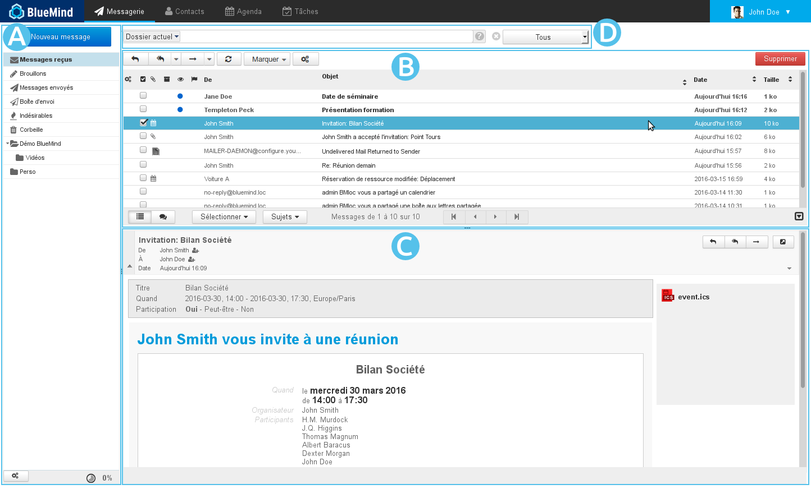

## Anzeige

Die standardmäßige Hauptansicht von BlueMind ist in drei Felder unterteilt:

-  : Die Seitenleiste zeigt die Baumstruktur des E-Mail-Systems des Benutzers, die seine eigenen Ordner und die freigegebenen Mailboxen enthält, auf die er Zugriff hat.
-  : In diesem Bereich werden die Liste der Nachrichten im ausgewählten Ordner und die zugehörigen Aktionsschaltflächen angezeigt.
-  : Hier wird die in der Liste ausgewählte Nachricht angezeigt. Der Benutzer kann in seiner Verwaltung der Einstellungen wählen, diesen Bereich auszublenden und seine Nachrichten in einer  Ansicht mit zwei Feldern darzustellen.
-  : Die erweiterte Suchmaschine für die *Volltextsuche* (Suche im Inhalt der Nachrichten und in den Anlagen) in mehreren Ordnern.

## Seitenleiste

Die Seitenleiste zeigt die hierarchische Liste der Ordner an, für die der Benutzer eine Lese- oder Lese- und Schreibberechtigung hat. Sie sind in alphabetischer Reihenfolge sortiert.

:::tip

Aktualisierung der Ordnerliste

Die Anwendung verfügt über einen Cache für die Ordnerliste, sodass ein neu erstellter oder freigegebener Ordner möglicherweise nicht sofort in der Verzeichnisstruktur erscheint.

Die Aktualisierung der Verzeichnisstruktur lässt sich mit einem Trick erzwingen:

- Rufen Sie die Ordnerverwaltung auf: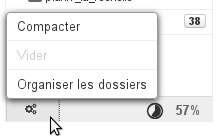
- Kehren Sie zum Webmailer zurück, ohne eine Aktion durchzuführen.

:::

Wenn ein Ordner ausgewählt ist, erfolgt die Anzeige seines Inhalts auf der rechten Seite des Fensters. 

Der Ordner "Dossiers partagés" (Freigegebene Ordner) enthält alle Ordner, Benutzer und freigegebenen Mailboxen, für die Berechtigungen der gemeinsamen Nutzung vergeben wurden.

Die Nachrichten können zwischen den Ordnern verschoben werden, indem Sie sie per Drag & Drop aus der Nachrichtenliste in den entsprechenden Ordner ziehen.

Wenn Sie mit der rechten Maustaste auf einen Ordner klicken, wird ein Menü mit spezifischen Aktionen für diesen Ordner angezeigt:

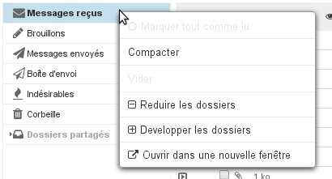

:::info

** **Über Kontingente** **

Wenn das Kontingent aktiviert ist, wird sein prozentualer Anteil an der Nutzung permanent unten im linken Bereich des Webmailers angezeigt; wenn Sie mit der Maus darüberfahren, werden detaillierte Informationen angezeigt:
 

Zur Visualisierung des Kontingentniveaus werden Farbcodes verwendet: Die Belegungsrate wird in Orange angezeigt, wenn sie 75 % des Kontingents erreicht, in Dunkelrot, wenn sie 85 % erreicht und in Rot, wenn sie 100 % erreicht:

Wenn ein Kontingent erreicht ist, blockiert es den Empfang von Mails. Diese Mails werden vom Server für einige Tage aufbewahrt.
Auch Sende- und sogar Löschvorgänge können gestört werden, da das System Kopien in einem temporären Verzeichnis und/oder im Papierkorb erstellen muss.

:::info

Kontingentierung und Löschung

Um Nachrichten zu löschen, wenn das Kontingent erreicht ist, verwenden Sie die Funktion zum permanenten Löschen (ohne über den Papierkorb zu gehen), indem Sie auf &lt;SHIFT+Suppr> klicken.

:::

Ein erreichtes Kontingent kann vom Administrator manuell erhöht und jederzeit wieder auf das ursprüngliche Kontingent gesenkt werden.

:::

## Nachrichtenliste

### Spalten und Sortierung

Die Schaltfläche in Form von drei Zahnrädern  am oberen Rand der Nachrichtenliste öffnet das Popup-Fenster für die Auswahl der Spalten und der Sortierreihenfolge der Anzeige: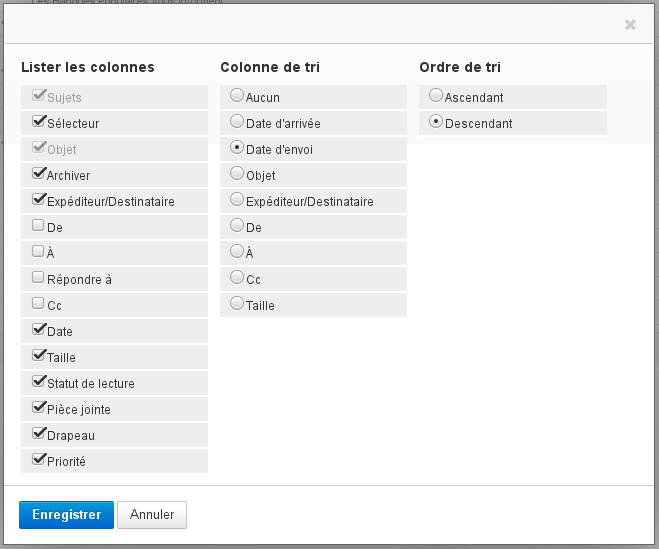Um die Nachrichten nach einer Spalte zu sortieren, klicken Sie auf die Überschrift dieser Spalte: Wenn es sich bereits um die Sortierspalte handelt, wird die Sortierreihenfolge umgekehrt (aufsteigend  absteigend), ansonsten werden die Nachrichten in aufsteigender Reihenfolge sortiert. Die aktuell gültige Reihenfolge wird durch einen Pfeil in der jeweiligen Spaltenüberschrift angezeigt:

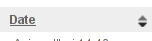

Um die Reihenfolge der Spalten zu ändern, klicken Sie in der Nachrichtenliste auf die Überschrift der zu verschiebenden Spalte: Sie wird ausgegraut und die Position der Spalte wird als gepunktete Linie gezeigt, verschieben Sie die Spalte dann an die gewünschte Stelle: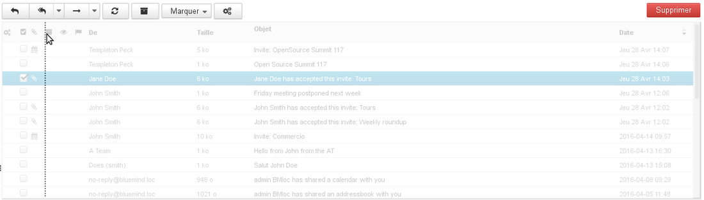

:::tip

Die Reihenfolge der Spalten und die gewählte Sortierung werden gespeichert und bei der nächsten Anmeldung verwendet.

:::

### Nachrichtenauswahl

Die Auswahl mehrerer Nachrichten kann auf verschiedene Weise erfolgen:

- Klicken Sie bei gedrückter Taste "Umschalt" auf die Zeile der ersten gewünschten Nachricht in der Liste und dann auf die Zeile der letzten gewünschten Nachricht, um den gesamten Bereich zwischen diesen beiden Nachrichten auszuwählen.
- Klicken Sie auf die Zeile der ersten gewünschten Nachricht in der Liste und wählen Sie die weiteren gewünschten Nachrichten, indem Sie mit gedrückter Taste "Strg" auf die jeweilige Zeile klicken.
- In der Spalte mit den Kontrollkästchen:
    - Klicken Sie auf das Kontrollkästchen jeder gewünschten Nachricht, ohne eine Taste der Tastatur gedrückt zu halten.
    - Klicken Sie auf die Spaltenüberschrift, um das Auswahlhilfe-Menü aufzurufen: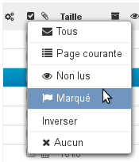

Die ausgewählten Nachrichten sind in der Liste durch einen blauen Hintergrund gekennzeichnet und ihre Kontrollkästchen sind aktiviert:

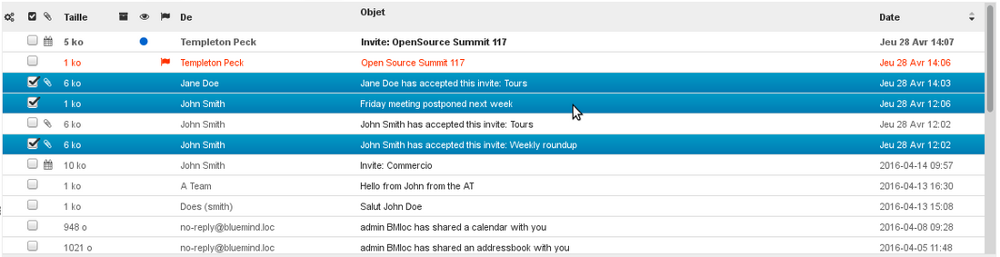

:::info

Wenn mehrere Nachrichten ausgewählt sind, wird im Vorschaubereich kein Inhalt angezeigt.

:::

### Ablesen und Ändern des Status

Die Spalten mit dem Nachrichtenstatus und der Markierung bieten zusätzlich zu den schnell sichtbaren Informationen die Möglichkeit, auf den Status von Nachrichten einzuwirken: Durch Klicken in die entsprechende Spalte wird der Status der Nachricht ("gelesen"/"ungelesen") automatisch umgekehrt oder der Nachricht wird eine Markierung hinzugefügt bzw. die Markierung wird entfernt:

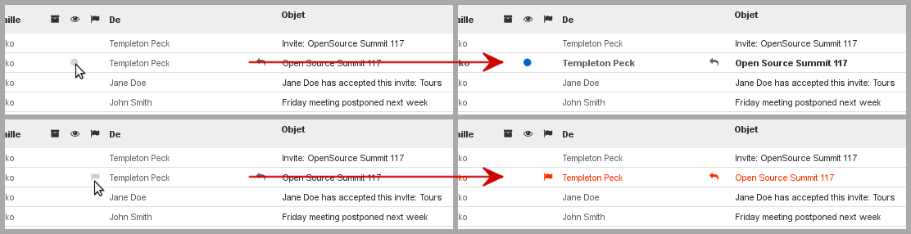

### Aktionen für Nachrichten

Die Symbolleiste am oberen Rand der Nachrichtenliste in  gestattet den Zugriff auf die Aktionen, die auf der/den ausgewählte(n) Nachricht(en) ausgeführt werden können:

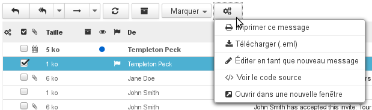

Diese Schaltflächen bieten schnellen Zugriff auf die wichtigsten Funktionen: antworten, allen antworten, weiterleiten, Status gelesen/ungelesen und Wichtigkeit ändern usw.

Die Schaltfläche mit den drei Zahnrädern  bietet weitere Aktionen an:

- **Nachricht drucken**
- **Lokal speichern (.eml)**: Ermöglicht das Herunterladen der Nachricht als Datei im Format EML.

- **Als neue Nachricht öffnen**: Öffnet die Nachrichtenerstellung mit der Nachricht, wie sie ist, die Felder Empfänger, Kopie, Betreff, Inhalt usw. sind bereits ausgefüllt.
- **Quelltext anzeigen**: Zeigt den Quelltext der Nachricht im Rohformat an.
- **In neuem Fenster öffnen**: Öffnet ein neues Webmailer-Fenster mit der Nachricht in der Ansicht mit zwei Feldern.

Schaltflächen, denen ein Pfeil folgt, bieten neben ihrer eigenen Funktion ebenfalls zusätzliche Aktionen an:

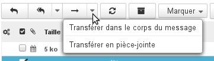

Actions supplémentaires pour le transfert

#### Nachricht beantworten

- Wählen Sie die Nachricht in der Nachrichtenliste aus und klicken Sie auf die Schaltfläche  "**Antwort verfassen**" in der Liste mit den Aktionsschaltflächen.

- Eine neue Nachricht an den Absender der empfangenen Nachricht wird erstellt.
Das Feld "Empfänger" ist bereits ausgefüllt.
Vervollständigen Sie die Nachricht und senden Sie sie.

:::tip

Um allen Empfängern der Nachricht zu antworten, klicken Sie auf  "**Antwort an Mailingliste oder an Absender und alle Empfänger verfassen**" und fahren Sie wie oben fort.

:::

#### Nachricht weiterleiten

- Wählen Sie die Nachricht aus und klicken Sie dann auf  "**Nachricht weiterleiten**".

- Das Fenster der Nachrichtenerstellung wird mit der ausgewählten Nachricht geöffnet.
- Wählen Sie die Empfänger, verfassen Sie die Nachricht und klicken Sie dann auf 

#### Nachricht löschen

- Wählen Sie die Nachricht aus und gehen Sie wie folgt vor:

    - Klicken Sie auf die Schaltfläche  oben rechts über der Nachrichtenliste.

    - Oder klicken Sie mit der rechten Maustaste und anschließend auf "**Nachricht in den Papierkorb verschieben**".

    - Oder drücken Sie die Taste "Entf" auf der Tastatur.

Die verschobene Nachricht bleibt je nach Mailboxkonfiguration für eine bestimmte Zeit im Papierkorb abrufbar. Standardmäßig ist der Papierkorb ohne zeitliche Begrenzung zugänglich, sofern er nicht manuell gelöscht wird.
- So **löschen Sie Nachrichten dauerhaft**:

    - Wählen Sie den Ordner "Gelöscht" und dann die zu löschenden Nachrichten aus.

    - Klicken Sie mit der rechten Maustaste und klicken Sie dann auf "Supprimer le message définitivement" (Nachricht dauerhaft löschen).

- So **leeren Sie den Papierkorb**:

    - Wählen Sie den Ordner "Gelöscht".

    - Klicken Sie mit der rechten Maustaste auf diesen Ordner und wählen Sie "**Leeren**".

#### Als neue Nachricht öffnen

Um eine Nachricht zu bearbeiten, anstatt sie weiterzuleiten oder zu beantworten, öffnen Sie das Menü "Mehr..."  und wählen Sie **"Als neue Nachricht öffnen**".

### Aktionen in der Nachrichtenliste

Mit den Schaltflächen am unteren Rand der Nachrichtenliste können Sie Aktionen in der Nachrichtenliste vornehmen:

- 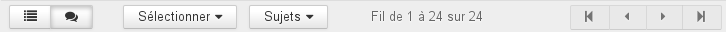Die ersten beiden Schaltflächen schalten die Anzeige zwischen einer einfachen Liste und einer nach Konversationen gruppierten Liste um.
- Das Menü "Auswahl" gestattet die Auswahl von Nachrichten nach vordefinierten Filtern.
- Das Menü "Konversationen" gestattet die strukturierte Gruppierung der Nachrichten nach Konversationen/Diskussionen.
- In der Mitte wird angeben, welche Nachrichten derzeit in der Liste angezeigt werden.
- Die Schaltflächen mit den Pfeilen ermöglichen das Navigieren zwischen den Seiten der Liste.

## Anzeige einer Nachricht

In diesem Feld wird der Inhalt einer ausgewählten Nachricht angezeigt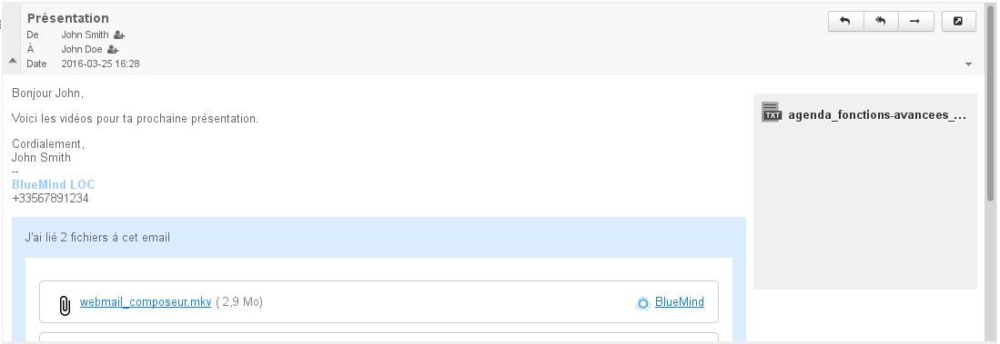

:::tip

Um eine Nachricht im gesamten rechten Teil des Fensters anzuzeigen, doppelklicken Sie in der Nachrichtenliste auf die Nachricht.

Um anschließend zur Standardanzeige zurückzukehren, klicken Sie auf das Symbol mit dem nach links gerichteten Pfeil oben links im Anzeigebereich:

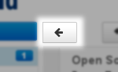

:::

### Anzeige der Kopfzeile

Standardmäßig wird Kopfzeile einer Nachricht im einfache Modus angezeigt. Um weitere Informationen zu sehen, klicken Sie auf den Pfeil links neben dem Bereich: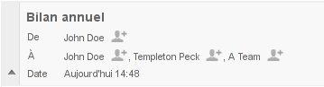Um den kompletten Header der Nachricht anzuzeigen, klicken Sie auf den Pfeil rechts neben Bereich der Kopfzeile:

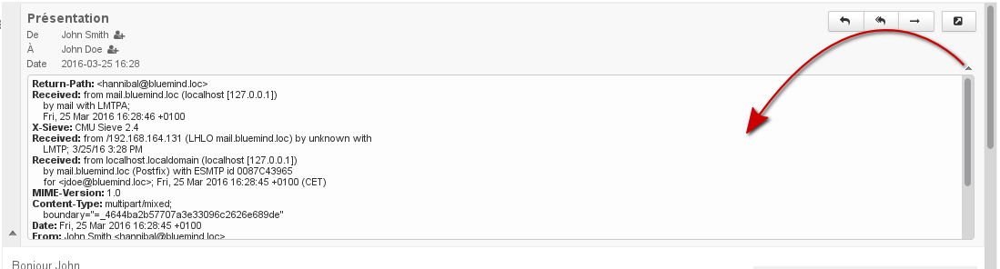

### Anlagen

Anlagen (Anhänge) befinden sich je nach Art der Anlage an zwei verschiedenen Positionen der Nachricht:

- In die Nachricht eingebettete Anlagen werden rechts von der Nachricht in einer Spalte auf grauem Hintergrund angezeigt. Eine Schaltfläche gestattet das Herunterladen als ZIP-Archiv.
- [Abgetrennte Anlagen](/old/Guide_de_l_utilisateur/La_messagerie/Fichiers_volumineux_et_détachement_des_pièces_jointes/) werden in einem blauen Kasten am Ende der Nachricht angezeigt.

:::tip

Angehängte Bilder werden in der Nachrichtenvorschau nach der Nachricht angezeigt.

:::

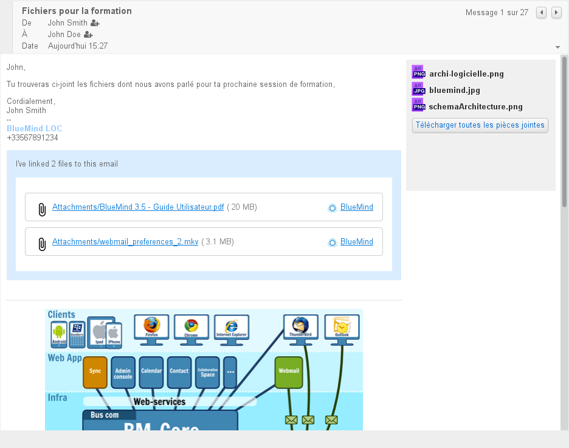Je nach Art der Anlage wird durch Anklicken das Vorschaufenster geöffnet oder das Herunterladen oder Öffnen der Datei angeboten.

