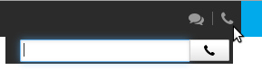
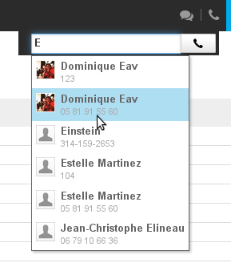
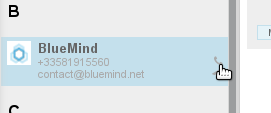
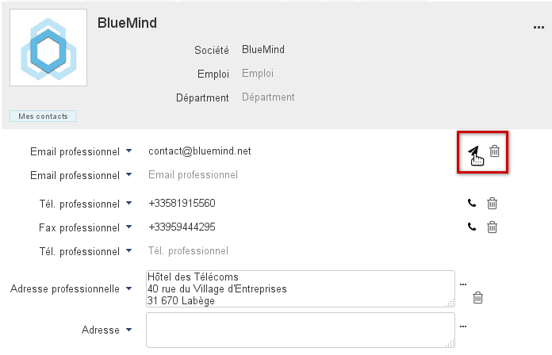
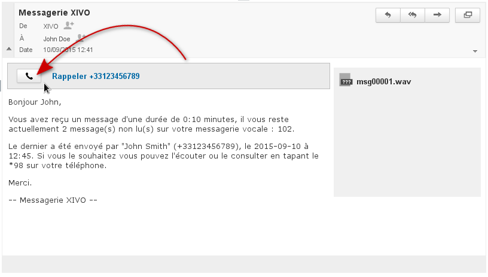
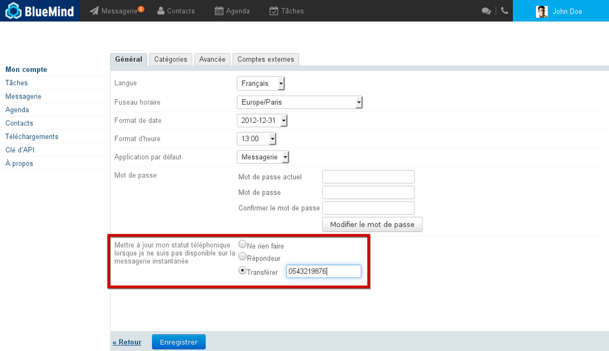

# Telefonie

## Präsentation

Dank der Verbindung mit [XIVO](https://www.xivo.solutions/) und [Wazo](https://wazo.io) wird BlueMind eine einheitliche kollaborative Mailbox-Lösung, die:

- Sprachnachrichten in Ihrer Mailbox empfängt
- die Online-Präsenz und telefonische Erreichbarkeit meldet
- die Anwesenheit und Verfügbarkeit der Mitarbeiter anzeigt
- Anrufe aufgrund des Anwesenheitsstatus weiterleitet
- den Anwesenheitsstatus automatisch mit den Kalenderterminen synchronisiert
- Anrufe über die Web-Schnittstelle betätigt
- auf eine umfassende Kontaktdatenbank zugreift

## Anrufen

Mit der BlueMind-Schnittstelle können Sie auf 3 verschiedene Arten telefonieren:

- mit dem Dialer, verfügbar in der Hauptmenüleiste
- in der Anwendung Kontakte
- mit einer Voicemail-E-Mail

Das Tätigen eines Anrufs über eine Schnittstelle wird allgemein als *“Click to call“* bezeichnet. Die Bedienung ist in allen Fällen gleich: Wenn der Benutzer klickt, um einen Anruf zu tätigen, klingelt sein Telefon, der Anruf wird getätigt, wenn er es abnimmt.

### Mit dem Dialer

Der Dialer befindet sich in der Hauptmenüleiste und ist auf allen Seiten der BlueMind-Schnittstelle verfügbar. Er ermöglicht, Anrufe durch Eingabe einer Rufnummer oder durch Autovervollständigung bei der Suche nach einem Kontakt einzuleiten.

1. Klicken Sie auf die Schaltfläche  in der Menüleiste, um den Dialer aufzurufen:
2. Geben Sie (direkt oder per Kopieren/Einfügen) die Nummer des gewünschten Gesprächspartners oder seinen Namen ein.
Die Autovervollständigung schlägt während des Tippens die entsprechenden Personen vor:

3. Klicken Sie auf die Schaltfläche  oder auf die gewünschte Nummer, oder blättern Sie mit den Auf-/Ab-Pfeiltasten auf dem Tastenfeld bis zur gewünschten Nummer und bestätigen Sie mit der Eingabetaste.

:::tip

XIVO durchsucht die folgenden Verzeichnisse:

- Die [Verzeichnisse](https://forge.bluemind.net/confluence/display/LATEST/Gestion+des+carnets+d%27adresses) des Benutzers: Privat- und Firmenverzeichnis
- Das mit Bluemind verbundene, vernetzte AD/LDAP-Unternehmensverzeichnis

:::

### Die Kontakte

Ein Anruf kann direkt von der Anwendung Kontakte von BlueMind betätigt werden:

- in der Kontaktliste, indem Sie auf das Symbol klicken, das erscheint, wenn Sie den Mauszeiger über einen Kontakt bewegen:
- im Kontakt, indem Sie auf das Symbol vor der gewünschten Zeile klicken:

### Von der Mailbox

Wenn eine Nachricht auf dem Anrufbeantworter des Benutzers hinterlassen wird, erhält der Benutzer diesbezüglich eine Nachricht. Dann kann der Anrufer vom Symbol  im Nachrichtenkopf aus zurückgerufen werden:

## Anwesenheitsanzeige

In Instant Messaging wirddie telefonische Erreichbarkeit durch ein Farbsymbol  (Telefon) vor der Online-Verfügbarkeit des Benutzers angezeigt:

Utilisateur hors ligne au téléphone mais disponible pour la messagerie instantanée

Telefonische Erreichbarkeit kann wie folgt sein:

 Verfügbar

 Online aber beschäftigt

 Offline / Verfügbarkeit unbekannt

 (blinkt rot und weiß) das Telefon klingelt

Die Verfügbarkeit von Instant Messaging kann wie folgt sein:

 Verfügbar

 Besetzt

 Abwesend

 Offline

*Um mehr über die Verfügbarkeit von Instant Messaging und dessen Verwaltung zu erfahren, sehen Sie bitte die entsprechende Seite ein * * [Instant Messaging](/old/Guide_de_l_utilisateur/La_messagerie_instantanee/) * *.*

## Status und synchronisierte Anrufweiterleitung

### Mit dem Kalender

Der Anwesenheitsstatus kann mit dem Kalender verknüpft werden, so dass bei Terminen automatisch der Status „besetzt“ erscheint und/oder eingehende Anrufe auf den Anrufbeantworter oder eine Telefonnummer umgeleitet werden.

Gehen Sie dazu in die Verwaltung der [Benutzereinstellungen](/old/Guide_de_l_utilisateur/Paramètres_utilisateur/) > Abschnitt Terminkalender > Registerkarte Allgemein und:

- „Meinen Status auf Besetzt ändern“ für Instant Messaging aktivieren
- den Anrufbeantworter oder eine Weiterleitung für die Telefonie aktivieren:

### Mit Instant Messaging

Mit BlueMind können Sie eine automatische Weiterleitung an den Anrufbeantworter oder an eine Nummer einstellen, wenn der Instant Messaging Status „Besetzt“ ist.

Gehen Sie dazu in die Verwaltung der [Benutzereinstellungen](/old/Guide_de_l_utilisateur/Paramètres_utilisateur/) > Bereich Mein Konto > Registerkarte Allgemein und aktivieren Sie die gewünschte Option:

