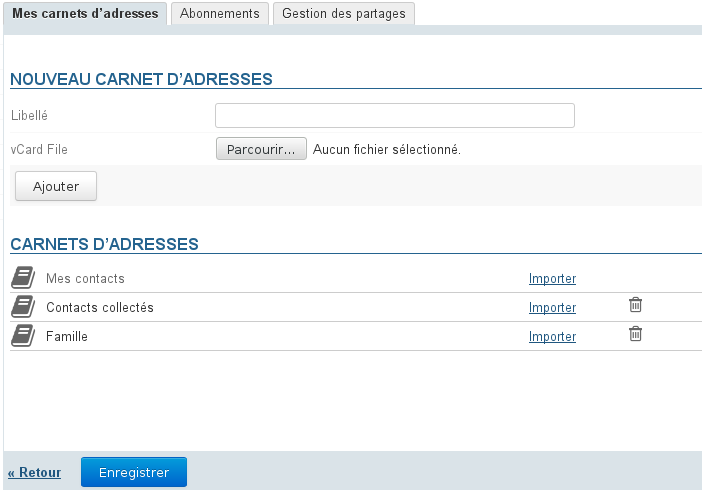
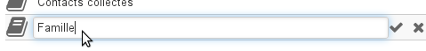
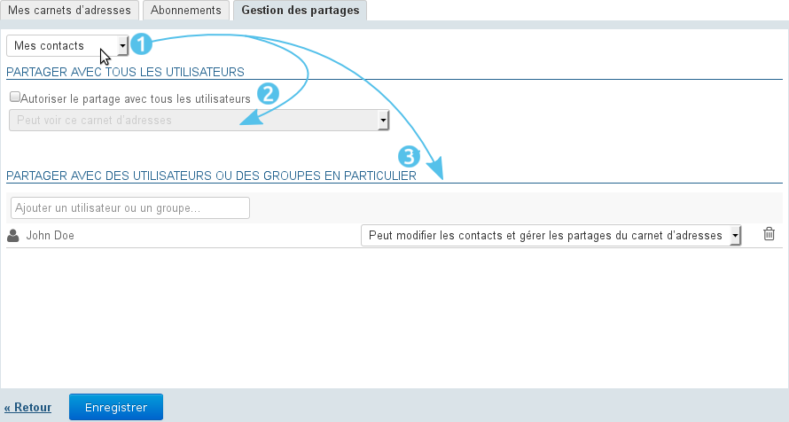
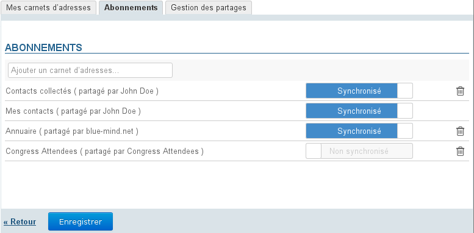
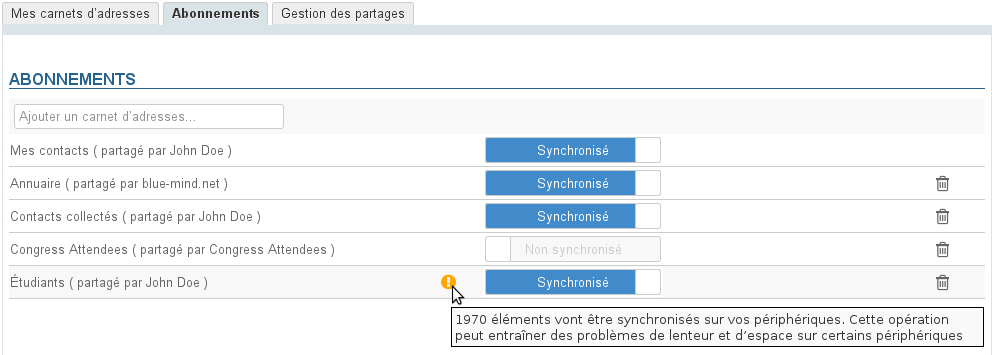
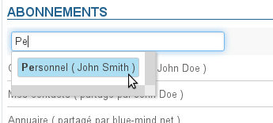
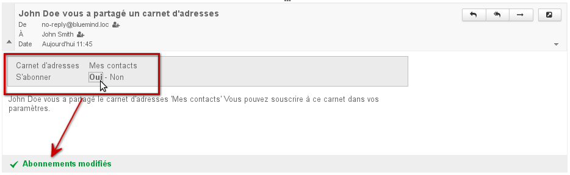

# Verwaltung der Adressbücher

## Präsentation

Die Verwaltung der Kontakteinstellungen gestattet dem Benutzer, seine eigenen Adressbücher und seine Abonnements für externe Adressbücher (Domain, andere Benutzer usw.) zu verwalten.

Der Zugriff erfolgt über die Verwaltung der Benutzereinstellungen, Bereich "Kontakte" (über die Anwendung "Kontakte" erfolgt der Zugriff automatisch):

## Adressbücher des Benutzers

Standardmäßig hat der Benutzer zwei Adressbücher:

- "Meine Kontakte" (oder "Kontakte"): das persönliche Adressbuch
- Gesammelte Kontakte: In dieses Adressbuch werden automatisch die Empfänger von Nachrichten des Benutzers aufgenommen, die nicht im Verzeichnis enthalten sind.

:::info

Das dritte Standardadressbuch, das Verzeichnis der Benutzer, wird nicht vom Benutzer verwaltet und wird nicht unter "Adressbücher" aufgeführt: Es handelt sich um ein Abonnement des Adressbuchs der Domain.

:::

Diese Adressbücher können weder geändert noch gelöscht werden, aber der Benutzer kann sie frei verwenden und die enthaltenen Kontakte verwalten.

### Erstellen und ändern

So **erstellen** Sie ein neues Adressbuch:

- Geben Sie seine Bezeichnung ein.
- Optional: Wählen Sie eine Vcard-Datei, wenn Sie das Adressbuch durch einen Import von Kontakten erstellen möchten.
- Klicken Sie auf die Schaltfläche "Hinzufügen".

So **bearbeiten** Sie ein Adressbuch:

- Klicken Sie auf die Bezeichnung des Adressbuchs, damit das Eingabefeld angezeigt wird:
- Geben Sie den neuen Namen ein und bestätigen Sie mit der Eingabetaste oder durch Klicken auf das Symbol .Wenn Sie während der Eingabe abbrechen möchten, drücken Sie die Escapetaste oder klicken Sie auf das Symbol 

So **löschen** Sie ein Adressbuch:

- Klicken Sie auf das Symbol  am Ende der Zeile.
- Bestätigen Sie den Löschvorgang.

:::info

Die Verwendung der Schaltfläche "Speichern", die hier wie auf allen Bildschirmen der Anwendung angezeigt wird, ist nicht notwendig: Die Änderungen werden im Verlauf der Benutzeraktionen vorgenommen und berücksichtigt, so dass jeder bestätigte Löschvorgang endgültig ist.

:::

### Kontakte importieren

Um Kontakte ausgehend von der Verwaltung der Einstellungen in ein Adressbuch zu importieren, müssen Ihnen die zu importierenden Kontakte als Datei im Format [vCard](http://fr.wikipedia.org/wiki/VCard) vorliegen.

### Ein Adressbuch exportieren

Das Exportieren der Kontakte eines Adressbuchs erfolgt ausgehend von der Anwendung "Kontakte".
Weitere Informationen: [Kontakte - Importieren und exportieren](https://forge.blue-mind.net/confluence/display/LATEST/Les+contacts#Lescontacts-Importeretexporter)

### Ein Adressbuch freigeben

BlueMind bietet die Möglichkeit, persönliche Adressbücher mit anderen Benutzern zu teilen.

So erfolgt die **Freigabe** eines Adressbuchs:

Rufen Sie die Verwaltung der Benutzereinstellungen > Bereich Kontakte > Registerkarte "Freigaben" auf:

1. Wählen Sie das Adressbuch aus, das Sie freigeben möchten.Ein Benutzer kann freigeben:
    - Seine persönlichen Adressbücher: Kontakte (oder "Meine Kontakte"), "Gesammelte Kontakte" und die von ihm erstellten Adressbücher.
    - Adressbücher, die an ihn delegiert wurden: Er verfügt über die Berechtigung "Kann dieses Adressbuch sehen, ändern und die Freigaben verwalten".
2. Wenn Sie das Adressbuch für alle Benutzer der Domain freigeben möchten, aktivieren Sie das Kontrollkästchen "Öffentliches Teilen erlaubt" und wählen die Art der Berechtigungen, die die Benutzer erhalten sollen.
3. ** **Empfohlene Wahl:** ** Wenn Sie Berechtigungen lieber individuell an bestimmte Benutzer oder Gruppen vergeben möchten, suchen Sie die entsprechenden Personen über das Eingabefeld und wählen Sie die zu vergebende Berechtigung.
4. Wenn Sie alle Berechtigungen wie gewünscht vergeben haben, bestätigen Sie mit "Speichern".

## Abonnements

### Ausgehend von der Verwaltung der Einstellungen

Die Adressbücher eines Benutzers und die Adressbücher, die für diesen Benutzer freigegeben wurden, werden in der Registerkarte *Abonnements* der Einstellungen angezeigt.

:::info

Nur die hier angezeigten Adressbücher sind in der BlueMind-Anwendung "Kontakte" zugänglich, unabhängig davon, ob die Synchronisierung aktiviert ist oder nicht.

:::

Die Schaltfläche "Synchronisation" (Synchronisierung) gestattet die Konfiguration verschiedener Synchronisierungseinstellungen für jedes Adressbuch mit der Client-Software (Webanwendung, Fat Clients oder mobile Geräte).

Wenn die Synchronisierung aktiviert ist, werden die Daten in die Client-Software heruntergeladen. Daher:

|  | Synchronisierung aktiviert | Synchronisierung deaktiviert | Webanwendung | EAS iOS | EAS (andere) | DAV | Outlook (Connector) | Thunderbird |
| --- | --- | --- | --- | --- | --- | --- | --- | --- |
| Die Kontaktkarten sind offline verfügbar und können eingesehen werden. | Die Kontaktkarten können online eingesehen werden, sind aber offline nicht verfügbar. |
| 
- Das Adressbuch ist sichtbar.
- Die Kontaktkarten sind offline verfügbar und können eingesehen werden.
 | - Das Adressbuch ist nicht sichtbar. | 

 | - Die Kontaktkarten sind für Suchvorgänge und die automatische Vervollständigung zugänglich. |
| 
- Das Adressbuch ist nicht sichtbar.
- Die Kontaktkarten sind für Suchvorgänge und die automatische Vervollständigung zugänglich.
 |
| 
Nur "Meine Kontakte":
 | 
- Das Adressbuch ist sichtbar.
- Die Kontaktkarten sind offline verfügbar und können eingesehen werden.
 | 
Andere Adressbücher: Keine Sichtbarkeit, kein Zugriff für Suchvorgänge
 |
| 
- Das Adressbuch ist sichtbar.
- Die Kontaktkarten sind offline verfügbar und können eingesehen werden.
 | Das Adressbuch ist nicht sichtbar. |
| 
- Das Adressbuch ist sichtbar.
- Die Kontaktkarten sind offline verfügbar und können eingesehen werden.
 | 
- Das Adressbuch ist sichtbar hat aber ein anderes Symbol.
- Die Kontaktkarten sind für Suchvorgänge (Adressbuch) und die automatische Vervollständigung (Nachrichtenerstellung) zugänglich.
 |

:::info

Warnung bei großer Datenmenge

Wenn die Datenmenge in einem Adressbuch sehr groß ist (mehr als 1.000 Kontakte), warnt eine Meldung vor möglichen Synchronisierungsproblemen:

:::

:::tip
Adressbücher, die vom Benutzer in der BlueMind-Anwendung "Kontakte" erstellt wurden, sowie solche, die von Fat Clients (Outlook oder Thunderbird) erstellt wurden, werden den Abonnements automatisch mit aktivierter Synchronisierung hinzugefügt.
:::

So fügen Sie ein Adressbuch hinzu:

- Beginnen Sie mit der Eingabe des Namen des Adressbuchs in das Eingabefeld:
- Die automatische Vervollständigung schlägt dann die Adressbücher vor, die Sie noch nicht abonniert haben: Ihre eigenen Adressbücher und Adressbücher, die andere Benutzer für Sie freigegeben haben (siehe oben).
- Wählen Sie in der von der automatischen Vervollständigung vorgeschlagenen Liste das hinzuzufügende Adressbuch aus und drücken Sie die Eingabetaste oder klicken Sie auf
- Falls gewünscht können Sie die Synchronisation deaktivieren
- **Klicken Sie auf die Schaltfläche "Speichern", um die Änderungen zu speichern.**

:::info

Auf „Speichern“ klicken, um eine Änderung des Synchronisationsstatus zu berücksichtigen und dann **die Synchronisation neu starten (oder auf die automatische Synchronisation  warten) auf der Client-Software**, damit die Änderungen berücksichtigt werden (Herunterladen und Anzeigen von Daten bei Aktivierung, Löschen von Daten bei Deaktivierung).

:::

### Ausgehend von der empfangenen Informationsnachricht

Wenn ein Benutzer eines seiner Adressbücher für einen anderen Benutzer freigibt, erhält dieser automatisch eine Nachricht zur Information. Diese elektronische Nachricht gestattet ihm, das Adressbuch ausgehend von der E-Mail-Oberfläche direkt zu abonnieren:

