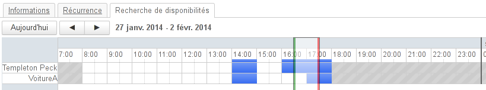
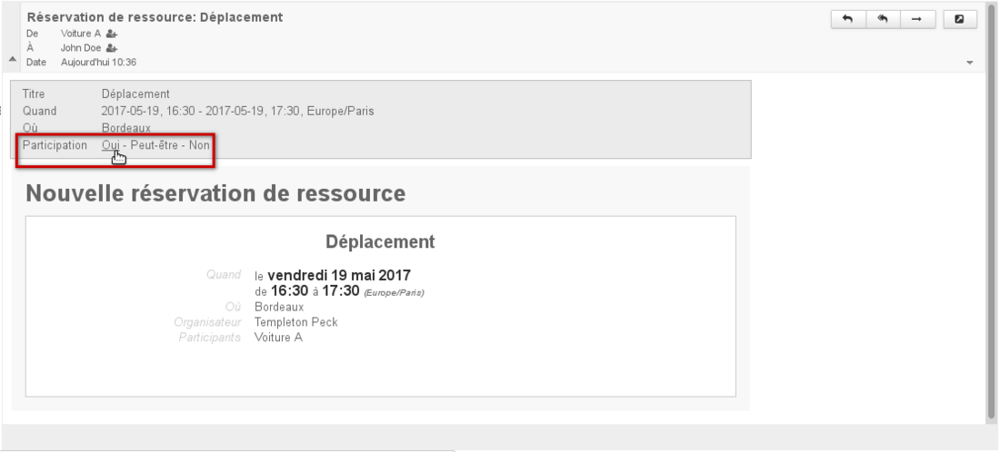
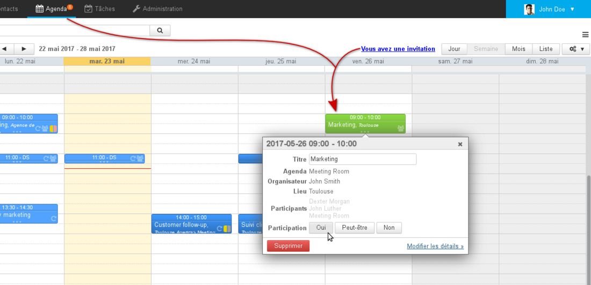

# Die Ressourcen

## Präsentation

Mit Blue Mind können Sie neben Einzel- oder Gruppen-Terminkalendern auch Ressourcen-Kalender (Fahrzeuge, Räume, Videoprojektoren usw.) verwalten.

Der Administrator kann neue Ressourcentypen definieren und die Ressourcenverwaltung an Benutzer delegieren.

Wie bei den Terminplanern von einzelnen Personen können Sie mit der Funktion Verfügbar/Belegt nach der Verfügbarkeit von Ressourcen suchen.

## Freigabrechte

Die Rechte, die Benutzern für eine Ressource zugewiesen werden können, sind wie folgt:

1. **Kann die Ressource reservieren**: Der Benutzer kann die Ressource mit einem Termin verknüpfen, um sie zu reservieren
2. **Kann die Ressource reservieren und ihre Reservierungen einsehen**: Zusätzlich zum obigen Recht kann der Benutzer den Ressourcenkalender einsehen und so die aktuellen Reservierungen und Anfragen sehen
3. **Kann seine Reservierungen ändern**: Zusätzlich zu den obigen Rechten kann der Benutzer die Reservierungen der Ressource ändern (akzeptieren, ablehnen, ändern, verschieben, löschen usw.). Der Benutzer wird in diesem Fall als **Ressourcenverwalter**bezeichnet.
4. **Kann seine Reservierungen ändern und seine Freigaben verwalten**: Zusätzlich zu den obigen Rechten kann der Ressourcenverwalter die Freigabeberechtigungen der Ressource ändern und sie anderen Benutzern zuweisen.

## Reservierung einer Ressource

Die Reservierung einer Ressource erfolgt in mehreren Schritten:

1. Der Benutzer, der die Ressource reservieren möchte, fügt sie beim Erstellen oder Bearbeiten den Teilnehmern seiner Veranstaltung hinzu.Dazu kann er die Verfügbarkeitssuche wie bei anderen Teilnehmern verwenden: 
2. Speichert der Benutzer seinen Termin, hat er die Wahl, eventuell eine Einladung zu senden, es handelt sich um eine Reservierungsanfrage per E-Mail.
3. Der/die benannte(n) Verwalter der Ressource erhalten eine Anfrage per Kalenderalarm, wenn der Ressourcenkalender derzeit in ihrer Anwendung angezeigt wird ** **und** ** per E-Mail, wenn eine Einladung verschickt wurde.

Le gestionaire peut accepter la demande depuis le mail de réservation

La ressource est vue en attente de validation par le gestionnaire

4. Je nach der für die Ressource gewählten [Reservierungsrichtlinie](/Guide_de_l_administrateur/Gestion_des_entites/Ressources/#Administrationdesressources-surbooking) gibt es 2 Möglichkeiten:
    1. Wenn automatische Annahme und Ablehnung aktiviert sind:
        - Erhält der Verwalter eine Reservierungsnachricht der Ressource
        - wenn die Ressource verfügbar ist, wird ihre Teilnahme validiert
        - wenn die Ressource nicht verfügbar ist, wird ihre Teilnahme abgelehnt
        - der Benutzer erhält eine Annahme- oder Ablehnungsnachricht von der Ressource
    2. Wenn die automatische Annahme und Ablehnung nicht aktiviert sind, muss der Verwalter die Reservierungsanfrage auf eine der folgenden Arten validieren:
        - per E-Mail, über die „Teilnahme“-Links der erhaltenen E-Mail
        - in seinem Kalender, über die Liste der anstehenden Termine (klicken Sie auf das verschlüsselte Symbol in der Navigationsleiste)
        - in seinem Kalender durch das Anklicken des Termin: 

:::tip

wenn nur die automatische Annahme aktiviert und die Ressource nicht verfügbar ist, dann gilt Fall b: Der Ressourcenverwalter erhält eine Nachricht mit der Reservierungsanforderung und der Status der Ressource steht aus.

:::
5. Der Benutzer wird per E-Mail informiert, dass die Ressource die Einladung angenommen oder abgelehnt hat.

:::info

Das Reservierungsverfahren ist dasselbe für den Ressourcenverwalter, der die Ressource selbst reservieren möchte: Die Annahme erfolgt nicht automatisch, er muss die Teilnahme der Ressource bestätigen, sobald der Termin erstellt wurde.
Andererseits erhält er keine Nachricht mit der Reservierungsanforderung, nur die anderen Administratoren der Ressource - falls vorhanden - erhalten sie.

:::

## Häufig gestellte Fragen

### Allgemein

#### Kann eine Ressource mehrere gleichzeitige Reservierungen haben?

Wenn der/die Verwalter nämlich mehrere Reservierungsanfragen für das gleiche Zeitfenster validieren, hat die Ressource mehrere gleichzeitige Reservierungen.

Zum Zeitpunkt der Reservierung wird der Benutzer über die Nichtverfügbarkeit der Ressource informiert, kann aber trotzdem eine Anfrage stellen.

**Eine Doppelreservierung (Überbuchung) wird bei neu angelegten Ressourcen standardmäßig verhindert: ** Wenn eine Ressource verfügbar ist, wird ihre Teilnahme automatisch bestätigt, wenn nicht, wird der Termin automatisch abgelehnt. Der Ressourcenverwalter behält jedoch die Kontrolle und kann weiterhin die Zuweisungen ändern sowie die Kalendertermine der Ressource direkt erstellen und bearbeiten.

Weitere Informationen zur Konfiguration finden Sie im Kapitel: [Administratorhandbuch > Ressourcenverwaltung > Reservierungsrichtlinie](/Guide_de_l_administrateur/Gestion_des_entites/Ressources/#Administrationdesressources-surbooking)

### Ich bin Benutzer

#### Die Ressource wird bei der Autovervollständigung nicht vorgeschlagen, wenn ich nach ihr suche

Erkundigen Sie sich bei Ihrem Administrator oder dem Ressourcenverwalter, ob Ihnen Reservierungsrechte zugewiesen wurden

### Ich bin Verwalter

#### Die Meldung der Buchungsanforderung wird nicht angezeigt

Prüfen Sie im linken Teil Ihres Terminkalenders, ob der Ressourcenkalender in der Liste der aktuell angezeigten Kalender vorhanden ist.

#### Die Buchungsanforderung wurde gemeldet, aber ich sehe kein Termin in meiner Ansicht

Prüfen Sie im linken Teil Ihres Kalenders, dass der Ressourcenkalender nicht ausgegraut ist: Wenn er ausgegraut ist, bedeutet es, dass er zwar vorhanden ist (die Meldung erscheint), aber nicht angezeigt wird (die Termine sind ausgeblendet)

#### Ich möchte die Verwaltung einer Ressource verlassen

Wenn Sie das Recht haben, Ressourcenfreigaben zu verwalten, können Sie diese selbst löschen, indem Sie zur Verwaltungsschnittstelle Ihrer Benutzereinstellungen > Kalender > Registerkarte „Freigabeverwaltung“ gehen:

- wählen Sie die Ressource in der Dropdown-Liste
- ändern oder löschen Sie die Ihnen zugewiesene Berechtigung in der Liste der berechtigten Personen und Gruppen

:::info
Wenn Sie Ihr Freigaberecht reduzieren, bleibt der Bildschirm zum Ändern von Ressourcenfreigaben verfügbar, bis Sie die Einstellungsverwaltung verlassen. Die Änderung ist jedoch sofort wirksam, und wenn Sie versuchen, das Recht zu ändern (z. B. zurückzusetzen), ist dies wirkungslos, und eine Fehlermeldung „Vorgang verboten“ informiert Sie darüber, dass Sie dies nicht tun können.
:::

Wenn Sie dieses Verwaltungsrecht nicht haben, müssen Sie sich an einen BlueMind-Administrator oder einen anderen Ressourcenverwalter wenden.

