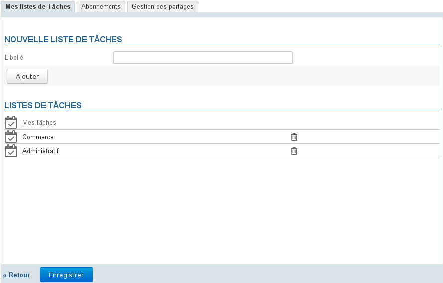
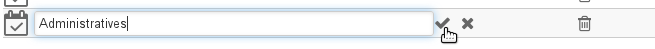
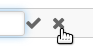
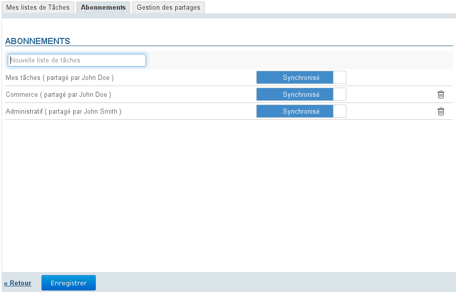

# Aufgabeneinstellungen

## Präsentation

Zum Zugriff auf die Aufgabeneinstellungen zu „Mein Konto“ gehen, indem Sie auf den Benutzernamen rechts in der Navigationsleiste klicken:

## Aufgabenlisten

Die 1. Registerkarte ermöglicht die Verwaltung Ihrer Aufgabenlisten, zusätzlich zur Verwaltung innerhalb der Anwendung:

Standardmäßig hat jeder Benutzer eine private Liste „Meine Aufgaben“, die nicht geändert oder gelöscht werden kann.

### Erstellung

So erstellen Sie eine To-Do-Liste:

- Eingeben einer Bezeichnung
- Klicken Sie auf die Schaltfläche „Hinzufügen“

Die Liste erscheint in der Liste unten und ist somit in der Anwendung zugänglich.

### Änderung

Um eine Liste umzubenennen, auf ihre Bezeichnung klicken, um das Eingabefeld aufzurufen:

Die neue eintragen und bestätigen, indem Sie auf das Häkchen am Ende der Zeile klicken, die Eingabetaste drücken oder das Feld verlassen:

:::tip

solange Sie Ihre Änderungen nicht validiert haben, können Sie auf das Kreuz am Ende der Zeile klicken, um sie zu abzubrechen: 

:::

### Löschung

Um eine Aufgabenliste zu löschen, klicken Sie auf das Papierkorbsymbol   der entsprechenden Zeile:

:::info

In einer Liste enthaltene Aufgaben werden zusammen mit der Liste gelöscht.

:::

## Abonnements

Auf dieser Registerkarte kann der Benutzer gemeinsame oder eigene Aufgabenlisten abonnieren und ihre Synchronisierung für die Verwendung offline oder auf Client Tier (Fat-Client-Software oder Mobilgerät) aktivieren:

Wenn die Synchronisierung für eine Liste aktiviert ist, werden die Daten in die Client-Software hochgeladen. Daher:

|  | Synchronisierung aktiviert | Synchronisierung deaktiviert | Webanwendung und Thunderbird | EAS iOS | EAS (andere) | DAV | Outlook |
| --- | --- | --- | --- | --- | --- | --- | --- |
| die Aufgaben sind offline einsehbar und verfügbar | die Aufgaben sind im verbundenen Modus einsehbar, aber offline nicht verfügbar |
| 
Die Aufgaben sind über die Anwendung  *Erinnerungen* anzeigbar und offline verfügbar
 | die Aufgaben sind nicht anzeigbar |
| 
**wenn das Gerät es zulässt** (siehe Seite[Kompatibilität](/FAQ_Foire_aux_questions_/Compatibilité/) für weitere Details):
- Aufgaben sind anzeigbar
- Aufgaben sind offline verfügbar
 | 
die Aufgaben sind nicht anzeigbar
 |
| Die Aufgaben sind anzeigbar und offline verfügbar |
| - Aufgaben sind sichtbar und offline verfügbar | 

 | - Wenn ein Listenabonnement in Outlook hinzugefügt wird, wird es bei aktivierter Synchronisation automatisch in BlueMind hinzugefügt | die Aufgaben sind nicht anzeigbar |

:::info

Wenn die in einer Liste enthaltene Datenmenge groß ist (mehr als 9000 Aufgaben), warnt eine Meldung vor möglichen Synchronisationsproblemen.

:::

Zum Hinzufügen einer Liste:

- Den Namen der gesuchten Liste eingeben
- Mit der Eingabetaste bestätigen oder in der von der Autovervollständigung vorgeschlagenen Liste wählen
- Falls gewünscht können Sie die Synchronisation deaktivieren
- **Klicken Sie auf die Schaltfläche „Speichern“, um die Änderungen zu speichern.**

So löschen Sie eine Liste:

- Klicken Sie auf das Papierkorbsymbol am Ende der Zeile 
- **Klicken Sie auf die Schaltfläche „Speichern“, um die Änderungen zu speichern.**

:::info

Auf „Speichern“ klicken, um eine Änderung des Synchronisationsstatus zu berücksichtigen und dann **die Synchronisation neu starten (oder auf die automatische Synchronisation  warten) auf der Client-Software**, damit die Änderungen berücksichtigt werden (Herunterladen und Anzeigen von Daten bei Aktivierung, Löschen von Daten bei Deaktivierung).

:::

## Verwaltung der Freigaben

Mit BlueMind können Sie Ihre To-Do-Listen für andere Benutzer freigeben, um sie leicht einsehbar zu machen oder gemeinsame Listen mit Schreibberechtigung zu erstellen.

Die möglichen Rechte lauten wie folgt:

- **Leseberechtigung**: Der Benutzer kann die Aufgaben nur einsehen, indem er die Liste in seiner Kalenderansicht oder in seiner Aufgabenanwendung anzeigt
- **Schreibberechtigung**: zusätzlich zur Leseberechtigung kann der Benutzer Aufgaben in der Liste ändern oder sogar erstellen bzw. löschen
- **Schreib- und Freigabeverwaltungsrechte**: Zusätzlich zu den obigen Rechten kann der Benutzer die Listenfreigaben in seinem Einstellungsverwaltung-Bereich verwalten

Zur Freigabe einer Liste:

1. Wählen Sie die entsprechende Liste aus der Dropdown-Liste oben auf der Registerkarte aus.Ein Benutzer kann freigeben:
    - seine privaten Listen: „Meine Aufgaben“ oder andere erstellte Listen
    - die Arbeitslisten, die an ihn delegiert wurden: die „Schreibberechtigung und Freigabeverwaltung“ wurden ihm gewährt
2. Wenn Sie eine öffentliche Freigabe erstellen möchten, aktivieren Sie das Kästchen „Freigabe für alle Benutzer zulassen“ und wählen Sie die Art der Rechte, die den Benutzern zugewiesen werden sollen
3. ** **Empfohlene Wahl:** ** Wenn Sie Berechtigungen lieber individuell an bestimmte Benutzer oder Gruppen vergeben möchten, suchen Sie die entsprechenden Personen über das Eingabefeld und wählen Sie die zu vergebende Berechtigung.
4. Wenn alle Rechte wie gewünscht zugewiesen wurden, bestätigen Sie durch Klicken auf **„Speichern“**

