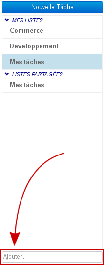
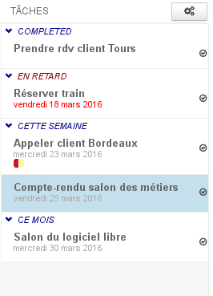
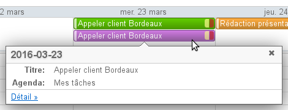
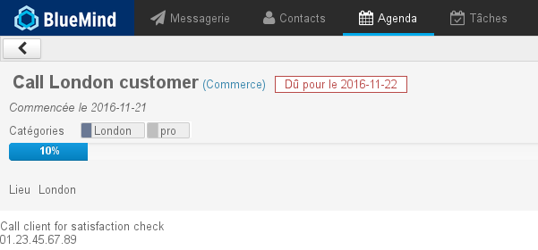

# Die Aufgaben

## Präsentation

BlueMind bietet die Aufgabenverwaltung in einer besonderen Schnittfläche, die mit dem Terminkalender synchronisiert ist.

Organisieren Sie Ihre Aufgaben nach Listen und verwenden Sie Tags, die mit anderen BlueMind-Anwendungen (Kontakte und Kalender) gemeinsam genutzt werden.

Teilen Sie Ihre To-Do-Listen mit Ihren Mitarbeitern, indem Sie ihnen lediglich die Anzeige oder die komplette Verwaltung übertragen.

## Schnittstelle

Die Aufgabenverwaltung ist eine Anwendung mit 3 Spalten:

-    : In der ersten Spalte befinden sich unter der Schaltfläche "Neue Aufgabe" die Aufgabenlisten, die der Benutzer abonniert hat: seine Standardliste "Meine Aufgaben" und andere Listen, die er erstellt hat oder die er (über die Verwaltung der Einstellungen) abonniert hat.
-  : In der zweiten Spalte befinden sich die in der ausgewählten Liste enthaltenen Aufgaben. Die Aktionsschaltfläche am oberen Rand der Spalte gestattet, Aufgaben aus der Liste zu exportieren oder in die Liste zu importieren.
-  : In der dritten Spalte, dem Hauptanzeigebereich, wird das Formular der in der zweiten Spalte ausgewählten Aufgabe angezeigt.

## Aufgabenlisten

Der Benutzer hat standardmäßig eine Liste „Meine Aufgaben“ und kann beliebig viele weitere Listen anlegen. Er kann zudem über seine Einstellungsverwaltung Listen abonnieren, die andere Benutzer mit ihm teilen.

Um eine neue Liste hinzuzufügen, geben Sie ihren Namen in das Feld „Hinzufügen...“ am unteren Rand von  ein und drücken Sie zur Bestätigung die Eingabetaste:

In der Liste erscheinen die Aufgaben nach ihrem Status sortiert in ausklappbaren Unterlisten:

- COMPLETED: listet abgeschlossene Aufgaben auf
- VERSPÄTET: zeigt unerledigte Aufgaben, die ihr Fälligkeitsdatum überschritten haben
- DIESE WOCHE: Aufgaben mit Fälligkeitsdatum in der laufenden Woche
- DIESER MONAT: Aufgaben mit Fälligkeitsdatum im kommenden Monat ab der folgenden Woche

## Die Aufgaben

### Erstellung

Die Taste  ermöglicht den Zugriff auf das Formular zum Erstellen einer Aufgabe, die dann in der aktuellen Liste angelegt wird:

- **Titel: Name oder Zusammenfassung der Aufgabe**
- Startdatum: Datum, an dem die Aufgabe beginnen soll
- Fällig am: Voraussichtliches Enddatum
- Priorität: niedrig, normal (Standard), hoch
- Status: aktueller Ausführungsstatus: nicht gestartet, abgeschlossen, in Bearbeitung, abgebrochen
- Fortschritt: der Prozentsatz der Fertigstellung einer Aufgabe kann während der Ausführung eingegeben werden
- Abgeschlossen am: effektives Enddatum
- Ort
- Tag: Tags werden mit den Kontakt- und Kalenderanwendungen geteilt, die zugänglichen Tags sind die der Domäne oder des Benutzers.
- Beschreibung: ausführlichere Beschreibung der Aufgabe, nützliche oder zusätzliche Informationen
- Alarm: Erinnerung, dass die Aufgabe in Angriff genommen werden muss

Nachdem das Formular ausgefüllt und gespeichert wurde, erscheint die Aufgabe in der Liste und die Schaltfläche  ist am oberen Rand des Formulars verfügbar.

### Änderung

So bearbeiten Sie eine Aufgabe:

- in der Liste anklicken
- die gewünschten Änderungen im Formular vornehmen
- klicken auf  oben links im Ausgabeformular, um zu validieren

So kopieren oder verschieben Sie eine Aufgabe in eine andere Liste:

- klicken auf  oder 
- wählen Sie die gewünschte Liste im Dropdown-Menü
- Klicken  auf  oben links im Bearbeitungsformular, um zu validieren

### Eine Aufgabe abschließen

BlueMind bietet mehrere Möglichkeiten, um eine erledigte Aufgabe abzuschließen:

- klicken Sie auf die Schaltfläche  des Bearbeitungsformulars der Aufgabe
- verwenden Sie die Dropdown-Liste „Status“ im Bearbeitungsformular: 
- klicken Sie auf das Häkchen  im [Aufgabenbereich des Kalenders](#Lestaches-actions-taches)

:::tip

Im Bearbeitungsformular der Aufgabe können Sie im Feld „Beendet am“ das effektive Datum vom Aufgabenende eingeben

:::

### Löschung

So löschen Sie eine Aufgabe:

- klicken Sie auf die Schaltfläche  in der rechten oberen Ecke des Bearbeitungsformulars

:::info

Achtung

 Die Bestätigung der Löschung ist nicht erforderlich, die Aufgabe wird direkt und endgültig gelöscht.

:::

## Integration in den Kalender

Im Kalender werden die Aufgaben in Kalenderform dargestellt. Die Listen werden im Untermenü „To-Do-Listen“ gruppiert und die Aufgaben werden im oberen Teil der Ansicht als ganztägige Termine an ihrem Fälligkeitsdatum dargestellt. Zusätzlich kann der Benutzer einen Bereich auf der rechten Seite der Seite anzeigen, um die Aufgaben in Listenform zu sehen und auf die Hauptfunktionen zuzugreifen:

### Anzeige einer Aufgabe

Wenn Sie auf den Termin klicken, wird eine Zusammenfassung der Aufgabe angezeigt:

Klicken Sie auf den Link „Detail“ für weitere Informationen:

### Bearbeiten der Aufgaben

In der rechten oberen Ecke des Kalenders befindet sich die Schaltfläche  die es ermöglicht, das Aufgabenfeld ein- oder auszublenden:

Unerledigte Aufgaben werden in der gleichen Art wie in der Aufgabenverwaltungsanwendung dargestellt:

- Late (verspätet): Aufgaben, die ihr Fälligkeitsdatum überschritten haben
- Today (Heute): Heute fällige Aufgaben
- This week (diese Woche): Aufgaben mit Fälligkeitsdatum in der laufenden Woche
- This month (diesen Monat): Aufgaben mit Fälligkeitsdatum im kommenden Monat ab der folgenden Woche

Jede Aufgabe wird präsentiert mit:

- dem Farbcode der Liste, zu der sie gehört
- ihrem Titel
- einem Häkchen  um die Aufgabe als erledigt zu markieren, sie verschwindet dann automatisch aus der Kalender- und der Listenansicht
- einem Papierkorbsymbol  mit dem die Aufgabe gelöscht werden kann

:::info

Die Löschung ist sofort und endgültig, eine Bestätigung ist nicht erforderlich

:::

