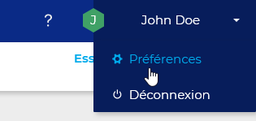
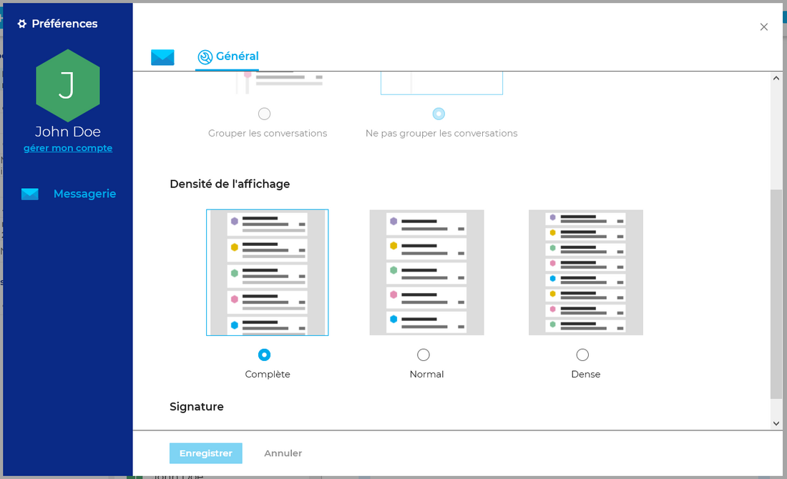
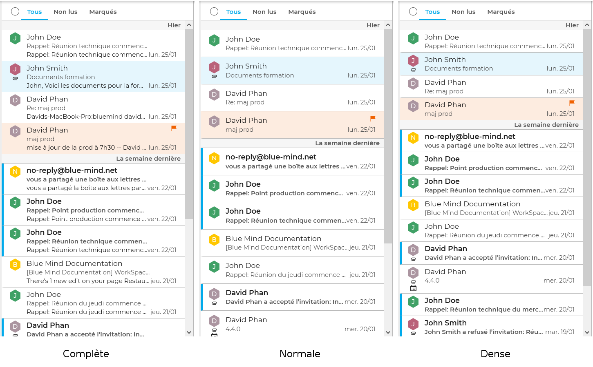
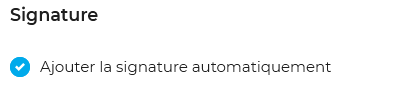
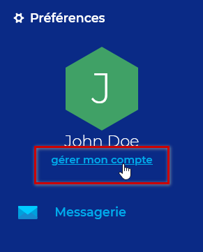

# Webmailer-Einstellungen

## Präsentation

Die Verwaltung der Webmailer-Einstellungen befindet sich noch in der Entwicklung und bietet regelmäßig neue Optionen zur Anpassung der Oberfläche.

## Zugriff

Die Einstellungen sind über das Menü oben rechts auf der Seite zugänglich:

## Anzeige-Einstellungen

Mit der Anzeigedichte kann der Umfang der Nachrichtenübersicht eingestellt werden, um wahlweise mehr Nachrichten oder einen längeren Nachrichtenausschnitt in der Anzeige zu sehen:

## Signatur

Mit der Option „Signatur automatisch hinzufügen“ können die in den [Kontoidentitäten](/old/Guide_de_l_utilisateur/La_messagerie/Les_identités/) eingerichteten Signaturen aktiviert oder deaktiviert werden.

## Allgemeine BlueMind-Einstellungen

Verwenden Sie den Link in der rechten Spalte unter dem Benutzernamen, um zu den [BlueMind-Benutzereinstellungen](/old/Guide_de_l_utilisateur/Paramètres_utilisateur/) zu wechseln:

