# Benutzereinstellungen

## Präsentation

Die Schnittstelle zur Verwaltung von Einstellungen ermöglicht es dem Benutzer, seine BlueMind-Umgebung anzupassen.

Diese Schnittstelle ist über die Navigationsleiste am oberen Rand aller BlueMind-Seiten zugänglich: 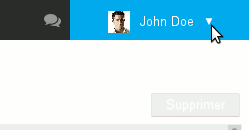

## Mein Konto

Auf der ersten Registerkarte der Seite „Mein Konto“ können Sie die allgemeinen Einstellungen für den Standort und die Anzeige der Anwendung einstellen:

- Die Anzeigesprache
- Die Zeitzone, in der sie sich befindet; damit kann die Anwendung ihre Uhr automatisch einstellen
- Das Format zur Datumsanzeige: Tag/Monat/Jahr oder Monat/Tag/Jahr oder Jahr-Monat-Tag
- Das Format der Uhrzeitanzeige: 24 Stunden („13:00“) oder angelsächsisch („1:00 pm“)
- Die Standardanwendung, die geöffnet wird, wenn sich der Benutzer bei BlueMind anmeldet
- Passwort-Änderung

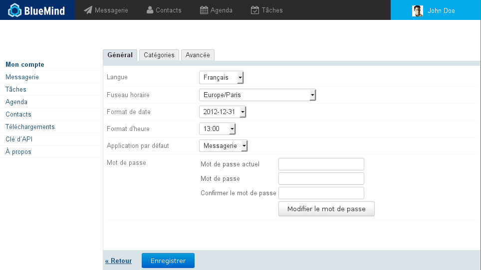

:::tip

Sprachen

BlueMind wird derzeit in mehrere Sprachen übersetzt. Sie können die verfügbaren Sprachen sowie deren Entwicklung auf der Website für die Übersetzung der Anwendung einsehen: [https://forge.blue-mind.net/translate/](https://forge.blue-mind.net/translate/)

:::

## Passwortablauf

BlueMind-Administratoren haben ab BlueMind Version 4.3 die Möglichkeit, eine Passwortablauf-Richtlinie einzurichten:

- in regelmäßigen Abständen: alle Passwörter aller Benutzer müssen nach einer bestimmten Anzahl von Tagen geändert werden
- punktuell: weil das Konto beschädigt wurde, können Sie das Passwort eines Benutzers ablaufen lassen und so den Benutzer zwingen, es zu ändern

In beiden Fällen wird, wenn der Benutzer versucht, sich mit seinem alten Passwort anzumelden, das folgende Formular angezeigt:

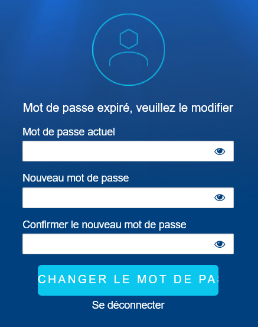Nachdem das Passwort geändert wurde, wird der Benutzer zurück zum Anmeldeformular geleitet und kann sich mit dem neuen Passwort bei BlueMind anmelden.

## Daten zurücksetzen

Die Registerkarte „Erweitert“ auf der Seite „Mein Konto“ ermöglicht den Zugriff auf die erweiterten Funktionen der Einstellungsverwaltung, d.h. das Zurücksetzen der lokalen Daten der Anwendung:

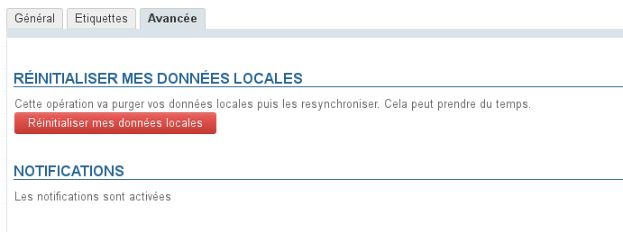

## Benachrichtigungen

Mit den Benachrichtigungen können Sie sich auf dem Bildschirm benachrichtigen lassen, wenn eine neue Nachricht eintrifft, und Sie können sich an Termine erinnern lassen.

Browser, die diese Funktion unterstützen, sind:

- Chrome
- Firefox
- Safari

Nicht unterstützte Browser sind:

- Internet Explorer
- Opera

Notifications d'événement et de nouveau message avec Chrome sous Debian

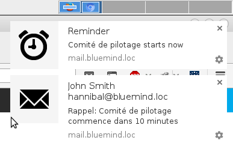

Deux notifications simultanées avec Chrome sous Debian

Wenn Sie auf die Benachrichtigung klicken, wird eine Nachricht in der Mailbox und ein Termin im Kalender geöffnet.

Die Benachrichtigung verschwindet nach ein paar Sekunden von selbst. Um das Schließen zu erzwingen, ohne BlueMind zu öffnen, klicken Sie auf das Kreuz in der oberen rechten Ecke.

### Aktivierung

- zur Registerkarte „Erweitert“ gehen
- klicken Sie auf die Schaltfläche „Benachrichtigungen aktivieren“: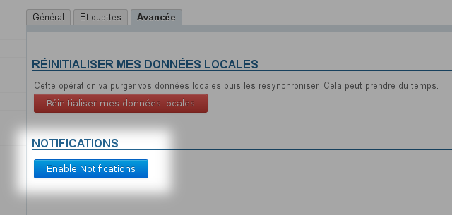
- Bestätigung der Aktivierung in Ihrem Browser
    - Klicken Sie unter Firefox auf das Symbol der Adresszeile des Browsers: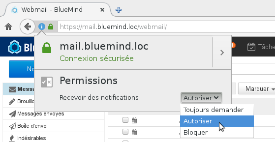
    - Wählen Sie unter Chrome die Option „zulassen“, wenn die Anfrage erscheint: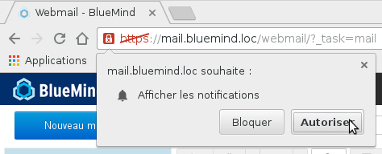

### Deaktivierung

#### Firefox

- Genau wie bei Aktivierung auf das Symbol der Adresszeile des Browsers klicken
- Ändern Sie Ihre Auswahl im Dropdown-Menü der Berechtigungen: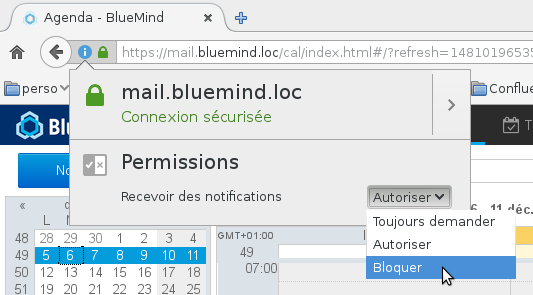

:::info

Die Auswahl von „Blockieren“ verhindert die künftige Reaktivierung von Benachrichtigungen für BlueMind. Wenn Sie auf die Aktivierungsseite in Ihren Kontoeinstellungen gehen, ist die Schaltfläche zwar vorhanden, hat aber keine Wirkung, Sie müssen sie erneut in Firefox autorisieren.

:::

#### Chrome

- Klicken Sie auf das Symbol in der Adressleiste des Browsers
- Suchen Sie die Zeile „Benachrichtigungen“ und ändern Sie die Auswahl des entsprechenden Dropdown-Menüs:

## Downloads

Im Bereich Einstellungen herunterladen können Benutzer den von ihrem Administrator bereitgestellten Thunderbird-Connector herunterladen, um ihre Software zu synchronisieren.

## API-Tasten

In diesem Abschnitt kann der Benutzer Zugangsschlüssel zur BlueMind API generieren, um sein(e) Entwicklungsprojekt(e) zu identifizieren.

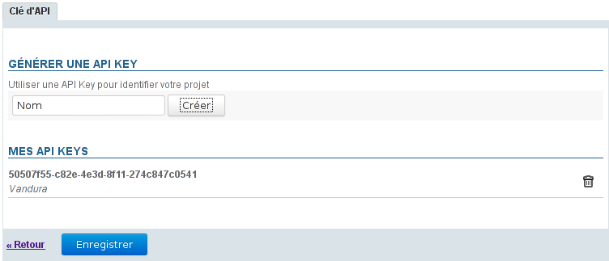

### Erzeugen eines API-Schlüssels

So erstellen Sie einen API-Schlüssel für ein Projekt:

1. Den Projektnamen in das Feld „Name“ eingeben
2. Klicken Sie auf die Schaltfläche „Erstellen“, der Schlüssel wird automatisch und sofort erstellt und in die Liste der API-Schlüssel mit dem entsprechenden Projektnamen aufgenommen und kann kopiert und sofort verwendet werden

### Löschen eines API-Schlüssels

So widerrufen Sie einen API-Schlüssel :

1. Klicken Sie auf das Papierkorbsymbol  am Ende der entsprechenden Zeile
2. Bestätigung der Löschung

:::info

ACHTUNG

Die Löschung ist sofort wirksam, ohne dass Sie auf die Schaltfläche „Speichern“ unten auf der Seite klicken müssen: Sobald der Benutzer die Löschung im Warn-Popup bestätigt, wird der Schlüssel gelöscht.

:::

## Apropos

Dieser Link zeigt den Informationsbildschirm über die installierte Version von BlueMind und die Abonnementinformationen an, sofern vorhanden:

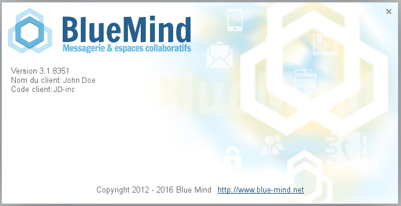

