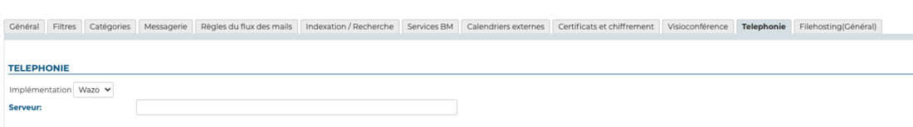

# Setting Up the Wazo Plugin


## Introduction

This document shows how to install and configure the BlueMind plugins that allow interconnexion with Wazo.


## Procedure

1. Install the required packages:
**Debian/Ubuntu**

```
 aptitude install bm-plugin-core-cti-wazo
```

Once they are installed, restart BlueMind:

2. 

```
# bmctl restart
```


## Configuration in BlueMind

### Domain Configuration

Still logged in as global admin0:

- Go to System Management > Modify Domain.
- Select the domain you want to set up to use Wazo.
- In the "Telephony" tab, enter the relay server:
- Save this configuration.


## Uses and integration

To know more about using and integrating telephony in BlueMind, please see user's guide pages:

- [Telephony](/Guide_de_l_utilisateur/La_téléphonie/)
- [Instant Messaging](/Guide_de_l_utilisateur/La_messagerie_instantanée/)


