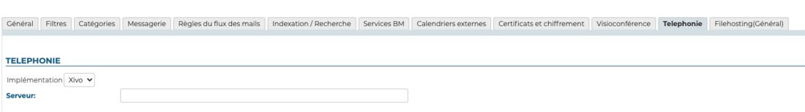

# Setting Up the Xivo/Avencall Plugin


## Introduction

This document shows how to install and configure the BlueMind plugins that allow interconnexion with Avencall's XiVO.


## Configuring Xivo

- create a *Xuc* user in *Services -> IPBX -> Users*
- enable the Xivo client for this user using the following:
    - login: *xuc*
    - password: *0000*
- create a *Web Services user* in *Configuration > Web Services Access* using the following settings:

    - Login: *xivows*
    - Password: *xivows*
    - Host: *empty*
- Make sure that *Multiqueues call stats sharing *is enabled in *Services > Ipbx > Advanced configuration* > *Queues*


## Installing the XiVO plugin for BlueMind

### Prerequisite

The XUC service must be installed on the Avencall server and set up on port 8090.

`/etc/xuc/xuc.conf` contents:


```
XivoWs {
    enabled=true
}
 
api {
    eventUrl = "http://<bluemind.srv.ip:9091/xivo/1.0/event/domain.tld/dropbox/"
}
 
xucami {
    enabled = false
}
```


### Procedure

1. Install the required packages:
**Debian/Ubuntu**

```
 aptitude install bm-plugin-core-cti-xivo bm-xivobridge bm-plugin-webserver-cti
```

**RedHat/CentOS**

```
yum install bm-plugin-core-cti-xivo bm-xivobridge bm-plugin-webserver-cti
```


:::info

In the case of a distributed installation, the `bm-plugin-webserver-cti` package must be installed on the server hosting the `bm-webserver` service.

:::

2. Once they are installed, restart BlueMind:


```
# bmctl restart
```


3. Modify the file `/etc/bm/xivo.ini` with the following information:


```
api.key=<xuc\_api\_key>
xuc.host=<xuc\_host>:8090
```

*Note: XUC's default port is 8090 but it might be 9000 on old XUC server versions*


## Configuration in BlueMind

### Domain Configuration

Still logged in as global admin0:

- Go to System Management > Modify Domain.
- Select the domain you want to set up to use Xivo.
- In the "Telephony" tab, enter the relay server:
- Save this configuration.


## Running a configuration test

You can test this configuration by simulating a XIVO event using CURL:


```
curl -X POST -H 'Content-Type: application/json' http://#BLUEMIND:9091/xivo/1.0/event/#DOMAIN/dropbox/ -d '{"username":"#LOGIN","status":#STATUS}'
```


with:

- #BLUEMIND: BlueMind url
- #DOMAIN : concerned domain (for example blue-mind.net)
- #LOGIN: user login (excluding the domain)
- #STATUS: phone status.


Supported statuses are:

- 0: available (green)
- 2: busy (red)
- 8: ringing (blinking red)


## Uses and integration

To know more about using and integrating telephony in BlueMind, please see user's guide pages:

- [Telephony](/Guide_de_l_utilisateur/La_téléphonie/)
- [Instant Messaging](/Guide_de_l_utilisateur/La_messagerie_instantanée/)


