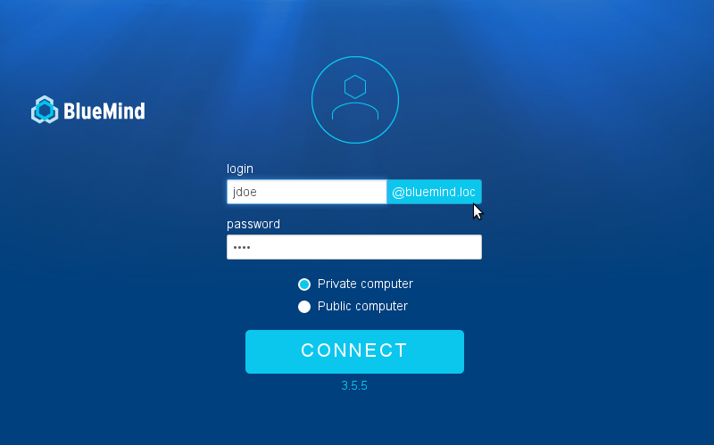

# Setting up a simplified login username


## Introduction

In order to allow users to connect to BlueMind by simply entering their username (leaving out the domain name, e.g. "jdoe" instead of "jdoe@bluemind.loc"), you can set up a default domain on the server side.


:::info

Other domains

When this is set up, users can still connect to another domain. In that case, they must then enter the full domain name (e.g.: jdoe@yellowmind.loc).

:::

## How to configure a default domain

- Edit the file `/etc/bm/bm.ini`, adding the following command line at the end:


```
default-domain=bluemind.loc
```

*NB: replace bluemind.loc* * by the appropriate domain name*

- Restart the service "bm-hps":


```
service bm-hps restart
```


The login page then appears as follows:



Enregistrer

