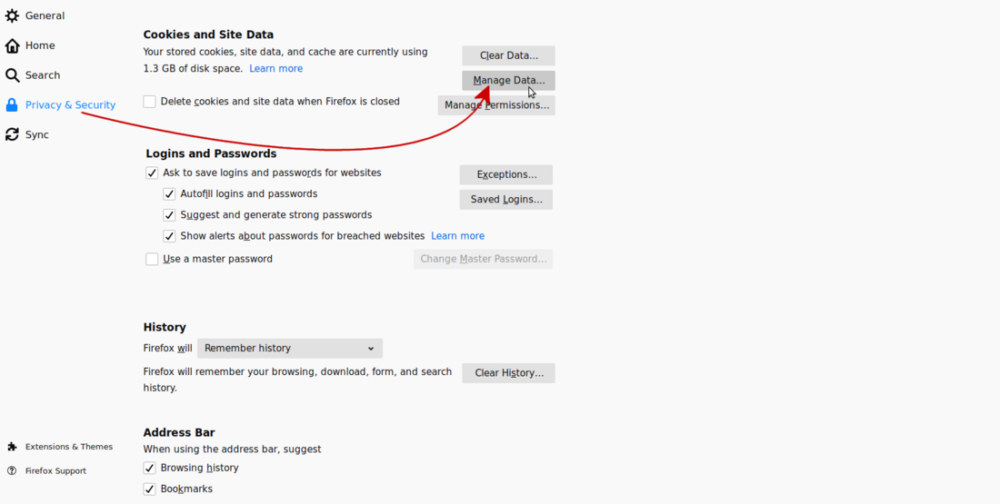
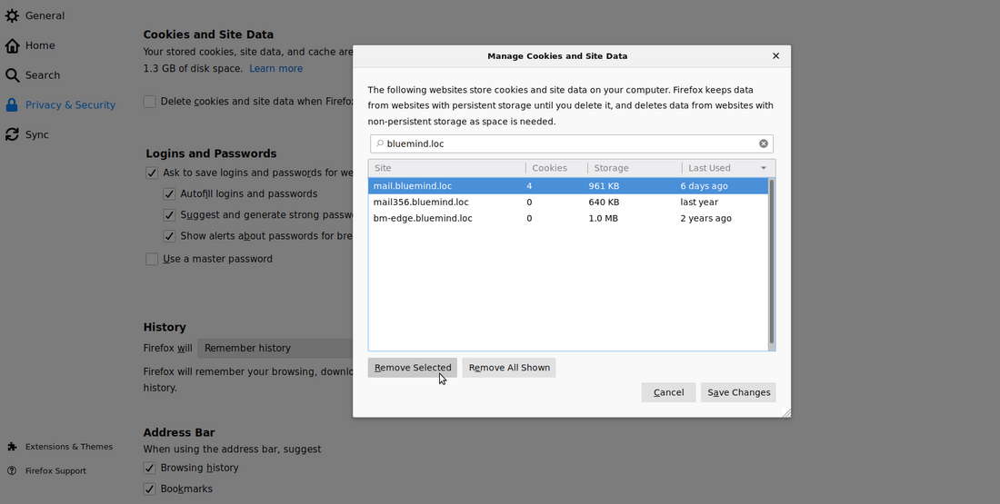
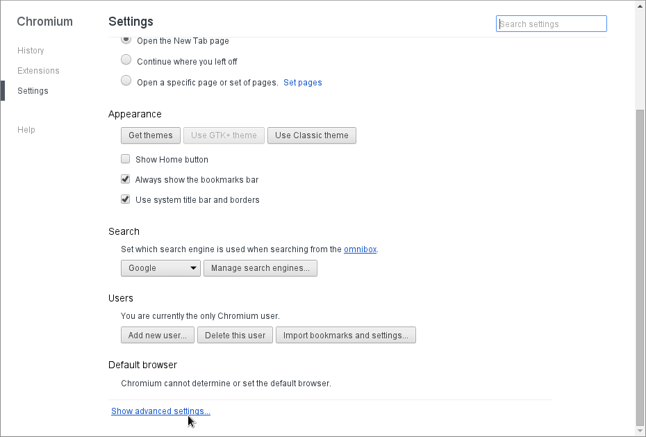
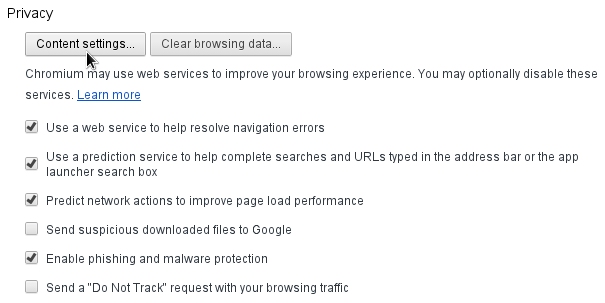
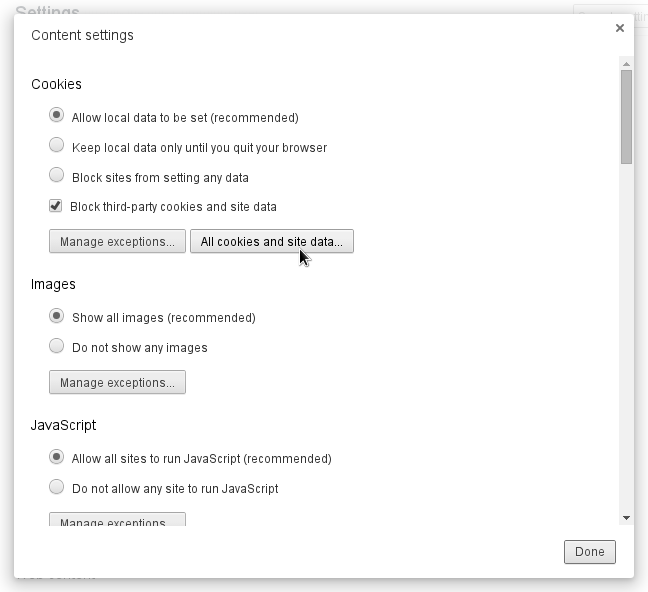
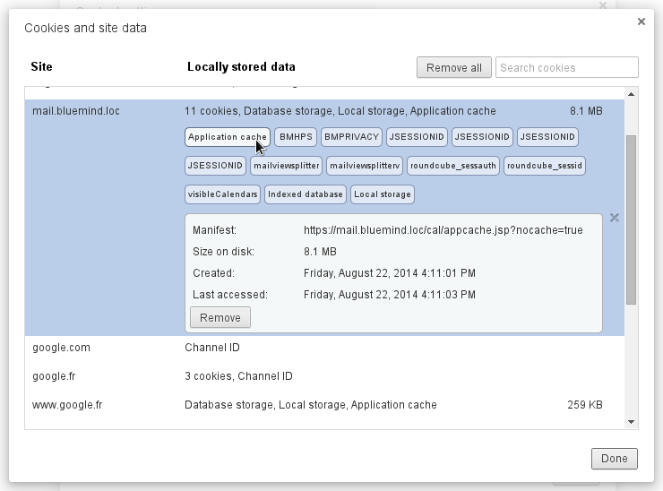

# Clearing the Client Browser Cache

:::info

This operation is done in the user's web browser. It can therefore be done by users themselves.

:::

## Introduction

BlueMind client applications such as Calendar and Contacts are saved in the client browser's cache so that they can run in offline mode.

This is done by the *HTML **appcache *functionality if it is included in the web browser. The cache refreshes automatically, but it can become corrupted by the browser. As a result it is important to be able to clear the cache to force the browser to upload a recent version of applications.

## Mozilla Firefox

- Go to the Firefox preferences page:
    - on Windows: Tools > Options
    - on Linux: Edit > Preferences
    - on Mac OS: Firefox > Preferences
- Go to the section "Privacy & Security" and scroll to "Cookies and Site Data"
- Click "Manage Data":
- Search and select your domain and click "Remove selected":

## Google Chrome

- Go to the Google Chrome settings page
- Click *Show advanced settings... *
- In the *Privacy* section, click *Content settings...***
- Click *All cookies and site data...*
- Select the BlueMind server url in the "*Site" *column
- Click each *Application cache *button, then click *Remove*

## Apple Safari

- Go to *Safari > **Preferences*
- Go to the *Privacy *section****

- Click *Details*
- Select the BlueMind domain for the appropriate server and click **Remove****

## Microsoft Internet Explorer

Available for Microsoft IE 10 and above only.

- Go to *Tools > Security > Delete browsing history* (or press *Ctrl + Shift + Del*)

- Check the boxes *Temporary Internet Files* and *Cookies*
- Click *Delete*

