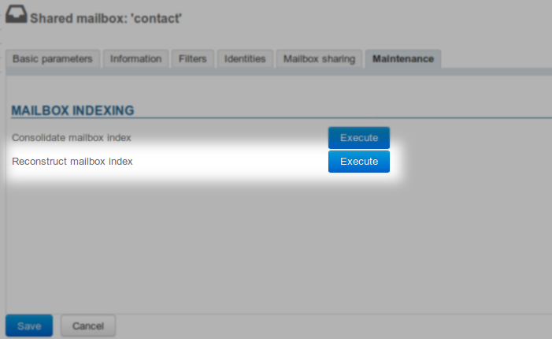

# Sharing read message status in shared mailboxes


:::info

Behaviour change in BlueMind 4.5

This documentation is valid for versions 4.0 to 4.4.x, from BlueMind 4.5 onwards the reading status of the boxes is mandatory shared between users. This behaviour can no longer be modified by administrators and cannot be configured.

:::

## Introduction

The default behavior of shared mailboxes is for the read status of mailboxes to be user-specific: each user has their own status and can see what message they have read or not, regardless of whether other users have opened this message or not.

In some cases, you may want users to have a shared read status for messages so that messages are shown as read when they have been read by a colleague or shown as unread so that they know noone has opened the message.

## Implementation

Read status sharing can be forced through Cyrus. To do this, on the BlueMind host server, connect to Cyrus with cyradm:


```
cyradm --user admin0 localhost --port 1143
```


Then type the following command for **each mailbox** you want to apply this to:


```
mboxcfg "mailbox-name@mydomain.tld" sharedseen true
```


Then you must **reconstruct the mailbox index**:

- Go to the mailbox's admin page in the BlueMind admin console > Maintenance tab > "Reconstruct mailbox index" and execute:




