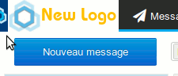

# Custom application logo


The default BlueMind logo, which can be seen on the application's log in screen and in the navigation bar, can now be customized and replaced by any image you choose.

## Customization results

The screenshot below shows how the custom logo will look like in BlueMind:

- on the homepage, instead of the BlueMind logo, the new logo is shown in a white frame. The BlueMind logo still appears below the log in form:
- in the navigation bar, once online, the custom logo is shown in the top left corner.Part of the BlueMind logo can still be seen on the left, and when the user hovers over it the BlueMind logo expands showing the version number being used:


## Image prerequisites

The logo must be:

- in PNG format
- 140x40 pixelsIf these dimension requisites are not met, the image will be resized automatically to fit within the set space, which is why we recommend that you pay extra attention to image size.


The background is dark blue, which means that all transparent areas in the picture will show as dark blue. If you want a different background color, make sure you replace any transparent areas in your picture by the desired color.

## Implementation

### Adding a new logo

Enter the following command:


```
curl -X PUT --header 'Accept: application/json' --header 'X-BM-ApiKey: TOKEN\_ADMIN0' -H "Content-Type: application/octet-stream" --data-binary "@/path/to/logo.png" 'https://mail.bluemind.loc/api/system/installation/logo'
```


Replacing:

- `TOKEN_ADMIN0`: only the admin0 *token* can modify the image.


:::tip

This token can be found in `/etc/bm/bm-core.tok`

:::

- `@/path/to/logo.png`: the path to the image file.
This can be a local path (the file is located on the server on which the operation is being performed) or a remote one.


:::info

You must always keep the @ symbol before the path when using a local path.

:::

- `mail.bluemind.loc`: the relevant BlueMind url.


### Reverting to the original BlueMind logo

To revert to the default BlueMind logo, simply delete the customized logo:


```
curl -X DELETE --header 'X-BM-ApiKey: TOKEN\_ADMIN0' 'https://mail.bluemind.loc/api/system/installation/logo'
```


Replacing:

- TOKEN_ADMIN0: only the admin0 *token* can modify the image. If the *token* is incorrect you will get a "*PERMISSION DENIED*" warning

- `mail.bluemind.loc`: the relevant BlueMind url.


Enregistrer

