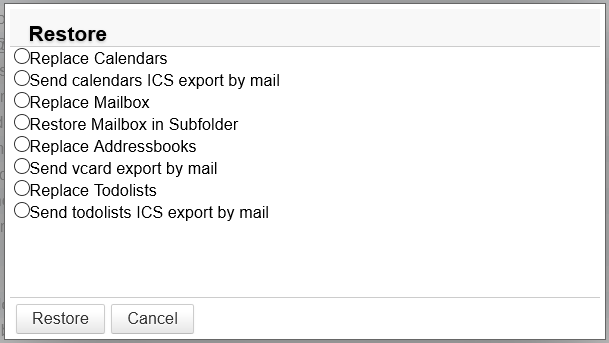

# Restoring a user calendar

## Introduction 

This page shows how to restore a calendar that has been previously backed up by the automatic system, whether backups are stored externally or not.

## Procedure

### Retrieving the backup

If your backup is stored externally, you first have to retrieve it: [Restoring a backup from an external source](/Guide_de_l_administrateur/Sauvegarde_et_restauration/Restauration_unitaire_Navigation_DataProtect/Restauration_d_une_sauvegarde_depuis_un_emplacement_externe/)

### DataProtect restoration

Once the backup is set up, go to the BlueMind admin console > Backup and Restore > DataProtect navigator to [restore a single user.](/Guide_de_l_administrateur/Sauvegarde_et_restauration/Restauration_unitaire_Navigation_DataProtect/)

The backup should be shown in the page – if it's not, click the refresh button at the top of the page.

To restore the calendar:

1. Click the selected backup – the system starts a temporary restoration of the data which allows you to browse through the backup
2. Click Close to access the data
3. Look for the user you want to restore, either by browsing or using the buttons and search box
4. Click "Restore" on the corresponding row
5. A popup of available actions opens:There are two choices for restoring a calendar:
    1. ****Send calendars ICS export by mail****: exports the user's calendar in [ICS format](http://fr.wikipedia.org/wiki/.ics) and sends it to him by email. Unless you [reset the target calendar manually first](/Guide_de_l_utilisateur/L_agenda/Préférences_de_l_agenda/), the file import will add events – items changed and created after the restoration will be kept but there may be duplicates.
    2. ****Replace the calendar's contents****: restores the whole calendar on the date of the backup. All changes (new events, deletions, moves, etc.) will be lost.
6. Check the desired option and click "Restore"
7. The progress is shown in real time in the popup. When the operation is complete a "Close" button is enabled to quit.

