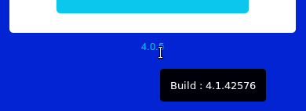
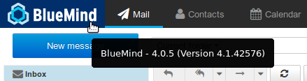
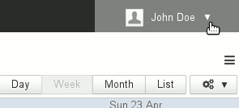
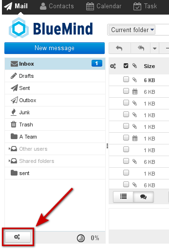

# FAQ


- [General](#FAQ-General)

    - [How can I find out which version of BlueMind I'm using?](#FAQ-HowcanIfindoutwhichversionofBlueMindI'musing?)
    - [What web browsers and versions does BlueMind support?](#FAQ-WhatwebbrowsersandversionsdoesBlueMindsupport?)
    - [What characters are allowed in passwords?](#FAQ-Whatcharactersareallowedinpasswords?)
    - [How does offline mode work?](#FAQ-Howdoesofflinemodework?)

- [Mail](#FAQ-Mail)

    - [How can I make BlueMind my default "mailto:" provider?](#FAQ-HowcanImakeBlueMindmydefault"mailto:"provider?)
    - [Unread messages in my sub-folders are only shown when I view said sub-folder](#FAQ-Unreadmessagesinmysub-foldersareonlyshownwhenIviewsaidsub-folder)
    - [I'd rather reply BELOW the original message ](#FAQ-I'dratherreplyBELOWtheoriginalmessage)
    - [Edit as new message](#FAQ-Editasnewmessage)
    - [I'd like to use different signatures depending on the recipient ](#FAQ-I'dliketousedifferentsignaturesdependingontherecipient)
    - [I have reached my mailbox quota but I can't delete messages to reduce its size](#FAQ-IhavereachedmymailboxquotabutIcan'tdeletemessagestoreduceitssize)
    - [I can't see the priority status of incoming messages](#FAQ-Ican'tseetheprioritystatusofincomingmessages)
    - [My shared mailboxes are not shown in the folders list](#FAQ-Mysharedmailboxesarenotshowninthefolderslist)
    - [What's remote content in messages and why doesn't BlueMind download it?](#FAQ-What'sremotecontentinmessagesandwhydoesn'tBlueMinddownloadit?)

- [Instant messaging](#FAQ-Instantmessaging)

    - [I can't see the instant messaging icon in BlueMind](#FAQ-Ican'tseetheinstantmessagingiconinBlueMind)
    - [I don't know how to clear my conversations history](#FAQ-Idon'tknowhowtoclearmyconversationshistory)
    - [I get an SSL error when I try to connect to the XMPP server with Thunderbird](#FAQ-IgetanSSLerrorwhenItrytoconnecttotheXMPPserverwithThunderbird)

- [Mobility](#FAQ-Mobility)

    - [When I try to create an account I get the message "Incorrect username or password"](#FAQ-WhenItrytocreateanaccountIgetthemessage"Incorrectusernameorpassword")
    - [I can't see directory contacts](#FAQ-Ican'tseedirectorycontacts)
    - [I can't see one of my secondary calendars or a shared calendar on my Android mobile phone](#FAQ-Ican'tseeoneofmysecondarycalendarsorasharedcalendaronmyAndroidmobilephone)
    - [I can't see a shared folder on my mobile device](#FAQ-Ican'tseeasharedfolderonmymobiledevice)

- [Calendar](#FAQ-Calendar)

    - [I can't see a calendar that has been shared with me](#FAQ-Ican'tseeacalendarthathasbeensharedwithme)
    - [I can only see two colors in the summary even though my appointment has several tags](#FAQ-Icanonlyseetwocolorsinthesummaryeventhoughmyappointmenthasseveraltags)

- [Contacts](#FAQ-Contacts)

    - [I can only see two colors in the summary even though my contact has several tags](#FAQ-Icanonlyseetwocolorsinthesummaryeventhoughmycontacthasseveraltags)

- [Administration](#FAQ-Administration)

    - [I have lost the setup wizard's password](#FAQ-swpasswordIhavelostthesetupwizard'spassword)
    - [The login ID entered for a new user is invalid](#FAQ-TheloginIDenteredforanewuserisinvalid)
    - [Scheduled jobs are no longer running](#FAQ-Scheduledjobsarenolongerrunning)
    - [A new user ID is invalid](#FAQ-AnewuserIDisinvalid)

- [Thunderbird](#FAQ-Thunderbird)

    - [I want to empty Thunderbird's browser cache](#FAQ-IwanttoemptyThunderbird'sbrowsercache)

- [Outlook](#FAQ-outlookOutlook)

    - [I need to retrieve Outlook logs](#FAQ-outlook-logsIneedtoretrieveOutlooklogs)
    - [Shared mailboxes aren't shown in the list of user folders](#FAQ-Sharedmailboxesaren'tshowninthelistofuserfolders)


## General

### How can I find out which version of BlueMind I'm using?

The BlueMind version is shown in the application's homepage. Hover over the version number and the technical version number will pop up:



When you're logged into BlueMind, hover over the logo (BlueMind logo or customised logo) in the top right corner of the application and both numbers will be shown (public version and technical version):



### What web browsers and versions does BlueMind support?

The documentation's [Compatibility](/FAQ_Foire_aux_questions_/Compatibilité/) page shows a list of compatible browsers, thick clients and mobile devices, etc. as well as known limitations.

### What characters are allowed in passwords?

Passwords can include upper and lower case letters, numbers and special characters. Accented characters may not be used.

[ **ASCII characters** ](https://en.wikipedia.org/wiki/ASCII) can be used, excluding control characters.

### How does offline mode work?

#### What is offline mode?

Offline mode allows you to continue working with BlueMind when your internet connection is lost either voluntarily (using your internet browser's offline mode if allowed or by disconnecting your computer's internet connection) or involuntarily (network disruption, cable unplugged, etc.). New inputs (new contacts, appointments, meeting acceptances, etc.) are saved in the browser and when you are connected again, the data is synchronized with the server and saved in BlueMind.

#### What applications are supported in offline mode?

Currently, the Contacts, Calendar and Tasks applications are supported.

#### How do I enable offline mode?

Offline mode is enabled automatically when your browser's internet connection is lost (whether voluntarily or not).

When you're offline, your navigation bar's personal menu is grayed out, and when you open it, it reads *"Offline"* and its links are disabled:



#### What web browsers are compatible?

Offline mode is available in Firefox, Chrome and Safari.

Offline mode being reliant on the browser's data storage capacity, some browsers or browser versions do not support his technology (Firefox in Private Mode, Internet Explorer, Edge).

## Mail

### How can I make BlueMind my default "mailto:" provider?

"mailto:" links allow you to open your default mail software composer.

To get the BlueMind composer to open when you click a mailto: link, in a web page or an email for example:

- go to **BlueMind's advanced settings**: in user preferences > Mail section >  *"Email client advanced settings" * link
- in the first "**User Interface" **section, click the link *"Register protocol handler for mailto: links"* 
- confirm authorization when prompted by the browser


To find out more, please go to the page on [Advanced settings](/Guide_de_l_utilisateur/La_messagerie/Préférences_de_messagerie/Préférences_avancées/).

### Unread messages in my sub-folders are only shown when I view said sub-folder

To change this behavior and force BlueMind to retrieve messages from all folders and sub-folders every time it queries the server:

- go to **BlueMind's advanced settings**: in user preferences > Mail section > "* *Email client advanced settings*" *link
- in the "**Mailbox view" **section, check the box *"Check all folders for new messages*"


To find out more, please go to the page on [Advanced settings](/Guide_de_l_utilisateur/La_messagerie/Préférences_de_messagerie/Préférences_avancées/).

### I'd rather reply BELOW the original message 

When you write a message, the original message is quoted underneath by default. To change this and place the original message above the message with your reply below:

- go to **BlueMind's advanced settings**: in user preferences > Mail section > *"Email client advanced settings" *link
- in the "**Composing messages" **section, then "Main options", select your choice from the list "When replying":
    - start new message above original
    - start new message below original


To find out more, please go to the page on [Advanced settings](/Guide_de_l_utilisateur/La_messagerie/Préférences_de_messagerie/Préférences_avancées/).

### Edit as new message

This option allows you to open a message in the composer, without being shown as a reply or forwarded.

To do this, you have two options:

1. right-click the message in the list > "More actions" > "Edit as new"
2. select the message in the list and click the menu "More actions" above the message list "Edit as new"


### I'd like to use different signatures depending on the recipient 

To do this you must create several "Identities" and set up a signature for each. When you send a message, all you will need to do is select the identity you want from the sender box and the corresponding signature will be added.

Identities are also used to customize the display name as well as the email alias used.

To find out more, go to the page on [Identities](/Guide_de_l_utilisateur/La_messagerie/Les_identités/).

### I have reached my mailbox quota but I can't delete messages to reduce its size

This is because when you delete a message using the "delete" button or the "Del" key, it is moved to the trash, and to do this it needs to be copied in a temporary directory. This operation is therefore impossible if the space quota has been reached.  

To free up space in a mailbox whose size quota has been reached, you must delete files directly: select the message(s) you want to delete and type "Shift-Del". You should then be prompted to confirm deletion.

To find out more, go to the page on [Mail](/Guide_de_l_utilisateur/La_messagerie/).

### I can't see the priority status of incoming messages

The Mail application incorporates a message priority status column, but it is not shown by default. To display this column:

- Click the "List options" gears button at the top right of the message list
- Check the "Priority" box in the column list
- Click "Save" to confirm.


Note: The column is added and placed in last position.

To find out more about organizing columns, go the page on [Mail](/Guide_de_l_utilisateur/La_messagerie/) > chapter 4.1 - Columns and sorting.

### My shared mailboxes are not shown in the folders list

In some cases, when a user is given privileges on a shared mailbox, the mailbox is not shown in their folders list. This is due to a bug in the webmail's engine display (Roundcube).

To show these folders, simply display the folders' list action menu:



Having the menu shown on screen should be enough to make the mailbox appear in the list, no further action is required.

### What's remote content in messages and why doesn't BlueMind download it?

Remote content in messages is content that isn't integrated into a message but downloaded from the internet. There are several types of remote content: images, videos, style sheets or scripts. 

By default, BlueMind doesn't download this content from unknown senders to protect your privacy. This is because this content may be used by its author to access information **directly related to your email address **– whether the message has been read (e.g. the time and date it was read but also how many times), about your IT environment (OS, email software, etc.), or about your location through your IP address. This content can also be used to give away the seemingly harmless yet invaluable information that your email address exists and is active by indicating that the image (and therefore the message), has been downloaded. 

By default, however, BlueMind trusts the senders in your address book – remote content from these addresses is automatically displayed when the message is opened. 

A button at the top of a message whose content has been blocked is used to download that message's content only. If you want to enable downloading remote content for all messages, regardless of the sender, go to [Mail - Advanced Settings](/Guide_de_l_utilisateur/La_messagerie/Préférences_de_messagerie/Préférences_avancées/).

## Instant messaging

### I can't see the instant messaging icon in BlueMind

This means that instant messaging hasn't been enabled on your domain, or the administrator has chosen to restrict this service to certain users only.

Contact your administrator or, if you're an administrator, go to the [domain management documentation](/Guide_de_l_administrateur/Configuration/Gestion_des_domaines/) for information on enabling instant messaging.

### I don't know how to clear my conversations history

This is because this feature isn't available in BlueMind's instant messaging application yet.

### I get an SSL error when I try to connect to the XMPP server with Thunderbird

This is because since version 38.0, Thunderbird uses DHE keys.

#### Manual fix

In Thunderbird Preferences > Advanced > Config Editor, set the following settings to 'true':


```
security.ssl3.dhe\_rsa\_aes\_128\_sha
security.ssl3.dhe\_rsa\_aes\_256\_sha
```


A message "Certificate is not trusted because it hasn't been verified by a recognized authority using a secure signature" may appear during connection, this is because BlueMind's SSL certificate is self-signed. Confirm that you want to use this certificate despite this warning.

#### Plugin fix

Install the following add-on which disables DHE keys [https://addons.mozilla.org/en-US/firefox/addon/disable-dhe/](https://addons.mozilla.org/en-US/firefox/addon/disable-dhe/)

## Mobility

### When I try to create an account I get the message "Incorrect username or password"

The server and user information entered is correct, and yet this message appears: this means that your administrator has not authorized connection to external devices.

To fix this there are two options:

1. the global administrator can authorize synchronizations for the whole domain in the admin console > System management > System configuration > "EAS server" tab
2. the domain administrator can authorize user-specific synchronizations in the admin console > Directory browser > select the user > "Devices" tab


In order to connect to BlueMind, you need to get help from an administrator.

To find out more, please go to the Administrator's guide > [Users](/Guide_de_l_administrateur/Gestion_des_entités/Utilisateurs/) or [EAS Server Configuration](/Guide_de_l_administrateur/BlueMind_et_mobilité/Configuration_du_serveur_EAS/).

### I can't see directory contacts

This is because with the Exchange ActiveSync synchronization protocol, only personal address books are synchronized with smartphone contacts. However, addresses from other address books (Directory, Collected contacts...) can be accessed through the smartphone's search features (contacts, emails...)

For more details, go to the page about your device in the section [Synchronizing with mobile phones and tablets](/Guide_de_l_utilisateur/Configuration_des_périphériques_mobiles/).

### I can't see one of my secondary calendars or a shared calendar on my Android mobile phone

Android does not allow viewing several color-coded calendars simultaneously. As a result, only your calendar is shown and works.

You can enable this feature and couple it to a third-party application: [Multiple calendars on smartphones](/Base_de_connaissance/Multi_calendrier_sur_les_smartphones/) (see known limitations on that page). When administrators enable this feature, users can see their secondary calendars on their Android phone. Shared calendars (user or domain calendars) cannot be viewed on smartphones.

### I can't see a shared folder on my mobile device

To access shared folders on a mobile device, you must [subscribe](/Guide_de_l_utilisateur/La_messagerie/Préférences_de_messagerie/#Preferencesdemessagerie-abonnements) to folders first. On Android devices, however, they may sometimes not be shown immediately. 

To display them, you have to force synchronize them first:

1. Go to the **device's** settings (not the mail application settings)
2. Go to the account section.Note: the name of this section may vary from one device to the next – "Accounts", "Accounts and Users", etc.
3. Choose the account for BlueMind syncing
4. Go to sync settings
5. Tap "*Sync now*"Note: Depending on the device, this action may be accessed directly or through a hamburger menu (three dots or bars)


Wait until the syncing process finishes. The folders you are subscribed to should now be shown in the Mail app, under *Public folder* for shared folders.

## Calendar

### I can't see a calendar that has been shared with me

By default, you are only able to see:

- your calendar
- domain calendars


To see another calendar, you must subscribe to it:

- go to the user settings management section > Calendar > "Subscriptions" tab
- look for the calendar you want using the "Add a calendar" text box
- select the calendar suggested by autocomplete
- click "Save" to confirm


For more details, please go to [Calendar preferences](/Guide_de_l_utilisateur/L_agenda/Préférences_de_l_agenda/).

### I can only see two colors in the summary even though my appointment has several tags

For readability reasons, calendar appointments only show two colors at the most.
However, if you hover over it with your mouse, all tags are listed in the tooltip.

For more details go to [Tags](/Guide_de_l_utilisateur/Les_catégories_tags_/).

## Contacts

### I can only see two colors in the summary even though my contact has several tags

For readability reasons, summary contact cards only show two colors at the most.
However, if you hover over it with your mouse, all tags are listed in the tooltip.

For more details go to [Tags](/Guide_de_l_utilisateur/Les_catégories_tags_/).

## Administration

### I have lost the setup wizard's password

You can change the setup wizard's password either through the admin console or in command line, even if you do not know the old password. There are two ways of recovering it:

1. If you access the administration console as global administrator admin0 go to System management > System configuration > "Reverse proxy" tab: enter the new password and save.
2. If you no longer access to the administration console (after BlueMind upgrade, for example), use command line in console mode:
    - connect to the BlueMind server as root and type the following command:

| `rm -f /etc/nginx/sw.htpasswd; htpasswd -b -c /etc/nginx/sw.htpasswd admin admin`
 |

    - connect to the */setup* URL using admin/admin as username/password** **This step is necessary even if you have not reached the update step yet.** **


### The login ID entered for a new user is invalid

New login IDs for new users must comply with the following rules:

- Maximum length: 64 characters
- Allowed characters are:
    - lower-case letters from a to z
    - numbers from 0 to 9
    - the following special characters: . (full stop), - (hyphen), _ (underscore)
- Special characters cannot be placed first


### Scheduled jobs are no longer running

This issue typically occurs after an update during which the bm-setup-wizard package was uninstalled.

To check this, the command below should not return anything:


```
dpkg -l | grep bm-setup
```


If the package does not appear, install it.

If the package is present, contact BlueMind support or ask for help on the forum.

### A new user ID is invalid

Rules for new user IDs are:

- maximum length: 64 characters
- Authorized characters are:
    - lowercase letters from a to z
    - numbers from 0 to 9
    - the following special characters: . (fullstop), - (dash), _ (underscore)
- Special characters cannot be placed in first position.


## Thunderbird

### I want to empty Thunderbird's browser cache

When restarting the connector fails to resolve display issues, in particular if an error is visible in logs, you can reset the cache manually:

- in Thunderbird, open the calendar tab
- go to Tools > Clear Recent History
- select "Everything" in the drop-down menu and check all the boxes
- click "Clear now"
- close Thunderbird's calendar tab


## Outlook


:::tip

For further investigations and resolving Outlook-related issues, please refer to our dedicated guide [Resolving issues with Outlook](/Guide_de_l_administrateur/Résolution_de_problèmes/Résolution_des_problèmes_avec_Outlook/)

:::

### I need to retrieve Outlook logs

**On the client software side**, any log issues will be in Outlook, in the folder "Sync issues".

**On the server side**, there are 2 relevant files:

1. the general log file `/var/log/bm-mapi/mapi.log`
2. the activity file `/var/log/bm-mapi/activities.log`


### Shared mailboxes aren't shown in the list of user folders

You don't need to subscribe in Outlook to the folders shared with you, they are automatically shown in the *Public Folders *section.

Public folders can be found by clicking the three dots at the bottom of the Outlook navigation pane:


Enregistrer

Enregistrer

Enregistrer

