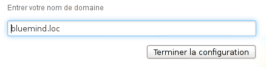
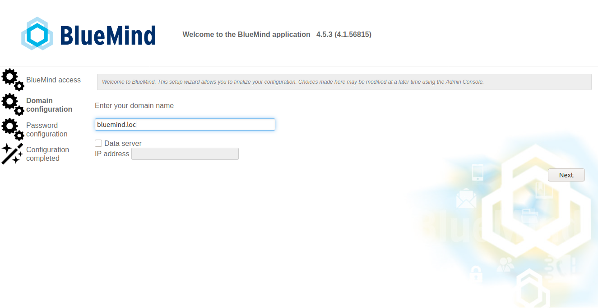
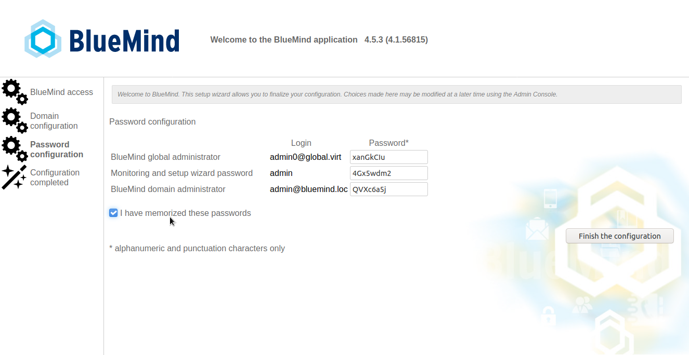
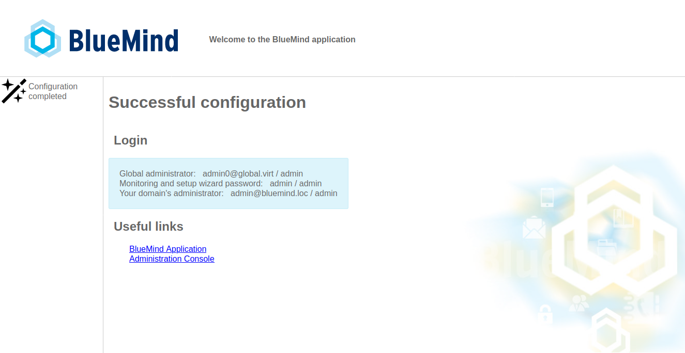

# Post-installation Configuration


# Setting up BlueMind

Once BlueMind is installed on your Linux distribution, use your web browser to visit the set up page. Enter the following address (including http**s**): **  [https://your.mail.server/setup](https://your.mail.server/setup).  **

Then let the wizard guide you through installation:

**  **

1 
** **Prerequisites check:** **
:::important

A warning may appear when the server has been assigned the minimum memory required. This is merely a non-blocking warning as a result of memory calculation, setup can go on regardless.

If an issue blocking installation is detected, a red error message appears and the "Continue" button is unavailable.

:::

1 ****BlueMind URL:****** **enter your public BlueMind url and click "Test access" to confirm. If all tests are successful, the "Next" button is enabled:
1 ** **Domain name**:** check the mail domain name and change it if necessary, then click "Next"If a [data server is used for data distribution](https://forge.bluemind.net/confluence/display/BM4/Installation+multi-backend), check the "Data server" box and enter its IP address.****
1 ****Passwords**: **from version 4.5.3, the system lets you customize installer-defined passwords.In addition, an extra safety step helps you not lose them inadvertently: until the box "I have memorized these passwords" isn't checked, the "Finish the configuration" isn't enabled. ****
1 **Installation is complete **and the application's connection details are displayed:
1 
**Restart** the BlueMind service:


```
bmctl restart
```


:::important

Make sure you secure administrator passwords!

For versions earlier than 4.5.3 for which the installer doesn't let you check and customize passwords, admin passwords ([admin@bluemind.lan](mailto:admin@bluemind.lan) in this instance) and admin0 ([admin0@global.virt](mailto:admin0@global.virt)) MUST be changed on production installs.

Unsecured passwords may be used maliciously to access **your server data** or use your server **to send SPAM** via the SMTP service. 

:::


# Subscription

If you have a [BlueMind subscription](https://forge.bluemind.net/confluence/display/BM4/La+souscription+BlueMind), you must now [install](https://forge.bluemind.net/confluence/display/BM4/Mise+en+oeuvre+de+la+souscription) it to enjoy related tools and be able to [work with Outlook](https://forge.bluemind.net/confluence/display/BM4/Mise+oeuvre+de+MAPI+pour+Outlook).

# Additional Components

Some additional components are not included in BlueMind's default install and require you to install extra packages.

## Detaching email attachments

BluMind version 3.5 introduces the possibility to [send email attachments](https://forge.bluemind.net/confluence/display/BM4/Fichiers+volumineux+et+detachement+des+pieces+jointes) as download links.

To find out more about installing and setting up BlueMind, go to our page about [linked attachments](https://forge.bluemind.net/confluence/display/BM4/Detachement+des+pieces+jointes).

## LDAP Import

To implement user and group import from an LDAP directory, go to the page [LDAP Synchronization](https://forge.bluemind.net/confluence/display/BM4/Synchronisation+LDAP)

## Subscription-based Components

The BlueMind subscription includes additional tools and features:

- the ActiveDirectory import tool.


To find out more, go to the page [Implementing the subscription](https://forge.bluemind.net/confluence/display/BM4/Mise+en+oeuvre+de+la+souscription)

# Provisioning

After BlueMind is installed, to insure best performance, some settings need to be configured according to your equipment and the number of users, namely:

- number of IMAP processes: In the admin console, go to the [System Configuration](https://forge.bluemind.net/confluence/display/BM4/Configuration+Systeme) page - chapter 1.2: Cyrus
- nginx workers: In the admin console, go to the  [System Configuration](https://forge.bluemind.net/confluence/display/BM4/Configuration+Systeme)  page - chapter 2: Reverse proxy


# Data migration

For data migration to be successful, it must be carried out from server to server using data export/import tools.

Any data transfer carried out by users or through thick clients (Outlook, Thunderbird) can be tricky in terms of volume and may lead to user data inconsistencies in the new instance of BlueMind.

For each type of data, we therefore advice you to use the following:

- Contacts: VCard exports and imports
- Events: ICS imports/exports
- Emails: depending on the source server, imapSync, Exchange or Domino migration tool.


Please ask BlueMind or your BlueMind partner for help with data migration.
:::important

PST Import

Reminder: with version 4.0, just like 3.5, DO NOT use PST import in Outlook to migrate data.

:::


