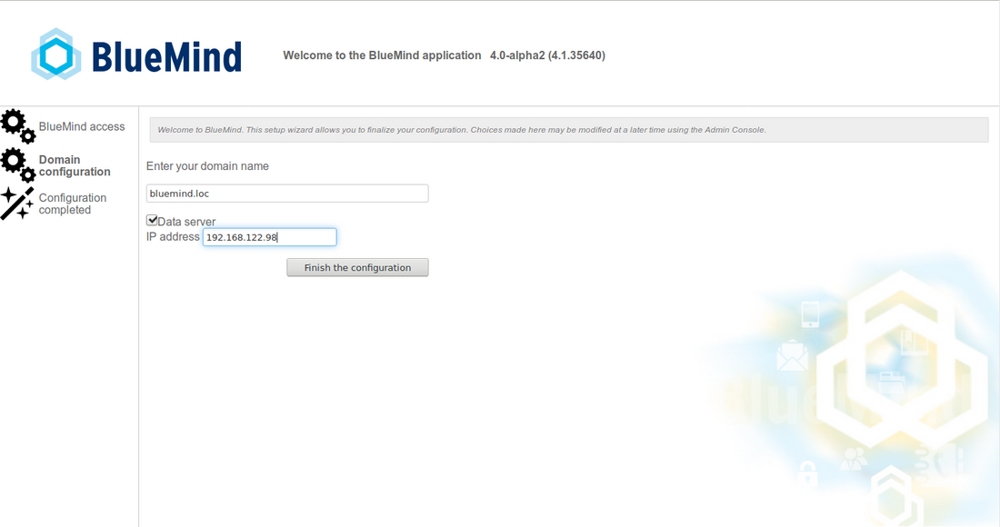
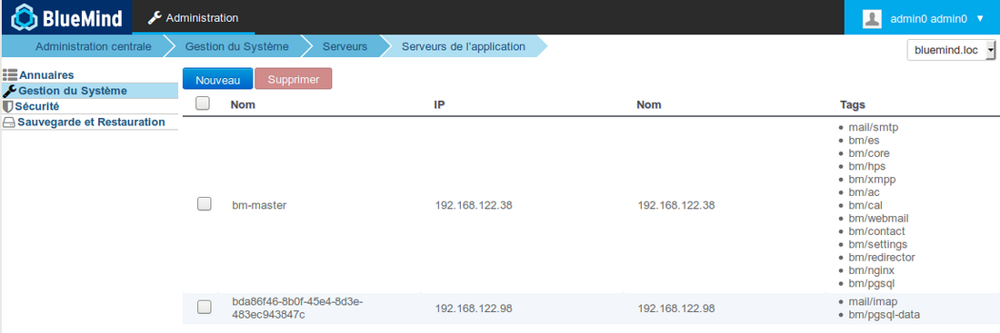
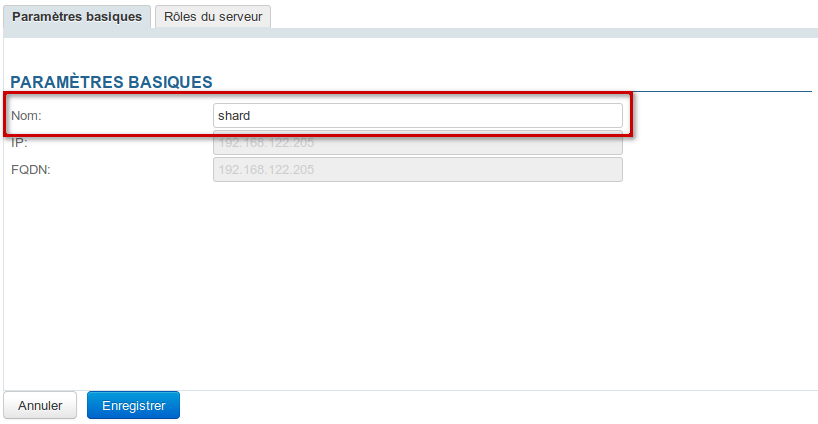

# Multi-backend installation


## Presentation

BlueMind 4.0 allows, in addition to the distribution of user emails, to distribute all user data on several servers which now contain a database in addition to cyrus.

Thus, when the administrator chooses to place a user's data on a server, it is no longer only his or her messages that will be placed on that server, but also all of that user's data that will be placed in that server's database (contacts, appointments, settings, etc.).


## Installation

### Prerequisites

Have 2 machines [installed and up to date](/Guide_d_installation/Prérequis_à_l_installation/) in a supported OS:

- main machine that will receive BlueMind
- secondary machine which will be used as a server to store user data


:::tip

It is possible to spread the data over several storage servers, it will be sufficient to repeat the preparation of the storage server on each of them.

This can be done before or after the installation of the main server, the order is not important.

:::

### Procedure

#### Preparing the storage server

On the secondary server, intended to receive the data :

1. drop the subscription in `/etc/apt/sources.list.d/bm.list`
2. install the package `bm-mailbox-role` :


```
aptitude install bm-mailbox-role
```

The following message may appear depending on the packages already installed or not on your system:


****
 Expand source


```
root@shard:~# aptitude install bm-mailbox-role
The following NEW packages will be installed: 
  bm-conf{a} bm-cyrus{a} bm-cyrus-imapd{a} bm-jdk{a} bm-lmtpd{a} bm-mailbox-role bm-maintenance-snzip{a} bm-maintenance-tools{a} bm-milter{a} bm-node{a} bm-pimp{a} bm-postfix{ab} 
  bm-postgresql{a} bm-tika{a} bm-ysnp{a} db-util{a} db5.3-util{a} emacs25-bin-common{a} emacs25-common{a} emacs25-el{a} emacs25-nox{a} emacsen-common{a} iftop{a} keyutils{a} 
  libasound2{a} libasound2-data{a} libgnutls-openssl27{a} libgpgme11{a} libjansson4{a} liblockfile-bin{a} liblockfile1{a} libnfsidmap2{a} libpq5{a} libsensors4{a} libtirpc1{a} 
  libtokyocabinet9{a} libxi6{a} libxrender1{a} libxtst6{a} mutt{a} nfs-common{a} pgdg-keyring{a} postfix{ab} postgresql-9.6{a} postgresql-client-9.6{a} postgresql-client-common{a} 
  postgresql-common{a} postgresql-contrib-9.6{a} rpcbind{a} sasl2-bin{a} ssl-cert{a} ssmtp{ab} sysstat{a} x11-common{a} 
0 packages upgraded, 54 newly installed, 0 to remove and 0 not upgraded.
Need to get 356 MB of archives. After unpacking 706 MB will be used.
The following packages have unmet dependencies:
 ssmtp : Est en conflit avec: mail-transport-agent which is a virtual package, provided by:
                              - postfix (3.3.0-1ubuntu0.2), but 3.3.0-1ubuntu0.2 is to be installed
                              - exim4-daemon-light (4.90.1-1ubuntu1.1), but it is not going to be installed
                              - exim4-daemon-heavy (4.90.1-1ubuntu1.1), but it is not going to be installed
                              - ssmtp (2.64-8ubuntu2), but 2.64-8ubuntu2 is to be installed
                              - sendmail-bin (8.15.2-10), but it is not going to be installed
                              - qmail-run (2.0.2+nmu1), but it is not going to be installed
                              - opensmtpd (6.0.3p1-1build1), but it is not going to be installed
                              - nullmailer (1:2.1-5), but it is not going to be installed
                              - msmtp-mta (1.6.6-1), but it is not going to be installed
                              - masqmail (0.3.4-1build1), but it is not going to be installed
                              - lsb-invalid-mta (9.20170808ubuntu1), but it is not going to be installed
                              - esmtp-run (1.2-15), but it is not going to be installed
                              - dma (0.11-1build1), but it is not going to be installed
                              - courier-mta (0.78.0-2ubuntu2), but it is not going to be installed
                              - citadel-server (917-2), but it is not going to be installed
                              - postfix (3.3.0-1), but 3.3.0-1ubuntu0.2 is to be installed
                              - exim4-daemon-light (4.90.1-1ubuntu1), but it is not going to be installed
                              - exim4-daemon-heavy (4.90.1-1ubuntu1), but it is not going to be installed

 postfix : Est en conflit avec: mail-transport-agent which is a virtual package, provided by:
                                - postfix (3.3.0-1ubuntu0.2), but 3.3.0-1ubuntu0.2 is to be installed
                                - exim4-daemon-light (4.90.1-1ubuntu1.1), but it is not going to be installed
                                - exim4-daemon-heavy (4.90.1-1ubuntu1.1), but it is not going to be installed
                                - ssmtp (2.64-8ubuntu2), but 2.64-8ubuntu2 is to be installed
                                - sendmail-bin (8.15.2-10), but it is not going to be installed
                                - qmail-run (2.0.2+nmu1), but it is not going to be installed
                                - opensmtpd (6.0.3p1-1build1), but it is not going to be installed
                                - nullmailer (1:2.1-5), but it is not going to be installed
                                - msmtp-mta (1.6.6-1), but it is not going to be installed
                                - masqmail (0.3.4-1build1), but it is not going to be installed
                                - lsb-invalid-mta (9.20170808ubuntu1), but it is not going to be installed
                                - esmtp-run (1.2-15), but it is not going to be installed
                                - dma (0.11-1build1), but it is not going to be installed
                                - courier-mta (0.78.0-2ubuntu2), but it is not going to be installed
                                - citadel-server (917-2), but it is not going to be installed
                                - postfix (3.3.0-1), but 3.3.0-1ubuntu0.2 is to be installed
                                - exim4-daemon-light (4.90.1-1ubuntu1), but it is not going to be installed
                                - exim4-daemon-heavy (4.90.1-1ubuntu1), but it is not going to be installed

 bm-postfix : Est en conflit avec: ssmtp but 2.64-8ubuntu2 is to be installed
The following actions will resolve these dependencies:

     Keep the following packages at their current version:
1)     ssmtp [Not Installed]                              


Accept this solution? [Y/n/q/?] Y
```


 Type "Y" then &lt;Enter> to accept the solution of keeping ssmtp uninstalled so that Postfix can be installed which BlueMind needs


#### Installation and configuration of BlueMind

On the main server:

1. [install BlueMind](/Guide_d_installation/Installation/)
2. During [the Setup Wizard](/Guide_d_installation/Configuration_post_installation/), at the domain configuration stage, check the "Data Server" box and enter the IP of the storage server:
3. Continue with the installation
4. Log in to BlueMind as superadministrator admin0
5. Go to System Management > Application Servers: the secondary server should appear and have the tags mail/imap and bm/pgsql-data :



:::tip

At this stage, the name of the server is a generated name, you can modify it simply in its management form, accessible by clicking on the corresponding line:



:::
In the server management form, in the Roles tab, the "User data" role is checked.

6. Go to System Management > Manage Domains > select the domain > Mail tab: the server is selected as *Mailbox storage server*:


The server is ready to receive data.


