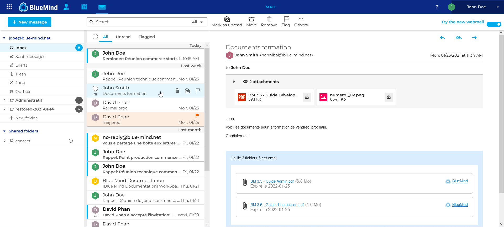
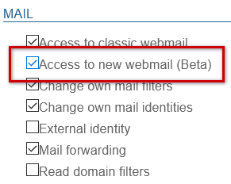
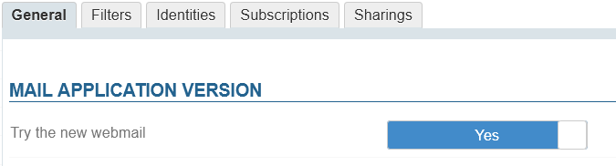

# Installing the new mail client


# Introduction

From BlueMind version 4.4, you can install the new BlueMind mail client for your users to try the Beta version.




# Installation

The BlueMind mail client isn't installed by default. Two dedicated packages have to be installed:


**
Debian/Ubuntu


**
RedHat/CentOS


```
apt install bm-plugin-core-mailapp bm-mail-app
```


```
yum install bm-plugin-core-mailapp bm-mail-app
```


The *core* service has to be restarted:


```
service bm-core restart
```

:::important

Warning, this operation momentarily suspends access to BlueMind and may log users out – and they may lose work in progress. The service must therefore be restarted at a time when users will not be impacted.

:::

# Provisioning

Access to the Beta webmail is ruled by [a role](/Guide_de_l_administrateur/Gestion_des_entités/Utilisateurs/Les_rôles_droits_d_accès_et_d_administration/) – it can be granted to all users or some of them only through user or group role administration.

Once the dedicated packages have been installed, a new role is available in the Mail section:



By selecting either this new role or "Access to classic webmail", you can force users to use one client or the other or let them choose by enabling both.

When you enable both, users will a new button in their interface where they can switch from one to the other:


Users can also switch between clients in the Mail section of their preferences:


:::important

In case a user were unable to switch back to the classic webmail, you can disable it by disabling the role – when the user logs in again, they will be automatically redirected to the classic webmail application.

:::


