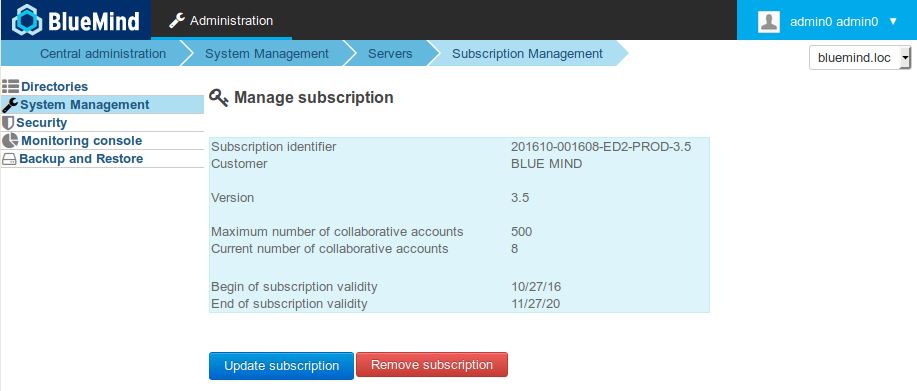
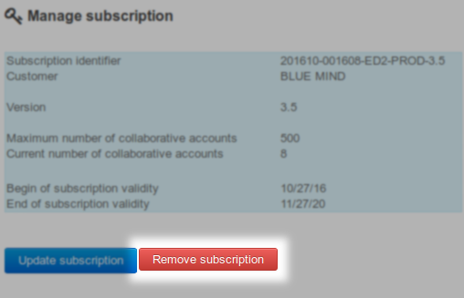

# Setting Up Subscriptions


## Introduction

### The subscription

BlueMind's software is Open Source. The BlueMind subscription is a professional offering designed to simplify and ensure production use and provide better connectivity with Outlook and ActiveDirectory.

### Subscription file

[The BlueMind subscription](/Guide_de_l_administrateur/La_souscription_BlueMind/) comes as a readable text file, which provides a unique key that integrates the subscriber's characteristics, including:

- number of users (for SAAS offerings, the notion of user profiles is also included)


- operating syste*m (see [Pré-requis à l'installation](/Guide_d_installation/Prérequis_à_l_installation/) for more information on supported OS)*

- subscription type:

    - production (Prod and Host)
    - evaluation (Eval)
    - individuals and OpenSource associations (Free)
- expiry date


**This file is readable and signed.**

The information about the subscription is visible.

The file is signed in the headings with the subscriber's details, as a result it must not be modified (except for url repositories), otherwise it risks being invalidated.

If you're using an evaluation subscription, you can modify repository access urls to change distributions.  

If you're using a Prod, Pre-Prod or Free subscription, do not edit the subscription file. You must request it from us in advance, e.g. if you want to change server distributions. We will provide you with a new subscription valid for your new environment.

**Do not distribute or give this file to any third parties**; access to repositories are subscriber-specific and tracked.

## System updates and migration

The subscription file contains the addresses of BlueMind's repositories and can be accessed by the system depending on its version. The file must therefore be updated when the system or BlueMind is updated in order to install the corresponding versions of BlueMind packages as well as the new additional packages.

** **The process is the same as for installation, it is not a simple file update.** **

## Installing subscriptions


:::info

BlueMind must be installed before installing your install the subscription using the [installer available for download](http://pkg.blue-mind.net/bm-download/) on the BlueMind website.

:::

To activate a subscription and additional components, proceed as follows:

1. install the subscription file

2. update packages to get new components

3. configure BlueMind using the new interactive tool


:::info

Perform a complete system backup

BlueMind makes every effort to provide reliable updates. In some special untested cases or due to external factors, however, data may be lost unexpectedly. BlueMind may not be held responsible for any possible update failure leading to system corruption.

It is your responsibility to prevent this risk by performing a complete backup of your system.

:::

### Installing the subscription file

#### Automated installation

- Connect to the BlueMind administration console as global administrator admin0 (username: admin0@global.virt)

- Go to System Management > Subscription management

- Using the "Update Subscription" button, search your computer for the subscription archive and open it.
BlueMind installs the subscription.
**The effect is immediate and doesn't require a service restart.**


:::tip

Even when a subscription is installed, the form remains active in order to allow replacements, e.g. when the subscription expires.

:::


#### Manual installation

- Extraire de l'archive fournie le fichier correspondant à la distribution utilisée
- Renommer le fichier en `bm.list`
- En tant que root, déposer le fichier sur le serveur dans le dossier `/etc/apt/sources.list.d/`
- En cas d'utilisation de serveurs secondaires (edge, archivage, etc.) déposer aussi le fichier sur ces serveurs-là dans le même dossier
- Redémarrer BlueMind pour faire prendre en compte la nouvelle souscription


### Updating software packages

The subscription file contains the addresses of BlueMind repositories and allows them to access the system. As a result, it must be updated in order to install the latest package versions as well as additional packages.

To do this, connect to the server and type in the following commands:


:::info

This operation must be performed on every BlueMind server related to the subscription (production, test or evaluation).

:::


**
Debian/Ubuntu


**
Redhat/CentOS


```
sudo aptitude update
sudo aptitude upgrade

```


```
yum makecache
yum upgrade
```


### Installing new packages

The following packages are now available:

- **bm-setup-wizard**: full-featured version of the Setup and Update Wizard
- bm-connector-outlook* and bm-plugin-core-outlook*: Outlook connector
- bm-plugin-core-ad-import*: ActiveDirectory import tool


* *optional packages, depending on your needs*

On the core server (the one where the BlueMind installation has been performed), install the new packages and restart BlueMind:


**
Debian/Ubuntu


**
Redhat/CentOS


```
sudo aptitude install bm-setup-wizard bm-mapi bm-plugin-admin-console-ad-import bm-plugin-core-ad-import
sudo bmctl restar
```


```
rpm -e --nodeps bm-installation-wizard
yum install bm-setup-wizard bm-mapi bm-plugin-admin-console-ad-import bm-plugin-core-ad-import
bmctl restart
```


### Post-update setup

The update manager tool – Setup Wizard – is now available.

Connect to the wizard with your web browser at **  [https://[your_server_ip]/setup.](#)  **

The Setup wizard loads up and displays the prerequisite status checklist.

- If the Setup Wizard blocks installation, correct the prerequisite and start the installation again
- If the Setup Wizard displays warnings:
    - Resolve the warnings and reload the page /setup in your web browser (access **  [https://[your_server_ip]/setup](#)  **  [  again](#))
    - or click "*Continuer en ignorant les problèmes*" ("Keep ignoring problems"). (This choice isn't recommended, unless you know exactly what you are doing).


If the packages were already up to date, a message indicating that the system is ready for use is displayed. Otherwise, go on to the step below:

Click "*Mise à jour*" ("Update"). 
Next to this button the current version of the data and the new version to which the update will be performed is displayed.


:::info

During the update process, access to the BlueMind application is no longer possible and a warning page informs any users who might try to access it.

:::

The update is executed and when it is complete, the Setup Wizard displays a page "*Configuration réussie*" ("Setup successful") with links to BlueMind.

### Checking installation

Go back to the Administration console > System Management > Subscription Management installation and check that the information contained in the subscription appears correctly.




:::tip

Update Notices

BlueMind subscriptions include updates. Make sure to subscribe to our dedicated newsletter to be kept informed of new versions – updates and upgrades: [https://lists.bluemind.net/mailman/listinfo/bluemind](https://lists.bluemind.net/mailman/listinfo/bluemind)

:::

### Activer les alertes

When the subscription's maximum number of users has been reached (or is close to) or when the subscription's expiry date approaches, information banners will appear in the admin console as well as the BlueMind application and emails will be sent.

To see these banners, users must have the subcription management role. To manage this, go to the user's administration page and grant them the "Manage the subscription" [role](/Guide_de_l_administrateur/Gestion_des_entités/Utilisateurs/#Administrationdesutilisateurs-user-roles).

Users may encounter two situations:

1. they **do not have access to the admin console**, they will receive notification emails. 
2. they **do have access to the admin console**, they will receive notification emails and access the to the administration page that enables them to install and update the subscription


Pour recevoir les alertes par email, les adresses doivent être déclarées dans la page de gestion de la souscription.

For more information about this, go to the dedicated page: [BlueMind Subcription](/Guide_de_l_administrateur/La_souscription_BlueMind/)

## Connecting Outlook

Une fois la souscription et les paquets installés, vous pouvez [mettre en œuvre MAPI pour Outlook](/Guide_de_l_administrateur/La_souscription_BlueMind/Mise_en_œuvre_de_MAPI_pour_Outlook/) afin de permettre aux utilisateurs d'utiliser leur logiciel avec leur compte BlueMind.

## ActiveDirectory Import

If you've installed the package, you can also use the AD import feature. Please go to  [ActiveDirectory Synchronization](/Guide_de_l_administrateur/Gestion_des_entités/Synchronisation_Active_Directory/) for further details.

## Updating subscriptions

Outside system or BlueMind version updates, once a subscription is installed and effective, there is no need to install new packages. Only the new subscription file needs to be installed.

### Updating the new subscription file

#### On the main server

- Connect to the BlueMind Administration console as admin0 (login: * [admin0@global.virt](mailto:admin0@global.virt)*)
- Go to System Management > Subscription Management
- Using the "Update Subscription" button, search your computer for the subscription archive and open it.
BlueMind installs the subscription.****The effect is immediate and doesn't require a service restart**.**


#### Mise à jour manuelle

- Extraire de l'archive fournie le fichier correspondant à la distribution utilisée
- Renommer le fichier en `bm.list`
- En tant que root, déposer le fichier sur le serveur dans le dossier `/etc/apt.sources.list.d/` à la place de l'ancien fichier de souscription
- En cas d'utilisation de serveurs secondaires (edge, archivage, etc.) déposer aussi le fichier sur ces serveurs-là dans le même dossier
- Redémarrer BlueMind pour faire prendre en compte la nouvelle souscription


## Deleting a subscription

When a subscription expires or for any other reason, you can delete subscriptions and go back to using BlueMind subscription-free:

- Log into the BlueMind admin console as admin0 (user login: * [admin0@global.virt](mailto:admin0@global.virt) * * *)
- go to System management > Manage subscription
- Click "Remove subscription":
- Confirm when prompted after having read the terms and conditions
- Restart BlueMind:


```
bmctl restart
```


