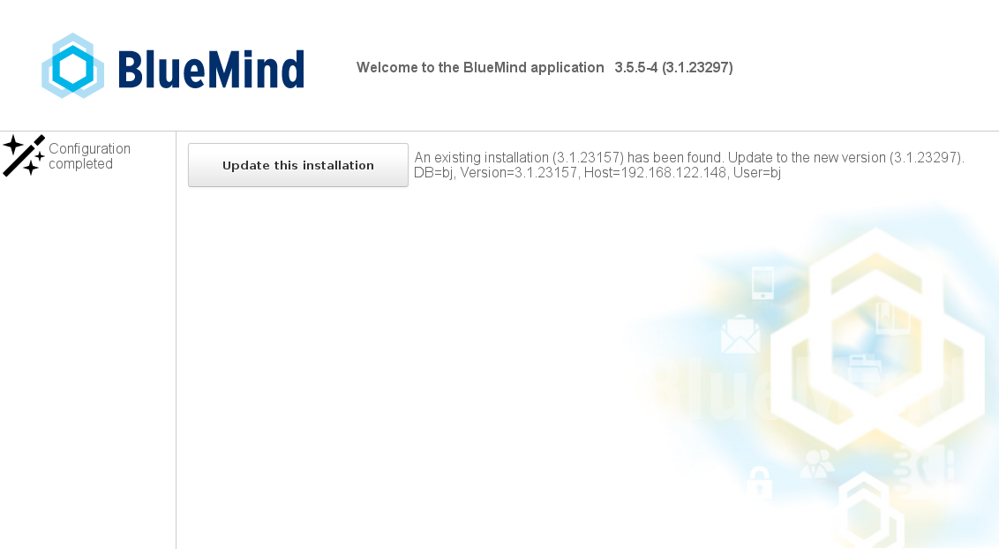
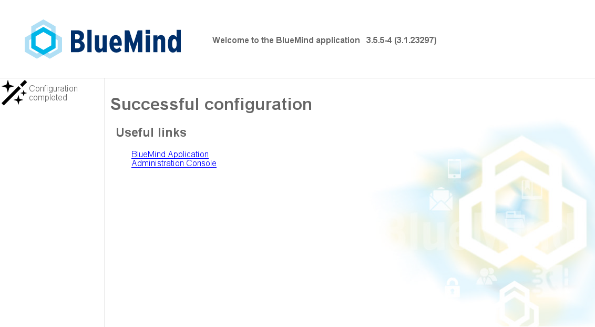

# Updating BlueMind


:::important

Perform a full system backup

BlueMind makes every effort to provide reliable updates. In some special untested cases or due to external factors, however, data may be lost unexpectedly. BlueMind may not be held responsible for any possible update failure leading to system corruption.

It is your responsibility to prevent this risk by performing a complete system backup.

:::
:::important

Linux Upgrades

**Major upgrades of Linux distributions (Debian 7 to Debian 8, etc.) must not be performed using automatic distribution update mechanisms (changing package sources and using the aptitude dist-upgrade command) because this may change BlueMind dependencies which may impact BlueMind services.**

**To perform major distribution upgrades, please contact your integrator service provider or contact us via our ticket platform.**

:::


:::important

New in 4.1: preparing for updates

From BlueMind 4.1 you must prepare for updates in the admin console (System Management > Update BlueMind) before you update packages with aptitude. This extra step is designed for administrators to update their system easily without updating BlueMind.

For more information, administrators should read [3.1 Preparing for updates](#UpdatingBlueMind-prepare-install) below.

:::

# Introduction

The BlueMind subscription includes a simplified, tried and tested update system.

Updating BlueMind to a corrective or adaptive version is made easier, safer and faster thanks to the graphical admin tool.
:::important

Major Upgrades: Migration

Major BlueMind upgrades (e.g. from **v2.x to v3.x or from v3.0.x to v3.5.x**) require software deposit addresses to be updated. The subscription file must therefore be updated for you to perform the version upgrade.

:::

# Prerequisites

## Subscriptions

To access BlueMind update tools, you must have a [valid and current subscription installed](/Guide_de_l_administrateur/La_souscription_BlueMind/).

## Access to the setup wizard

Updates require access to the setup wizard (**https://&lt;your.server.com>/setup**) for which you were provided a password at the end of the [post-installation process](/Guide_d_installation/Configuration_post_installation/).

In case you lost this password, there are two ways of recovering it:

1 Before any installation operation: Access the administration console as global administrator admin0 and go to System management > System configuration > "Reverse proxy" tab: enter the new password and save.
1 Using command line in console mode:
  - 
Log into the BlueMind server as root and type the following command:


```
rm -f /etc/nginx/sw.htpasswd; htpasswd -b -c /etc/nginx/sw.htpasswd admin admin
```


  - Log into the */setup* URL using admin/admin as username/password** **This step is required even if you have not reached the update step yet.** **


## Repository signature

Repositories are now signed for all supported Ubuntu/Debian distributions.

Repository signature is required for Ubuntu 18.04 and Debian 9 which are supported by BlueMind 3.5.9.

You may, if you need or want to, manually import the key on all our supported distributions using the following command:


```
curl https://pkg.bluemind.net/bluemind-deb.asc | apt-key add -
```


Otherwise, a warning may come up during earlier version updates. This will not disrupt or interfere with updates.

## Points of Caution 

We recommend that you carefully read the page [Rolling out BlueMind 4.0: What to Watch Out For](/Guide_d_installation/Déploiement_BlueMind_4_points_de_vigilance/) before any important version update.

### Updating from 4.0 to 4.1

#### Inbox subfolders

In BlueMind versions 4.0.x, folders created in the inbox by Outlook are not mailbox folders but virtual folders.** BlueMind 4.1 brings inbox subfolder support**.

 **When you update from BlueMind 4.0.x to 4.1, virtual folders users may have created will not be migrated and will be deleted.**  To prevent this and keep these folders, we recommend that you move virtual folders outside the inbox before you perform the update. You can them put them back into the inbox where they will be created again as mail folders.

# Update instructions

Repositories are registered as soon as the subscription is installed, as a result, BlueMind will be updated automatically when the system is updated.
:::important
If you've made changes to configuration files manually, make sure you back them up.To find out more, please refer to the Appendices: [note on configuration files](#UpdatingBlueMind-note-conf)
:::

## Preparing for the update

For updates from ****BlueMind version 4.1 or above****, the process must always be prompted. This gives you greater control over versions and reduces the risk of errors: the target version can now be left open to allow updates to the latest published version or, on the contrary, it can be frozen to prevent unintentional updates. This also helps ensure that the server's major version as well as additional packages are conformed to.

This can be done in the admin console:

1 Go to System management > Update BlueMind
1 Click "Setup": **the latest available version will be installed**.


## Update Procedure

The BlueMind update procedure begins with an update of the packages on all the installation's servers using the commands already used for installation. **Steps 1 and 2** therefore must be applied to **all the machines concerned**. Then, the update itself will have to be played just once, by login into the /setup url:
:::important

Advanced administrators can perform update operations in command line using the bm-cli tool.

To find out more, please refer to the page [CLI admin client](/Guide_de_l_administrateur/Administration_avancée/Client_CLI_pour_l_administration/#CLIAdminClient-installation).

:::

1 **Log in as root** on each platform server.
1 
**Update the packages on each:**
:::important

If you want to minimize service downtime, you can pass the update command with the "download-only" option, which enables you to download all the packages ahead of the update.

This does not interrupt or slow down services, which means it can be done at any time of day or night.

You can then run the "upgrade" command at a more convenient time and therefore reduce service downtime.

:::


**
Debian/Ubuntu


**
Redhat/CentOS


**Debian/Ubuntu**

```
## Operations that can be carried out in production
aptitude update
aptitude --download-only upgrade
 
## Operation that puts the service in maintenance mode
aptitude upgrade

```


**RedHat**

```
## Operations that can be carried out in production
yum makecache
yum --downloadonly upgrade
 
## Operation that puts the service in maintenance mode
yum upgrade
```


****Repeat these commands on each platform server.****
:::important

You may get a warning message about repository signature during earlier version updates. This does not disrupt the update, it is a mere warning. To remedy this issue, please refer to [2.3.c: Repository signature](#UpdatingBlueMind-signature-depot) above.

:::

1 
**Go to the setup wizard** https://&lt;your.server.com>/setup 


:::important

Note: this step requires the setup wizard's password - see [paragraph 2.2](#UpdatingBlueMind-setup-passwd) above.

:::

1 Click "Update" to **start the automatic update process**.
1 Once this is done, a message informs you that configuration was successful:


   BlueMind is then available at its usual url.
:::important

In the event of a problem, errors are logged into the *bm-core* and *bm-tomcat* files.

:::

Appendices

## About configuration files

The postfix configuration is overwritten during the installation phase only. From then on, this configuration can be updated using the command postconf.
Configuration files can be configured as desired, with the following restrictions:

- deleting BlueMind maps: maps can however be added.
- editing mynetwork: mynetwork must be edited in the admin console.
- editing relayhost: relayhost must be edited in the admin console.

Concerning NGinx: the virtual host is overwritten with every update. All VHosts are disabled during updates. Only BlueMind VHosts (bm-client-access and bm-webmail) are enabled again afterwards. Other virtual hosts may be enabled again, but this must be done as part of the update process, in addition to and to complete the BlueMind update process.BlueMind's virtual host can also be extended through the /etc/nginx/bm-local.d/*.conf files.


