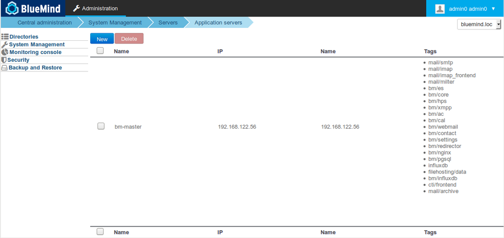
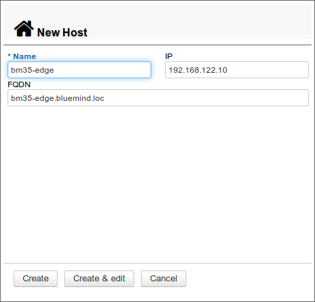
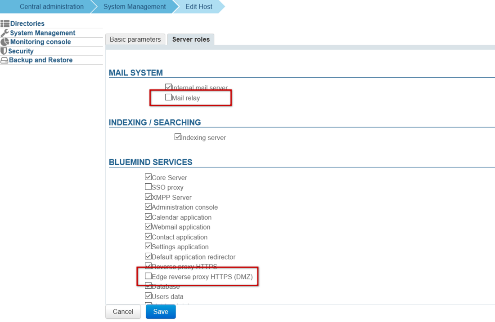
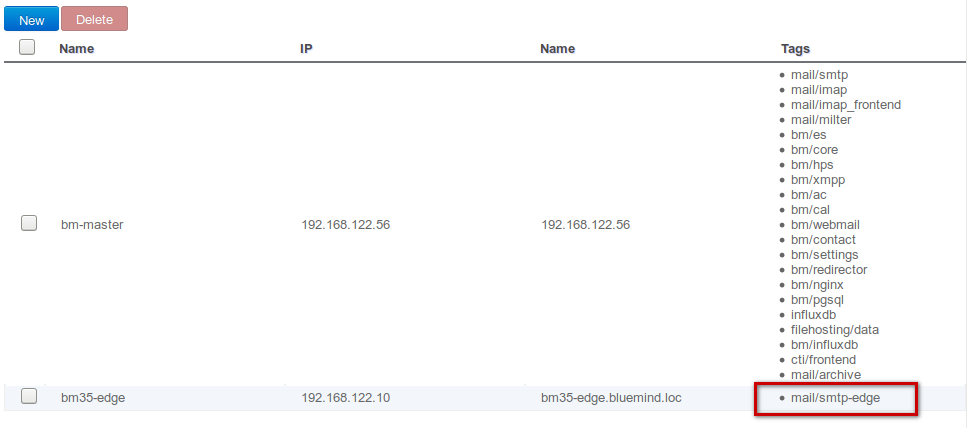
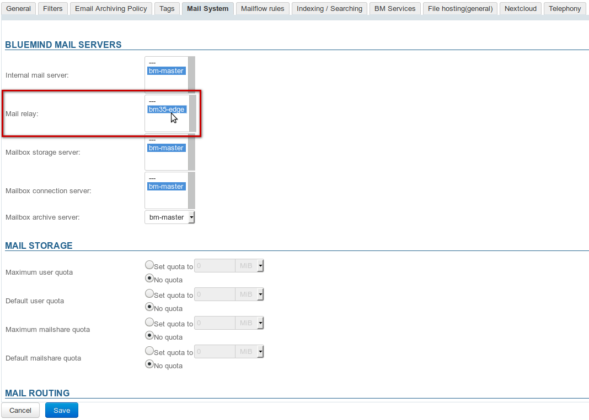
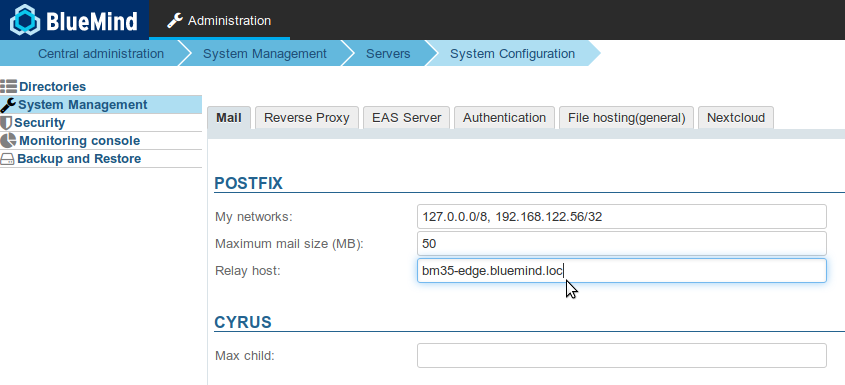

# Installing an Edge server: Nginx and Postfix


## Introduction

This page describes the roll-out procedure for a BlueMind Edge server as a postfix and proxy relay.

## Postulate

- BlueMind is installed on the main server
- the role *bm-edge-role* is installed on the so-called "Edge" server 
- the Edge server's nginx web server is set up as a proxy relay that serves as a main server


| 
 | 
| 
 |  | 
 |
 | 
 | 
 |  | 
 |
| 
 |  | 
 |


## Roll-out procedure

1. Install BlueMind on the main server [following the usual procedure](https://forge.bluemind.net/confluence/display/LATEST/Guide+d%27installation)


:::info

The storage space for BlueMind backups must be accessible on this new server at `/var/backups/bluemind`

:::

2. Install the subscription on the secondary server as a file


:::info

Reminder: the text file for the subscription can be installed on a server manually

- for Ubuntu / Debian as `/etc/apt/sources.list.d/bm.list`
- for RedHat / CentOS as `/etc/yum.repos.d/bm.repo`


:::

3. Install the package `bm-edge-role` on the edge server


**
Debian/Ubuntu


**
RedHat/CentOS


```
bm35-edge.bluemind.loc:~$ sudo aptitude update
bm35-edge.bluemind.loc:~$ sudo aptitude install bm-edge-role
```


```
bm35-edge.bluemind.loc:~$ sudo yum makecache
bm35-edge.bluemind.loc:~$ sudo yum install bm-edge-role
```


4. Add the smtp relay role to the edge server in the main server's admin panel:
    - log into BlueMind on the main server as *admin0@global.virt *
    - browse to *System management > Application servers* 
    - click *New > Host*
    - fill in the information for the new server: 
    - click "Create & edit" or "Create" then click the corresponding row to edit it
    - in the *Server roles *tab:
        - enable the role "Mail relay"
        - **if you are using the BlueMind** nginx on this server, also enable the role "Edge reverse proxy HTTPS (DMZ)"
        - click **Save**
    - back in the servers list, the server is shown with the mail relay tag *mail/smtp-edge*: 
5. Set up the domain so that the edge server is used as a mail relay: 
    - still signed in as *admin0@global.virt*, browse to *System management > Manage domains*
    - click the row for the domain you want to configure
    - in the *Mail system* tab, select the edge server you have created as mail server and click *Save*:**
6. Set up the server to send outgoing messages through the relay:
    - still signed in as *admin0@global.virt*, browse to *System Management > System Configuration*
    - in the *Mail* tab, fill in the *Relay host* field with the IP address or the edge server's host name and click *Save*:**



## Nginx

### Setting up web access


:::info

If you are using the BlueMind nginx, and therefore you have enabled the role "Mail relay" on this server (see above), then this section doesn't apply to you – please move on to paragraph 4.2 below.

:::

1. Log in as root on the edge server
2. Browse to the folder `/etc/nginx/sites-available`:


```
bm35-edge.bluemind.loc:~# cd /etc/nginx/sites-available
```


3. Create a configuration file `bm-proxy` and edit it, e.g. using vim:


```
bm35-edge.bluemind.loc:/etc/nginx/sites-available# vim bm-proxy
```


4. Add the following command lines:


```
server {
  listen 80;
  # <bluemind\_external\_url> is the external url users use connect to
  server\_name <bluemind\_external\_url>;

  location / {
	return 301 https://<bluemind\_external\_url>$request\_uri;
  }
}

server {
  listen 443 ssl http2;
  server\_name <bluemind\_external\_url>;

  ssl\_certificate /etc/ssl/certs/bm\_cert.pem;
  ssl\_certificate\_key /etc/ssl/certs/bm\_cert.pem;
  ssl\_session\_timeout 5m;
  ssl\_prefer\_server\_ciphers on;

  ssl\_protocols TLSv1.2;
  ssl\_ciphers 'EDH+CAMELLIA:EDH+aRSA:EECDH+aRSA+AESGCM:EECDH+aRSA+SHA256:EECDH:+CAMELLIA128:+AES128:+SSLv3:!aNULL:!eNULL:!LOW:!3DES:!MD5:!EXP:!PSK:!DSS:!RC4:!SEED:!IDEA:!ECDSA:kEDH:CAMELLIA128-SHA:AES128-SHA';
  add\_header Strict-Transport-Security max-age=15768000; # six months

 proxy\_set\_header X-Forwarded-For $proxy\_add\_x\_forwarded\_for;

 location / {
	# <internal\_srv> is the main BlueMind server
    proxy\_pass https://<internal\_srv>;
  }

  location /webmail/ {
    client\_max\_body\_size 0m;
    proxy\_pass https://<internal\_srv>/webmail/;
  }

  location /Microsoft-Server-ActiveSync {
    proxy\_pass https://<internal\_srv>/Microsoft-Server-ActiveSync;
    proxy\_read\_timeout 1200s;
    proxy\_headers\_hash\_bucket\_size 128;
    proxy\_headers\_hash\_max\_size 2048;
    client\_max\_body\_size 0m;
    proxy\_pass\_header Server;
  } 

  location /eventbus {
    proxy\_pass https://<internal\_srv>;
    proxy\_http\_version 1.1;
    proxy\_set\_header Upgrade $http\_upgrade;
    proxy\_set\_header Connection "upgrade";
  }

  location /api/filehosting/ {
    client\_max\_body\_size 0m;
    proxy\_pass https://<internal\_srv>$request\_uri;
    proxy\_set\_header        X-Real-IP       $remote\_addr;
    proxy\_set\_header        X-Forwarded-For $proxy\_add\_x\_forwarded\_for;
    proxy\_http\_version 1.1;
    proxy\_buffering off;
  }

  location /api/attachment/ {
    client\_max\_body\_size 0m;
    proxy\_pass https://<internal\_srv>$request\_uri;
    proxy\_set\_header        X-Real-IP       $remote\_addr;
    proxy\_set\_header        X-Forwarded-For $proxy\_add\_x\_forwarded\_for;
    proxy\_http\_version 1.1;
    proxy\_buffering off;
  }

  location /fh/ {
    proxy\_pass https://<internal\_srv>/fh/;
    proxy\_http\_version 1.1;
    proxy\_buffering off;
  }
}

```


5. Save file and exit the editor
6. Run the following commands to set up the configuration:


```
bm35-edge.bluemind.loc:/etc/nginx/sites-available# ln -s /etc/nginx/sites-available/bm-proxy /etc/nginx/sites-enabled/
bm35-edge.bluemind.loc:/etc/nginx/sites-available# rm /etc/nginx/sites-enabled/default
```


7. Reload the nginx server configuration:


```
bm35-edge.bluemind.loc:/etc/nginx/sites-available# service bm-nginx reload
```


### Setting up the mail service

1. On the edge server, copy the main server's configuration file located at `/etc/nginx/global.d/bm-proxy-mail.conf`. You can use scp to do this:


```
bm35-edge.bluemind.loc:~# scp root@srv1.bluemind.loc:/etc/nginx/global.d/bm-mail-proxy.conf /etc/nginx/global.d/
```


2. Edit the file `/etc/nginx/global.d/bm-mail-proxy.conf` on the relay server and replace the IP address in the line `auth_http` by the main server's IP address

3. Reload the nginx configuration:


```
bm35-edge.bluemind.loc:~# service bm-nginx reload
```


### Setting up XMPP

For the server to manage the XMPP flow:

1. create a file `/etc/nginx/global.d/bm-xmpp-proxy.conf` with the following contents:


```
stream {
    upstream backend\_xmpp {
        least\_conn;

                server 1.2.3.4:5222;
                server 1.2.3.5:5222 backup;
    }

    server {
        listen 5222;
        proxy\_pass backend\_xmpp ;
    }
}
```

and replacing 1.2.3.4 by the main server's IP address or the server [with the XMPP role](/Guide_de_l_administrateur/Configuration/Gestion_des_domaines/#Gestiondesdomaines-ServicesBM) if appropriate

2. Reload the nginx configuration:


```
bm35-edge.bluemind.loc:~# service bm-nginx reload
```


## Apache Proxy


:::info

BlueMind advises against using Apache as a reverse proxy.

:::

You can also use Apache as a proxy instead of Nginx. To do this, you need a version of Apache equal to or above 2.4 and enable the following modules:

- mod_ssl
- mod_proxy and mod_proxy_wstunnel
- mod_rewrite


VirtualHost example for Apache:


```
<VirtualHost \*:80>
        Redirect / https://<bluemind\_external\_url>/
</VirtualHost>

<VirtualHost \*:443>
        SSLEngine On

        SSLCertificateFile     "/etc/ssl/certs/bm\_cert.pem"
        SSLCertificateKeyFile  "/etc/ssl/certs/bm\_cert.pem"

        SSLProxyEngine On
        SSLProxyCheckPeerCN Off
        SSLProxyCheckPeerName Off
        SSLProxyVerify none

        # Websocket proxy
        RewriteEngine on
        RewriteCond %{HTTP:UPGRADE} ^WebSocket$ [NC]
        RewriteCond %{HTTP:CONNECTION} Upgrade$ [NC]
        RewriteRule .\* wss://<internal\_srv>%{REQUEST\_URI} [P]

        ProxyPreserveHost On
        <Location />
                ProxyPass https://<internal\_srv>/
                ProxyPassReverse https://<internal\_srv>/
        </Location>
</VirtualHost>
```


