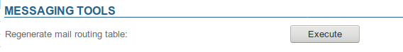

# Mail maintenance

In the admin console, System Management > Maintenance > Manage Messaging system section allows you to force regenerate all postfix maps on all BlueMind servers.

Click "Execute" to run the regeneration:

You don't need to restart the service after this procedure, all changes are effective immediately.

