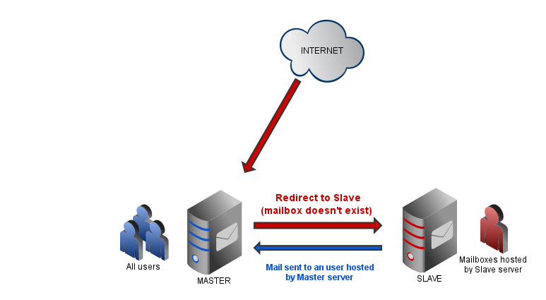
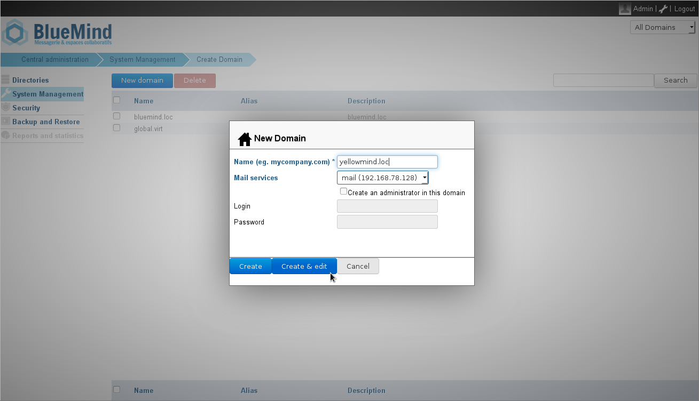
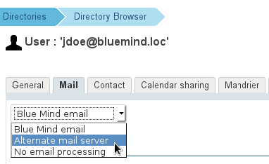
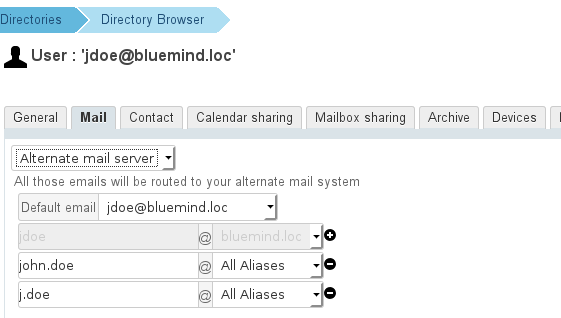
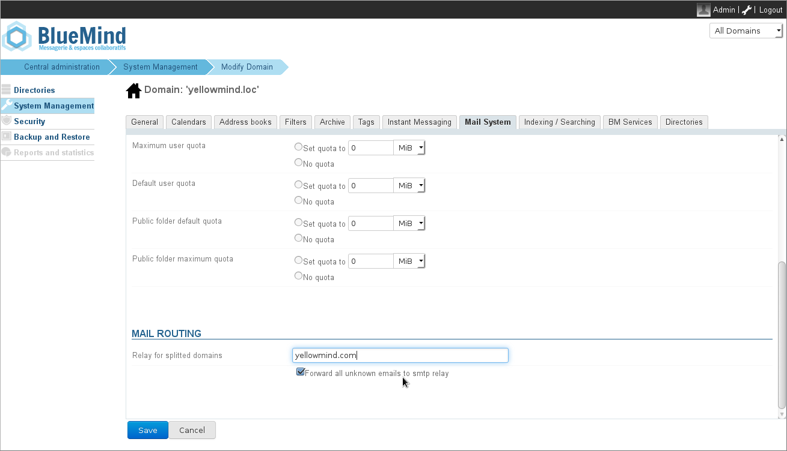

# Routing Messages Directly to Another Domain

# Introduction

BlueMind must be able to handle part of a single domain's users only, in order to integrate into an architecture where a single domain's users are managed by different systems, and as a result, by different mail servers.

A split mail architecture (split domain) has a Master system and a Slave system, and BlueMind is able to serve as either or both:

# Implementation

## BlueMind as master server
:::important

Users must all be known to BlueMind.
Users not hosted by BlueMind must not be able to connect to or use BlueMind.
:::

### BlueMind Configuration

In order for BlueMind to redirect incoming messages directly to the domain that handles recipient addresses (without going through the MX):

- **If the destination domain does not exist in BlueMind yet**, you first need to create it:
  - Logged in as superadministrator admin0, go to System Management > Create Domain.
  - Click "New domain" and enter the name of the domain you want to create:
  - Click "Create & edit" to go straight to the domain management page.
- **If the domain already exists**, go to its management page:
  - Logged in as superadministrator admin0, go to System Management > Modify Domain.
  - Click the domain's name in the list.
- **In both cases** go to the "Mail System" tab > "Mail Routing" section and:
  - In the box "Relay for splitted domains" enter the target domain's name or IP address".
  - for the box "Forward all unknown emails to smtp relay":
    - either all users exist on the BlueMind server and those that haven't been migrated are marked as third-party emails, **then do not check this box**
    - either only BlueMind users are known and you must **check this box** so that email messages sent to users that have not been migrated are rerouted to the old server. 
- Validate by clicking "Save".

### User Configuration

For each user involved, once the user is created in BlueMind, you must specify the mail system type. To do this:

- Connect to the administration panel as superadministrator aka admin0 or one of the user's administrators. 
- Go to directories > Directory Browser.
- Select the user you want to configure and go to the "Mail" tab.
- In the drop down menu at the top of the page, select "Alternate mail server":
- This opens a new form, which allows you to select all or part of the email addresses configured for this user, considering that all incoming messages for these addresses will be routed to the alternate mail server:
- Click "Save" to confirm the changes.

## BlueMind as slave server
:::important
This is a domain-specific redirect. In this type of configuration, addresses unknown to the domain will be redirected to the master relay server.
:::

In order for BlueMind to redirect incoming messages directly to the master server (without going through the MX):

- **If the destination domain does not exist in BlueMind yet**, you first need to create it:
  - Logged in as superadministrator admin0, go to System Management > Create Domain.
  - Click "New domain" and enter the name of the domain you want to create:
  - click "Create & edit" to go straight to the domain management page.
- **If the domain already exists**, go to its management page:
  - Logged in as superadministrator admin0, go to System Management > Modify Domain
  - Click the domain's name in the list.
- Go to the "Mail System" tab > "Mail Routing" section and:
  - In the box "Relay for splitted domains" enter the target domain's name or IP address".
  - **CHECK the box** "Forward all unknown emails to smtp relay"
- Confirm by clicking "Save".

