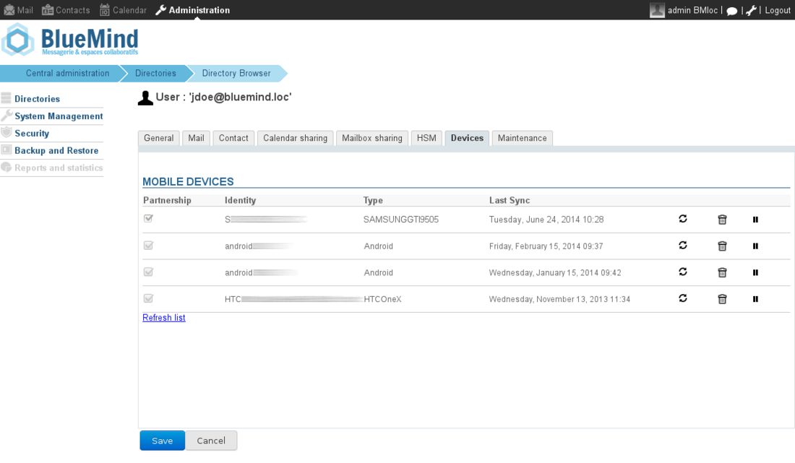

# MDM - Mobile Device Management

Mobile synchronization is done via the ActiveSync protocol which allows native synchronization with no need to install additional components on mobile devices for Mail, Contacts or Calendars.BlueMind incorporates MDM ("Mobile Device Management") services that allow you to manage the fleet of smartphones authorized to connect to BlueMind.By default, smartphones are not authorized to connect via ActiveSync.In the admin console, the administrator can authorize smartphone synchronizations. Authorizations are assigned to one smartphone linked to a user exclusively, it is a partnership.If the smartphone is reused by another employee, the partnership must be authorized again.The admin console offers you several device management options:
- Reset data synchronization, for maintenance or in case of device malfunction.As a result, there is no need to take the smartphone physically to the IT department, this operation can be performed remotely.
- Delete the partnership: the smartphone is no longer authorized to synchronize with the user account.
- Reset the smartphone remotely: this functionality allows **all data to be deleted on the device** (factory reset) and prevents the loss of information in case of theft.

To find out more about EAS server configuration and managing peripheral devices, see the page [EAS server configuration](/Guide_de_l_administrateur/BlueMind_et_mobilite/Configuration_du_serveur_EAS/).

