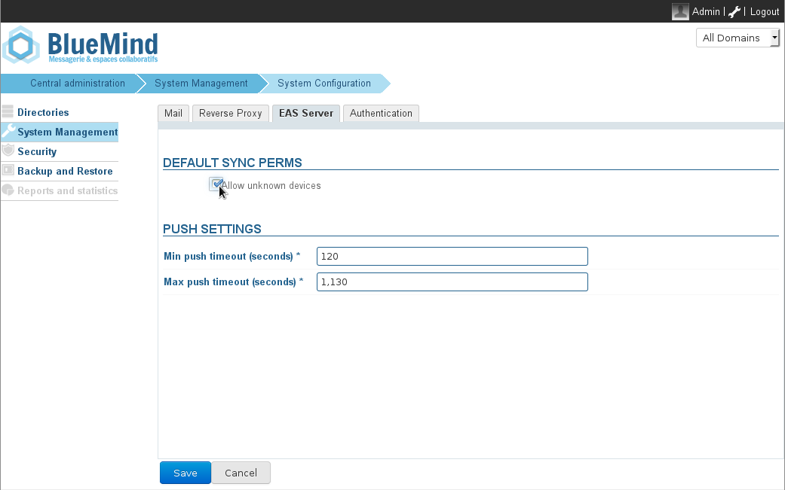

# EAS Server Configuration

# Introduction

The EAS (Exchange ActiveSync) server allows BlueMind servers data synchronization with mobile devices.

For safety reasons, this functionality is disabled for unknown devices by default. It can be enabled in the admin console.

:::important

First synchronization delay

From BlueMind version 3.5.10-3, a cache system has been set up for server performance reasons, which causes a delay in the first synchronization of devices.

Whatever the chosen permission mode (see below), a device's first synchronization will be carried out 10 minutes after it is authorized by the server (whether it is at a device's request or enabled by the admin).

Similarly, when a device's permission is revoked, synchronization will stop 10 minutes later.

This delay cannot be configured or changed.

:::

# Enabling synchronization for all devices

To allow any device to connect to the EAS server rather than authorize each individually:

1 Connect to the BlueMind server admin console as global administrator
1 Go to *System Management > System Configuration*
1 Select the tab *EAS Server*
1 Check the box "*Allow unknown devices" *
1 Click *Save*

# Allow/block a specific device

When unknown device synchronization is not enabled, you can authorize a specific device after it has already attempted to synchronize once.

1 Connect to the BlueMind admin console as global administrator
1 Go to *Directories > Directory Browser* to manage users
1 Click the user whose device you want to authorize
1 Select the *Devices *tab
1 Check the user's mobile devices you want to allow or uncheck those you want to block 
1 Confirm when prompted
1 Click *Save*

:::important

Remove a device

The  icon is used to remove a device's authorization.

:::

# Wiping a device remotely

In case of loss or theft, you can remote wipe a device.
:::important

Remote wiping erases all data on the device, whether it is private (photos, SMS, etc.) or linked to the BlueMind account. **This operation is irreversible.**

:::

1 Connect to the BlueMind admin console as administrator
1 Go to D*irectories > Directory Browser*
1 Select the user whose device you want to erase
1 Select the *Devices* tab
1 Click the icon:   "Remote wipe"  
1 A warning popup window opens. Confirm the operation by typing the device identifier and click *OK*
1 The device is reset to factory settings

:::important
If the device attempts to synchronize with BlueMind again, it will be wiped again.
:::

To allow a new device to synchronize with BlueMind:

1 Connect to the BlueMind admin console as administrator
1 Go to *Directories > Directory Browser*
1 Select the user whose device you want to allow again
1 Select the *Devices *tab 
1 Click the icon:  "Cancel remote wipe..."
1 Confirm to proceed
1 The device is now allowed to synchronize with BlueMind again.

