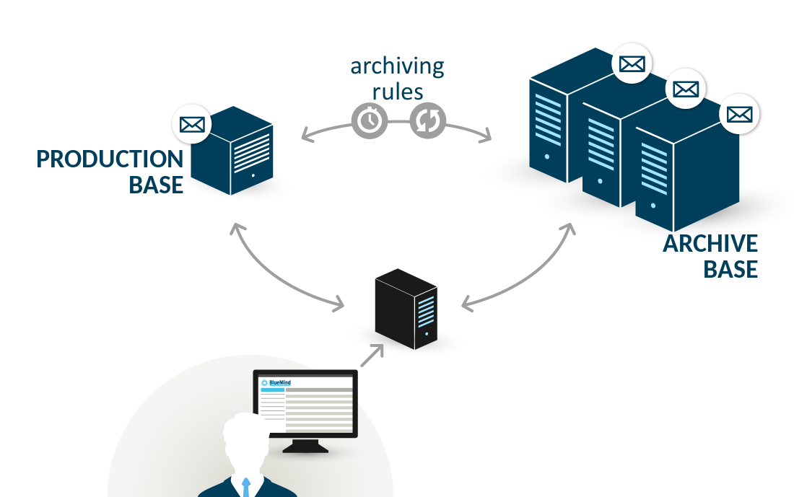

# Archiving

# Introduction

BlueMind has a centralized archiving system. This enables you to take some weight off storage servers by storing some messages (older ones for example) on another server (or a mount point on another storage system) with lower storage costs.

BlueMind uses server-side archiving: this enables you to keep archives together on a single-server, unlike PST archives generated with Outlook which stay on users' machines and must be backed-up.

Hierarchical storage allows you to specify different storage spaces, usually to have extra storage space with lesser performances (and at a lower cost). BlueMind's hierarchical archiving system has the following characteristics:

- archiving rules (messages older than X days, etc.) by user, group and domain.
- archive access from BlueMind webmail and thick clients (Thunderbird, Outlook, etc.).

 In BlueMind 4.0, archiving is completely automatic and transparent, which means that users no longer have an "archiving" button or able to see a message's archive status.

# Implementing an archiving policy

To implement archiving, in the admin console:

- go to System Management > System Configuration > Mail tab
- In the Archiving section, check the box and fill in:
  - Number of days before archiving: the number of days before a message is archived
  - 
Size of messages (MiB): threshold above which messages are archived automatically, without waiting for the number of days set
The default value is 1Mb
:::important

The MiB (Mebibyte) is a multiple of a byte, not to be confused with the MB (megabyte): it is equal to 1024 kebibytes, which itself is equal to 1024 bytes.

Therefore, 9 MiB equals 9,43718 MB.

:::

Archiving runs every day at 4am GMT.

# Setting up an archiving space

The partition must be mounted in the `/var/spool/bm-hsm/cyrus-archives/` folder.

# Changes relative to BlueMind 3.5

Changing the archiving system to a completely automatic system has several consequences. As we've said above, users are no longer able to archive messages manually, but also:

- The archiving policy is the same for all domain users
- 
There are no group or user-specific archiving quotas any more. There is just one quota, archived data is accounted for within this one quota in addition to other non-archived messages.

- The scheduled jobs HSMJob and HSMIndexJob are therefore irrelevant and no longer exist. 

