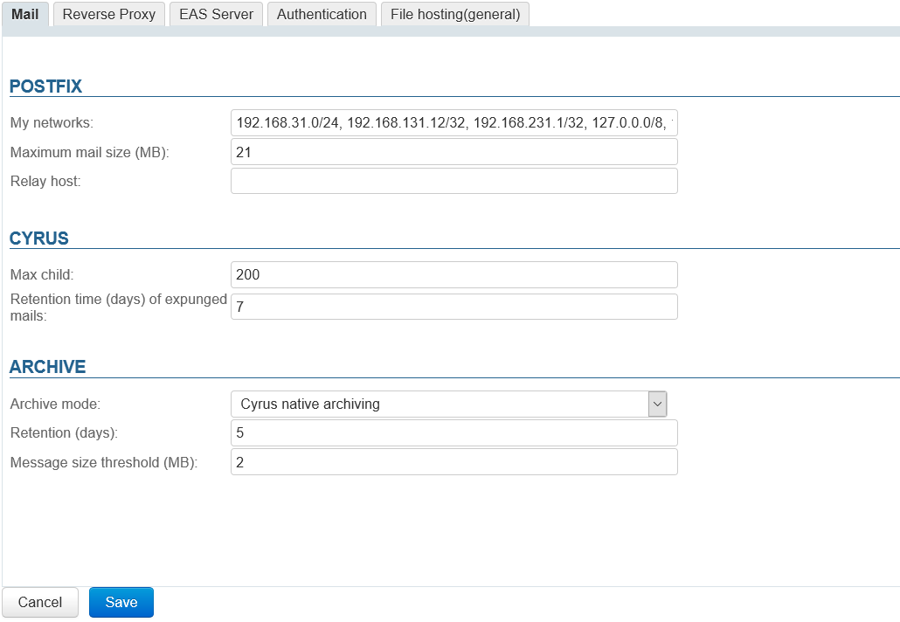
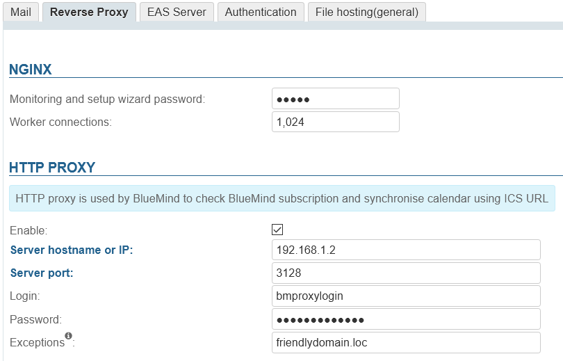
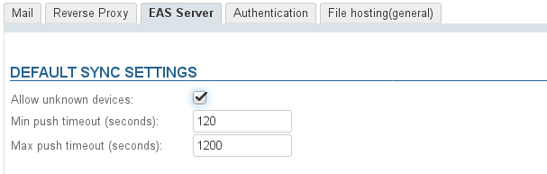
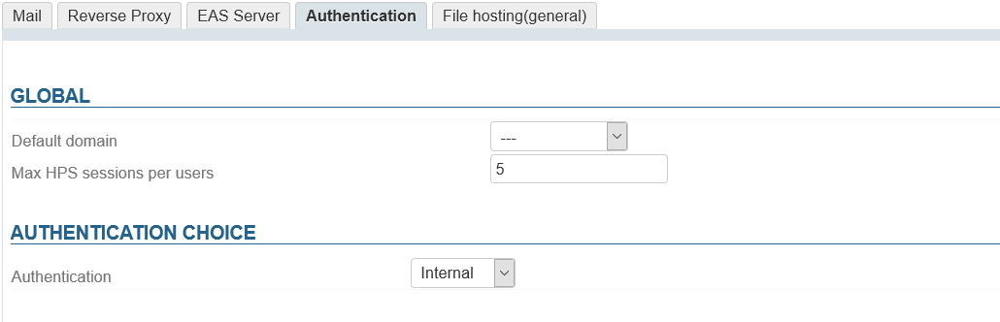
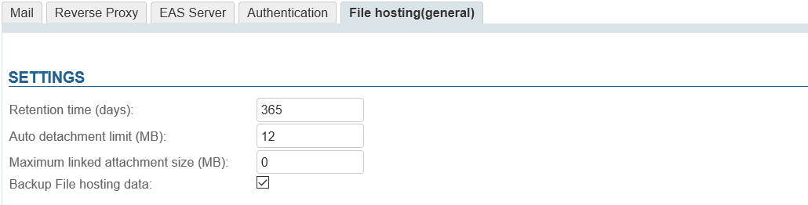

# System Configuration


## Mail

This tab is used to set system postfix and Cyrus settings.



### Postfix

- **My networks** 
The list of "trusted" SMTP clients that have more privileges than "strangers".
Specify a list of network/netmask patterns, separated by commas and/or whitespace, for instance:


```
127.0.0.0/8, 192.168.198.0/24
```

For more information see  [http://www.postfix.org/postconf.5.html#mynetworks](http://www.postfix.org/postconf.5.html#mynetworks).

- **Maximum message size**The maximum size (MiB) of messages that users are allowed to send.


:::info

Warning, this is the size of **messages,** not including the attachments they may contain.

After files are converted to be attached to an email message, their size increases: allow for an extra 50% approximately.
For example, if you want to allow attachments up to 10MB, you must set maximum message size to 15MB.

:::


:::info

Maximum limit

The maximum size of messages handled by BlueMind can't exceed 100MB.

:::

- **Relay** 
Specify the address of the relay through which outgoing messages must pass through.


:::info

The MiB (Mebibyte) is a multiple of a byte, not to be confused with the MB (megabyte): it equals 1,024 kebibytes, which equals 1,024 bytes.

Therefore, 9 MiB equal 9.43718 MB.

:::

### Cyrus

- **Max child** This field sets the maximum number of IMAP processes Cyrus is able to start. By default it is set to 200.It may be useful, and possibly necessary, to increase it, for example if you encounter [identification issues](/Guide_de_l_administrateur/Resolution_de_problemes/Erreurs_d_identification_IMAP/).
- **Retention time (days) of expunged mails** Number of days during which email messages are kept on the server after they are deleted by a user (completely deleted directly or trash emptied). During that time, emails deleted by users can be restored.


### Archiving

A drop-down list is used to choose the archiving method:

- None
- Cyrus native archiving
- S3 object storage


## Reverse Proxy



The "Reverse Proxy" tab is used to configure Nginx as well as a proxy server.

### Nginx

- **The setup wizard's password** generated automatically by BlueMind during[ installation](/Guide_d_installation/Configuration_post_installation/) – this is the password used to access the [update interface](/Guide_d_installation/Mise_à_jour_de_BlueMind/).


:::tip

The administrator who is logged in will not be asked for the old password, which means the password can be changed here in case it is lost.

:::

- **worker_connections**: the maximum number of simultaneous connections that can be opened by a worker process. One worker works for one connection, therefore worker_connections = number of (possible) active connections at the same time. Most of the time, worker_connections = number of users.


:::tip

In order to best adjust this parameter's value to your requirements, you can run the command on the server to find out the number active connections at a given point in time, e.g. during weekdays:


```
ss -p | grep nginx | grep -i estab | wc -l
```


:::

### HTTP Proxy

 In different scenarios – e.g. external calendar queries – some installations require an HTTP proxy server. From version 4.4, an HTTP proxy server can be configured: external queries made by BlueMind use this server when it is configured.

- **Enable**: the server can be disabled by clicking the box without the form being emptied. This allows you to enable/disable the proxy server as needed without having to re-enter the details every time.
- **Server hostname or IP **
- **Server Port**
- **Login**
- **Password**
- **Exceptions**: the queries passed to these domains will not go through the proxy server but will be queried directly by BlueMind.Enter a list of names and/or IPs separated by commas.Note: the "*" character is supported only as a prefix.


## EAS Server

The "EAS Server" tab is used to access the Exchange Active Sync server configuration options, which handles mobile device syncing.




:::tip

If communication problems persist, you can use Microsoft online diagnostic tool to make sure that the server is configured properly: [https://testconnectivity.microsoft.com/](https://testconnectivity.microsoft.com/)

:::

## Authentication

This tab is used to set:

- **The default domain **– in multi-domain installs.
- The maximum **number of HPS session per user**: the number of simultaneous connections on multiple machines/browsers allowed for a single account (mobile devices that connect through EAS are not taken into account).This value is particularly useful for management accounts shared by several people (one contact user account and another admin user account).
- **The authentication method of **users:
    - Internal
    - [SSO CAS authentication](/Guide_de_l_administrateur/Configuration/Gestion_des_domaines/Les_methodes_d_authentification/Mise_en_place_du_SSO_CAS/)
    - [SSO Kerberos authentication](/Guide_de_l_administrateur/Configuration/Gestion_des_domaines/Les_methodes_d_authentification/Mise_en_place_du_SSO_Kerberos/). 


## Filehosting

This tab sets the default values for **newly created domains **– **it does not set or override the values for all domains**.



- **Retention time (days)**: number of days files will be kept on the server, from the original sent date
- **Auto detachment limit (MiB)**: size for which email attachments are automatically added as links
- **Maximum linked attachment size (MiB)**: maximum file size permittedThis is the maximum size permitted **per file**, several files whose total size exceeds the limit can be attached to and detached from a single email message provided each individual file does not exceed the limit.
- **Backup File hosting data**: if this box is checked, the storage folder on the server will be included in BlueMind [backup](https://forge.bluemind.net/confluence/display/BM4/Sauvegarde+et+restauration) tasks.


:::info

The MiB (Mebibyte) is a multiple of a byte, not to be confused with the MB (megabyte): it equals 1,024 kebibytes, which equals 1,024 bytes.

Therefore, 9 MiB equal 9.43718 MB

:::


