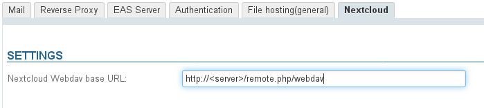
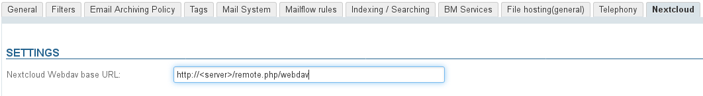

# Connecting with Nextcloud


# Introduction

BlueMind offers the possibility to connect to an external drive, starting with Nextcloud.

Users are now able to use their Nextcloud personal space to manage the files they send using BlueMind mail and enjoy the advantages of their drive: file structure, moving, deleting, security, synchronization with other apps, etc.

Tool handling for administrators is improved: easier, more detailed disk space management, user-specific management, centralized data, security and back-up monitoring.

#### Supported versions

BlueMind supports Nextcloud version 11 and above.


# Pre-requisites

## Installing Nextcloud

Nextcloud must be installed and operational.
:::important

Nextcloud is an independent product with no ties to BlueMind. For more information on getting and installing it and how it works, please go to [https://Nextcloud.com/](https://nextcloud.com/)

:::
:::important

When Nextcloud is running in Apache + PHP-FPM, it is not capable of retrieving the file's contents. The uploaded file therefore weighs 0 bytes and no error is reported to BlueMind or shown in logs.

About this Apache bug: [https://bz.apache.org/bugzilla/show_bug.cgi?id=57087](https://bz.apache.org/bugzilla/show_bug.cgi?id=57087)

**The BlueMind plugin for Nextcloud will therefore not work if Nextcloud is deployed in a PHP-FPM on Apache. You must use mod_php or Nginx+PHP-FPM.**

:::

## Uninstalling BlueMind's file storage

Nextcloud can be used:

1 ** **alongside BlueMind's internal storage****: if the user doesn't enter a Nextcloud login ID, BlueMind will be used.To do this, install the files as shown in the section below.
1 
** **instead of BlueMind's internal storage****: if the user doesn't enter a BlueMind login ID, they will not have access to the linked attachments feature.
To do this, uninstall the BlueMind file hosting package:


```
aptitude remove bm-plugin-core-filehosting-filesystem
bmctl restart
```

:::important

BlueMind must be restarted to complete uninstallation, but it doesn't have to be done immediately. You can install as described below and restart BlueMind later.

:::

Then install Nextcloud as described below.


# Installation

## From BlueMind 4.2

Install the dedicated packages:


**
Debian/Ubuntu


**
Redhat/CentOS


```
aptitude install bm-nextcloud-common bm-nextcloudXX
```


yum install bm-nextcloud-common bm-nextcloudXX


where XX is your version of Nextcloud:


```
aptitude install bm-nextcloud-common bm-nextcloud12
```


- up to Nextcloud 11, you must enter the exact version number 
- **with versions 12 or above, use the bm-nextcloud12 package.**


## Versions prior to BlueMind 4.2

- Download and extract the archive from the [BlueMind marketplace](https://marketplace.bluemind.net/addons/80/)
- Get the jar files kept in:
  - the `net.bluemind.filehosting.nextcloud` folder
  - the `net.bluemind.filehosting.nextcloud*****`folder for your version of Nextcloud
:::important

Note: The folders provided for version 12 are compatible with all subsequent versions.

:::
- 
Place these 2 files in the server in the directory `/usr/share/bm-core/extensions/`

- Delete the directory `/var/lib/bm-core`
- 
Restart the bm-core service:


```
service bm-core restart
```


- Place the file `net.bluemind.ui.adminconsole.nextcloud.settings-*.jar` in the server in the directory `/usr/share/bm-webserver/extensions`
- Delete the directory `/var/lib/bm-webserver`
- 
Restart the webserver:


```
service bm-webserver restart
```


# Configuration

## For all domains

Only the platform administrator is able to connect BlueMind to Nextcloud for all domains:

- log into the admin console as admin0
- go to System Management > System Configuration > Nextcloud tab
- enter the Nextcloud WebDAV database's url:


## For a specific domain

Anyone with the ["Domain Administrator"](/Guide_de_l_administrateur/Gestion_des_entités/Utilisateurs/Les_rôles_droits_d_accès_et_d_administration/)  role for a specific domain can configure BlueMind to connect to Nextcloud for this domain.

- connect to the admin console as domain administrator
- go to System Management > Manage Domain > select the domain > Nextcloud tab
- enter the Nextcloud WebDAV database's url:


# Connecting user accounts

Once Nextcloud has been properly installed and configured, users can connect their Nextcloud account to their BlueMind account.

To find out more about how to proceed and how to use this feature, please go to the BlueMind User's Guide page [Large files and linked attachments](/Guide_de_l_utilisateur/La_messagerie/Fichiers_volumineux_et_détachement_des_pièces_jointes/)


