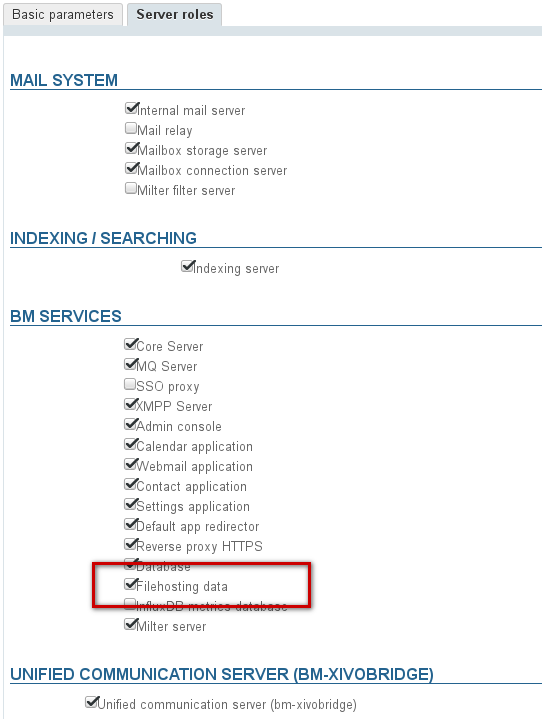
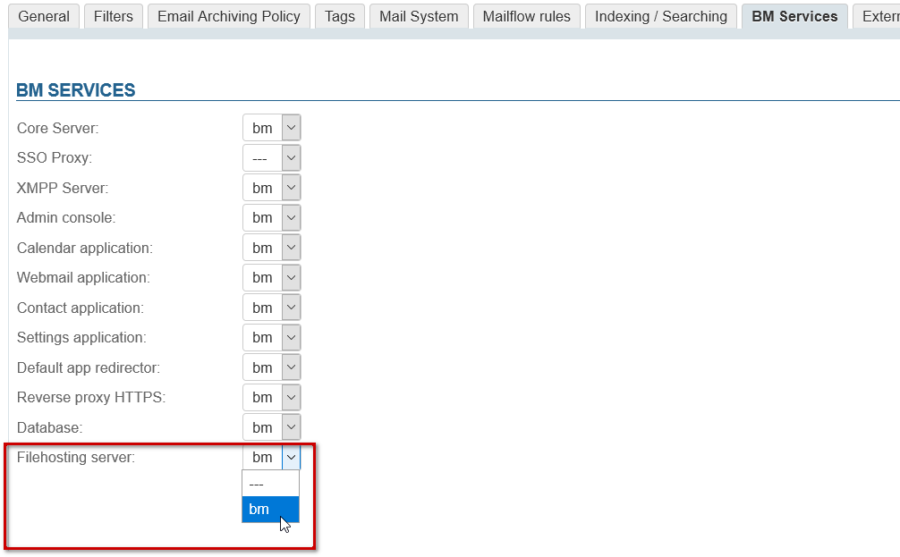
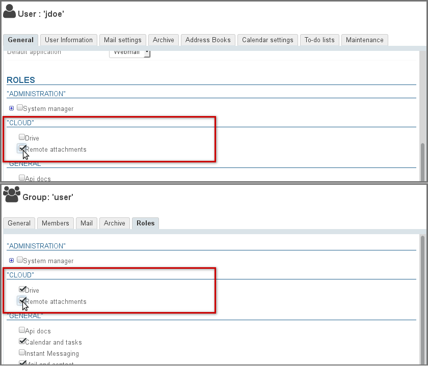
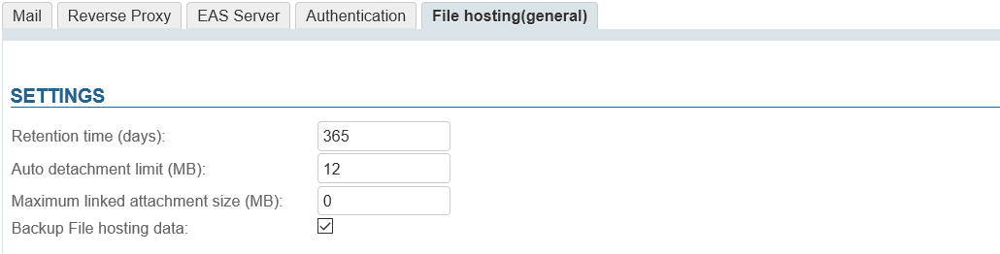

# Linked Attachments


# Introduction

BlueMind lets users [detach email attachments](/Guide_de_l_utilisateur/La_messagerie/Fichiers_volumineux_et_détachement_des_pièces_jointes/) and show them as download links to recipients. This reduces the size of messages which lightens the load on servers and communications networks: the file is no longer physically sent with the email message and stored on the incoming network in addition to the outgoing network and thereby duplicated and multiplied as messages are forwarded and replied to.


# File storage

Files are stored on the BlueMind server, in the directory `/var/spool/bm-filehosting/&lt;domain>/`.
:::important

Folder structure

Files are stored in sub-folders by User Identifier (UID), with the path `/var/spool/bm-filehosting/&lt;domain>/**&lt;UID initial>/&lt;UID>**/Attachments`

Note that folders for users migrated from BlueMind 3.0 will be shown as `/u/user_entity_XXX` and folders for users created in version 3.5 will be shown as `f/F149E21D-596B-49CF-AECC-AC354139A06B`.

:::

Files stored in this way are not accounted for in user quotas (which only apply to emails) whether the *Drive* feature (the possibility to find folders later on) is enabled or not.

As a result, depending on usage and the install's number of users, this can take a lot of space. In order to prevent disk space overload, we recommend that you create a disk mount that allows you to store data externally and set up a monitoring system.

# Implementation

## Installing the packages
:::important

From BlueMind 4.3, packages are installed by default – there is no need for them to be installed manually.

:::

In a default install for versions earlier than BlueMind 4.3, sending email attachments as links is not available to all users. To let them access this feature, you must install the required packages and restart the server:


**
Debian/Ubuntu


**
RedHat


```
# sudo aptitude install bm-plugin-webserver-filehosting bm-plugin-core-filehosting-filesystem bm-plugin-admin-console-filehosting-settings
# bmctl restart
```


```
# yum install bm-plugin-webserver-filehosting bm-plugin-core-filehosting-filesystem bm-plugin-admin-console-filehosting-settings
# bmctl restart
```


:::important

As things stand, files are stored on the BlueMind server itself. A [connection with Nextcloud](/Guide_de_l_administrateur/Configuration/Détachement_des_pièces_jointes/Connecter_avec_Nextcloud/) is also possible.

In the future, BlueMind will enable interconnection with other external file sharing services such as Dropbox, ownCloud, Pydio, etc.

:::

## Defining the file hosting server

BlueMind must be told which server must be used to store files remotely. To do this, you must give the desired server the "Filehosting data" role, even if you are in a single server architecture.

- log in as admin0
- go to System Management > Application Server > [select server] > "Server roles" tab
- in the "BM services" section, check "Filehosting data":


## Enabling the service for the domain

Once the server has been defined, the service must be enabled for the desired domain(s).

To do this, go to System Management > Manage Domains > select a domain > "BM Services" tab and set the server whose role you've enabled before using the drop-down list:



## Enabling the features for users

Once the packages are installed, the features must be enabled for users. This is done by assigning them the appropriate role. Linked attachments (remote attachments) can be enabled for all users or specific ones only, individually or through groups.

Two new additional rights are available:

- **Remote attachments**: allows users to detach and link files to email messages.
- **Drive**: gives access to BlueMind's file browser. Users can browse previously sent files and link them into new messages.This saves disk space as the same file is not stored multiple times.


In the admin console, go to the entities management section > Directory browser:

- Choose the group or user you want to assign a role to.
- Go to the roles management section:
  - For groups, go to the "Roles" tab
  - For users, stay in the "General" tab and scroll down to the "Roles" section
- In the "CLOUD" section, check the features you want to enable:


# Setup

The linked attachment feature can be set up in several areas of the admin console:

- In System management > [System Configuration](/Guide_de_l_administrateur/Configuration/Configuration_système/) > Filehosting tab: this tab is used to set the default values for **newly created domains**, **it does not set or override the values for all domains. **
- In  System management > Manage Domains > &lt;choose a domain> > Filehosting tab: this tab is used to set the default values for the chosen domain.


Once the packages are installed and roles are assigned, users have access to the linked attachments feature with a default maximum file size of 5MiB.

To change this limit and access more configuration options:

- log into BlueMind as admin0
- go to System Management > System Configuration > Filehosting tab:

:::important

The MiB (mebibyte) is a multiple of a byte, not to be confused with the MB (megabyte): it equals 1,024 kibibytes, which equals 1,024 bytes.

Therefore, 9 MiB equals 9.43718 MB.

:::


