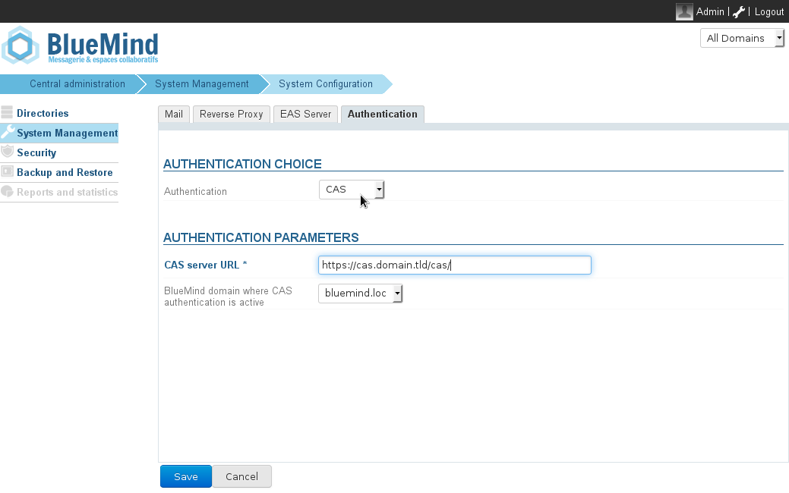
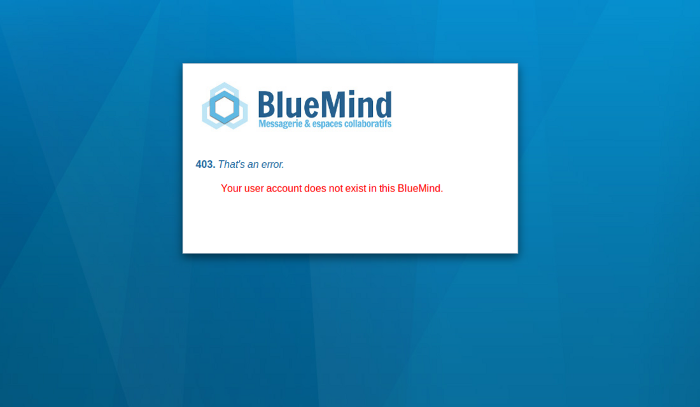

# SSO CAS


## Introduction

This article describes how to configure BlueMind to recognize CAS authentication.

This single sign-on authentication is possible since BlueMind v.3.0.12.


:::info

In this chapter we look at the CAS server url *cas.domain.tld* and the BlueMind domain *domain.tld* located on the server *bm.domain.tld.*

:::


:::info

CAS authentication is suitable for a single-server BlueMind installation.

:::


## How CAS authentication works

1. The client requests access to a protected resource (e.g. BlueMind). This client is not authenticated on the CAS server.
2. The server redirects the client to the CAS server for **authentication**.
3. Once authenticated, a **CAS cookie **is placed in the client's web browser and the client is redirected to the protected resource with a** ticket for validation**.
4. The BlueMind server sees this ticket and **checks its authenticity with the CAS server.** If authentication is successful, the server allows the client in and connects it as **login_cas** and places a **BlueMind cookie** in the client's web browser.
5. The client requests access to the BlueMind server again. As it has the BlueMind cookie, it is authenticated automatically as long as the cookie is valid.

For more information
[http://aldian.developpez.com/tutoriels/javaee/authentification-centralisee-sso-cas/images/09_diagramme_full.png](http://aldian.developpez.com/tutoriels/javaee/authentification-centralisee-sso-cas/images/09_diagramme_full.png)

[https://www.apereo.org/cas/protocol](https://www.apereo.org/cas/protocol)

## Installation

Install the needed package :
**Ubuntu/Debian**

```
aptitude install bm-plugin-hps-cas
```

**RedHat**

```
yum install bm-plugin-hps-cas
```


Restart BlueMind :


```
bmctl restart
```


## Configuration

1. You need to be connected as **admin0 **and go to System Management > System Configuration > **Authentication **tab.
2. Select **CAS** as authentication mode from the drop-down menu and complete the related authentication settings:
3. Save changes.
4. Restart the bm-hps service.


:::info

Once CAS authentication is enabled, you will be automatically redirected to the CAS server when you access the authentication page. If you want to connect as **admin0** or to another domain, go to the page: https://bm.domain.tld**/native**

**This access always remains reachable in case of configuration problem to be able to access to the administration console to correct it.


**

:::

## Known errors

### Error 403: Your user account does not exist in this BlueMind.



This error message means that the username entered to authenticate on the CAS does not exist in the domain *domain.tld*. You have two options:

- Create the user bound to the CAS **username** that does not pass through to the domain *domain.tld*
- Ignore the error. You can do this if some users from your CAS database do not have access to your BlueMind. 


### Error 500: Internal Server Error

This error message can have several causes. The easiest way to find out is to look at your server's **HPS logs**, using the command below, for instance:


```
cat /var/log/bm-hps/hps.log | grep CAS
```


### Using a self-signed certificate or an unknown certification authority 

If you use a self-signed certificate for your CAS server, or your CAS server's certification authority is not indexed, you will probably get an error message when you connect to the CAS server via https.

The easiest way to resolve this error is to import the certificate into the jvm keystore BlueMind uses.
**Importing a root certificate authority or a self-signed certificate**

```
keytool -import -trustcacerts -alias cas -file cert\_racine.crt -keystore /usr/lib/jvm/bm-jdk/jre/lib/security/cacerts
Enter keystore password: changeit
```

For more information
[http://www.sslshopper.com/article-most-common-java-keytool-keystore-commands.html](http://www.sslshopper.com/article-most-common-java-keytool-keystore-commands.html)

 

 


 

Enregistrer

