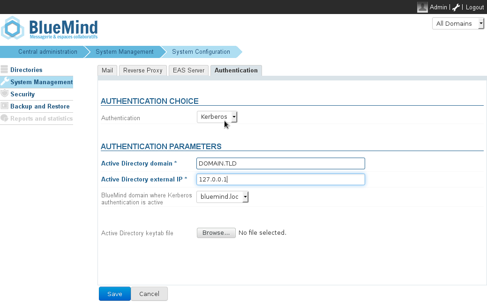
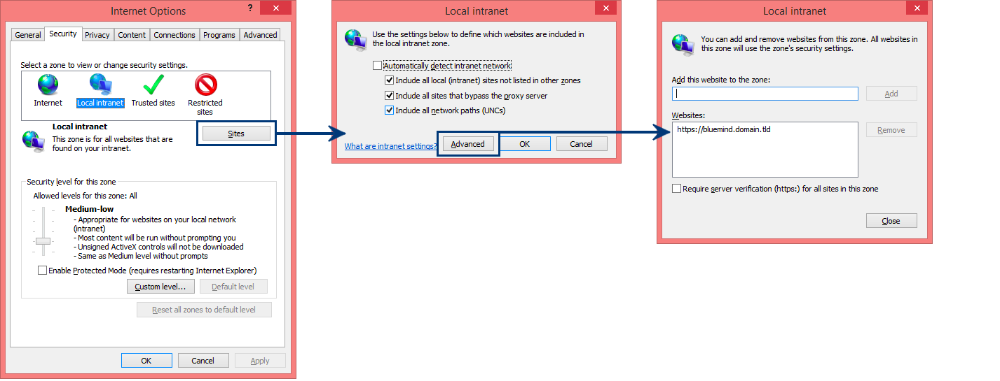

# SSO Kerberos


:::important

Translation in progress
The English translation of this page is still in progress and will be available soon.
:::


# Introduction

This article describes how to enable BlueMind to recognize Kerberos authentication in a Windows infrastructure.

This authentication is possible for BlueMind v.3.0.12 and above.
:::important

In this article, we look at the BlueMind external url which can be accessed by the users bluemind.domain.tld and the Active Directory server ad.domain.tld.

The domain name for all these servers is *DOMAIN.TLD*.

:::


# Prerequisite

Install the dedicated package on the server:


**
Ubuntu/Debian


**
RedHat/CentOS


aptitude install bm-plugin-hps-kerberos


yum install bm-plugin-hps-kerberos


# Setting up connection information

1 Create a service user for Kerberos authentication in the Active Directory, e.g. *bmkrb *with the password "krbpwd".
1 
Open a "cmd.exe" console and run the following command:


```
setspn -A HTTP/bluemind.domain.tld bmkrb
```


1 
This command should return a result similar to the following lines: 


```
Registering ServicePrincipalNames for CN=bmkrb,CN=Users,DC=domain,DC=tld
		HTTP/bluemind.domain.tld
Updated object
```


1 
Run the following command:


```
ktpass /out C:\hps.keytab /mapuser bmkrb@DOMAIN.TLD /princ HTTP/bluemind.domain.tld@DOMAIN.TLD /pass krbpwd /kvno 0 /ptype KRB5\_NT\_PRINCIPAL
```


1 
The result should look like this:


```
Targeting domain controller: AD.domain.tld
Using legacy password setting method
Successfully mapped HTTP/bluemind.domain.tld to bmkrb.
Output keytab to C:\hps.keytab
```


# Setting up Kerberos in the admin console

1 As** admin0 **go to System  Management -> System Configuration  -> **Authentication **tab.
1 Select **Kerberos** as authentication mode from the drop-down menu and fill in the related authentication settings (the keytab file requested is: C:\hps.keytab previously exported on the Kerberos server)
1 Save. You will be required to restart the bm-hps service.

:::important

Once Kerberos authentication is enabled, you will be automatically authenticated if your browser is configured correctly. If you want to connect as **admin0** or on another domain, go to the page: bm.domain.tld**/native.**

:::

# Setting up Kerberos manually

This section describes how to configure Kerberos authentication manually. However, you might also find [this paragraph](#SSOKerberos-Configurationclient) useful if your Kerberos domain name is different from your BlueMind domain name.

1 Copy the file `C:\hps.keytab` from the Kerberos server to the BlueMind server into `/etc/bm-hps/`
1 Copy the file "`/etc/bm/default/bm-hps.ini"` to "`/etc/bm/local/bm-hps.ini"`
1 Go to the web page [https://github.com/bluemind-net/hps-kerberos-sample](https://github.com/bluemind-net/hps-kerberos-sample) to download the sample files `bm-hps.ini`, `jaas.conf` and `krb5.ini`
  2 Copy the files `jaas.conf` and `krb5.ini` in the `/etc/bm-hps` directory of the BlueMind server
  2 
Copy the contents of the file `bm-hps.ini` into the file copied previously `/etc/bm/local/bm-hps.ini`

1 In `jaas.conf`, change the following information:
  2 `principal="HTTP/bluemind.domain.tld@DOMAIN.TLD"`
1 In `krb5.ini`, change the following information:
  2 `default_realm = DOMAIN.TLD`
  2 In `[ realms ]`, `DOMAIN.TLD = { kdc = &lt;ip_ad_server>:88 }`
  2 In `[ domain_realm ]`, `domain.tld = DOMAIN.TLD` and `.domain.tld = DOMAIN.TLD`

:::important

IMPORTANT

The Active Directory domain name must be **written in CAPITAL LETTERS** in the configuration file, failing that it will not work.

:::

# Setting up different domains for Kerberos and BlueMind

Since BlueMind v.3.0.7, you can set up authentication with different domains for Kerberos and BlueMind.

## Server configuration 

Create a new configuration file `/etc/bm-hps/mappings.ini` with the following contents:


```
[bm\_mappings]
DOMAINEAD.LAN=domaineBM.vmw
```


In this instance, `DOMAINEAD.LAN` is your AD domain and `domaineBM.vmw` is your BlueMind domain.

When the file has been created, restart BlueMind:


```
bmctl restart
```


## Client configuration

When the AD domain is different from the BlueMind domain, the client web browser may not trust the BlueMind domain. The BlueMind url access must therefore be added as a trusted site in the web browser.

### Firefox

To add a trusted site, you need to access the Firefox configuration settings. To do this:

- 
in the web browser address bar, type:


```
about:config
```


- Dismiss the warning by clicking "I'll be careful, I promise!"
- 
In the search box, type:


```
trusted
```


- Double-click "network.negotiate-auth.trusted-uris" or right-click > Modify
- Enter the BlueMind domain address, *bluemind.domain.tld* in this instance, and validate.The preference is then shown in bold, which means it has been modified and no longer has its default value:
- Restart Firefox to apply the changes.


### Internet Explorer

Trusted sites are configured in the Internet Options window:

- Go to the Tools menu > Internet Options 
- In the Security tab, select Local Intranet and click "Sites"
- In the dialog box that opens, click "Advanced" 
- Fill in the "Add this website to the zone" box and click "Add". The site should be added to the list of websites underneath.
- Click "Close" to quit, then "OK" in the second dialog box, and finally "OK" in the first one.
- Restart the web browser to apply the change.


### Chrome

Chrome is based on the Internet Explorer configuration. As a result, in Windows, simply follow the same process as above to add a new site to the trusted list.

For other operating systems, however, use the following command line to add a trusted website:


```
google-chrome --auth-server-whitelist="*bluemind.domain.tld"

```


### References

For more information, please look at the following pages:

[http://sammoffatt.com.au/jauthtools/Kerberos/Browser_Support](http://sammoffatt.com.au/jauthtools/Kerberos/Browser_Support)

[http://support.microsoft.com/kb/303650](http://support.microsoft.com/kb/303650)


