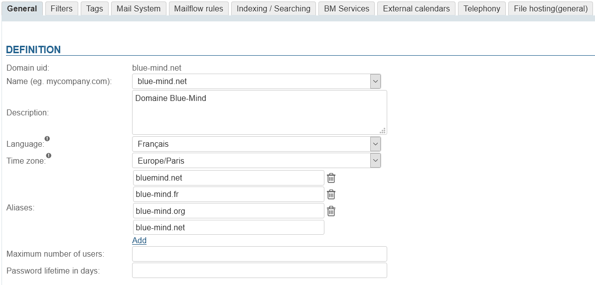
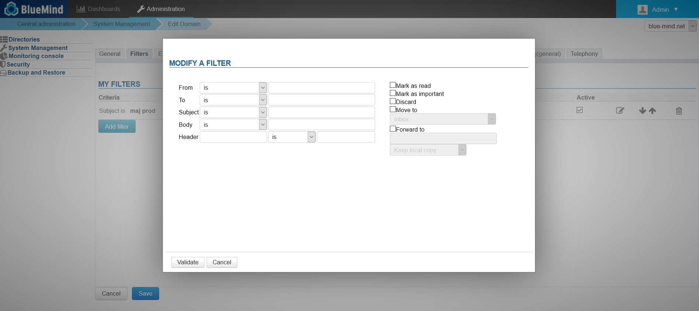
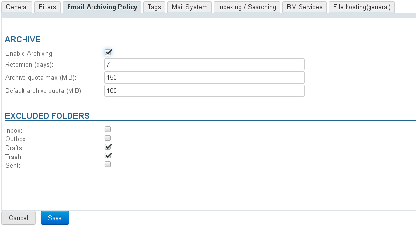
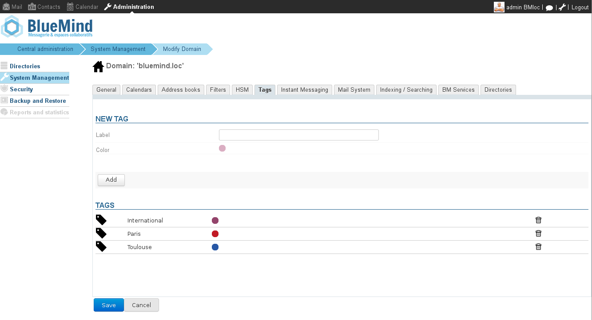
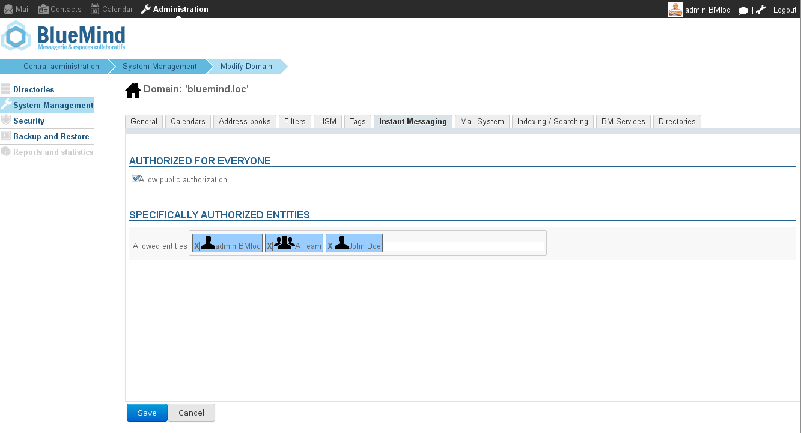
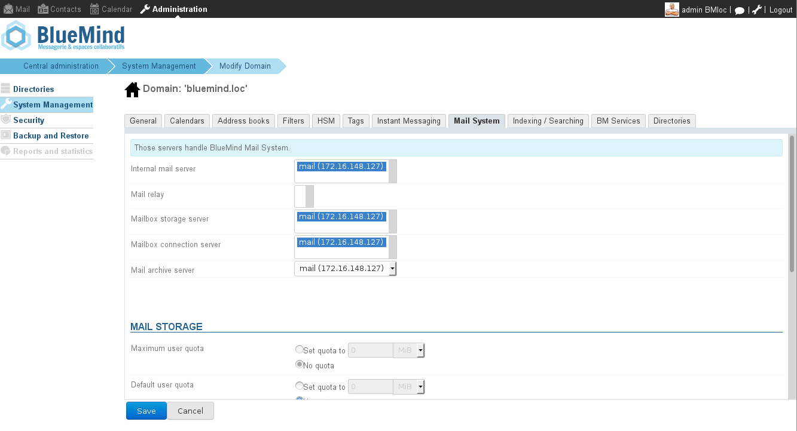
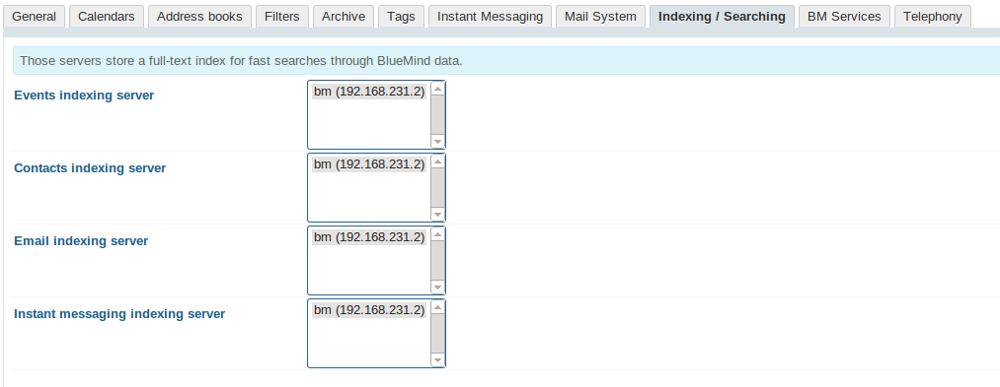
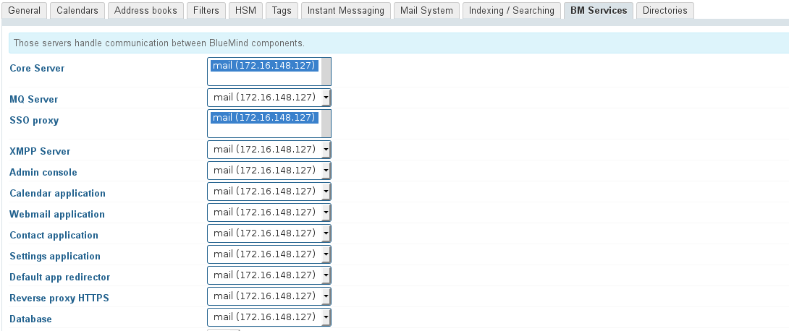
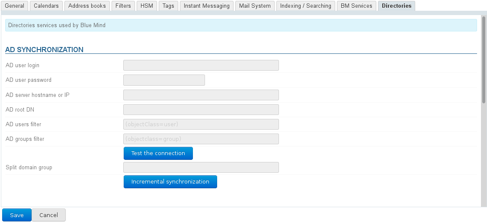

# Managing Domains

# Introduction

The domain administration section gives you access to technical domain settings (server addresses, domain aliases, etc.) as well as default user settings (address books, message filters, storage quotas, archiving, etc.).
Enregistrer

# General

The General tab shows the information and options for the selected domain:

&lt;s>Domain UID cannot be changed but the following settings can be customized:&lt;/s>

L'UID du domaine lui sert d'identifiant, il est unique dans BlueMind et n'est pas modifiable, en revanche peuvent être positionnés :

- **Nom** : le nom d'usage du domaine, à choisir parmi les alias de celui-ci
- **Description**: domain descriptions can be useful, in particular when the installation is made up of several domains and they are similar.
- **Langue** : la langue par défaut des utilisateurs du domaine
- 
**Fuseau horaire** : le fuseau horaire par défaut pour les utilisateurs du domaine (à partir de BlueMind 4.4)
:::important

Modification de la langue ou du fuseau horaire

NB : lorsque la valeur des champs "Langue" ou "Fuseau horaire" est modifiée, elle l'est aussi chez les utilisateurs qui utilisaient l'ancienne valeur, et chez eux seulement.
Par exemple on change la valeur de "Europe/Paris" pour "America/Toronto" :

  - les utilisateurs qui avaient "Europe/Paris" passent automatiquement sur "America/Toronto"
  - les utilisateurs qui avaient modifié la valeur de départ pour une autre conservent cette autre valeur
  - les utilisateurs créés après cette modification auront "America/Toronto"

:::
- **Alias**: you can add as many aliases as you want
  - click "Add" to open a new field and enter a new alias
  - click the trash icon news to the alias box to delete it
- **Maximum number of users**: the maximum number of users that can be created in this domain.This option is used to distribute users on the domains and limit the number of accounts authorized for one subscription.
- **Password lifetime in days**: sets the number of days a user password is valid for after it has been assigned or changed.Available from BlueMind 4.3, this option is common to all domain users. You can change this value or force-expire a user's password by going into their admin page. To find out more, go to the page [Entities](/Guide_de_l_administrateur/Gestion_des_entités/) > [Users](/Guide_de_l_administrateur/Gestion_des_entités/Utilisateurs/).

:::important

AD or LDAP connections

The password expiry policy does not apply to users imported from an AD or LDAP directory.

:::

# Filters

This tab allows you to set common filters across all domain users: filters set in this tab will apply to mail messages of all domain users.

Global filters can, for instance, be used to to move messages marked as "SPAM" automatically by analyzing message headers.
:::important

The server runs domain filters BEFORE user filters. This may interfere with user filters working properly (moving to a folder, tagging or forwarding).

:::

Domain filters are managed the same way as user filters:

For detailed information on creating filters and filter options please go to the page [Message Filters](/Guide_de_l_utilisateur/La_messagerie/Les_filtres_de_messages/).

# Email Archiving Policy

This tab allows you to implement a global archiving policy for a domain.

For more inforlation, see [Archiving - 2.3 Enabling message archiving - a) Global archiving](/Guide_de_l_administrateur/Configuration/Archivage/)

# Tags

This tab allows you to manage domain tags, which will be common to all users:

It works similarly as [user tags](/Guide_de_l_utilisateur/Les_catégories_tags_/).

# Instant Messaging

This tab allows you to enable instant messaging either for all users or for specific users or groups:

# Mail System

This tab allows you to configure the servers that handle the BlueMind mail system for the domain.

In the mail storage section you can set storage quotas for domain users.

# Indexing/Searching

This tab allows you to set the indexing server addresses for each BlueMind application: Mail, Contacts, Calendar and Instant Messaging.

# BM Services

This tab allows you to specify a server address for each BlueMind service (MQ, database, admin console, webmail, etc.) in the domain.

# Directories

This tab allows you to configure and manage synchronization for the AD (*ActiveDirectory*) or LDAP directories.

For more information on implementing synchronization with external directories, see [Administration Système > Synchronisation Active Directory](/Guide_de_l_administrateur/Gestion_des_entités/Synchronisation_Active_Directory/) and [Administration Système > Synchronisation LDAP](/Guide_de_l_administrateur/Gestion_des_entités/Synchronisation_LDAP/).

