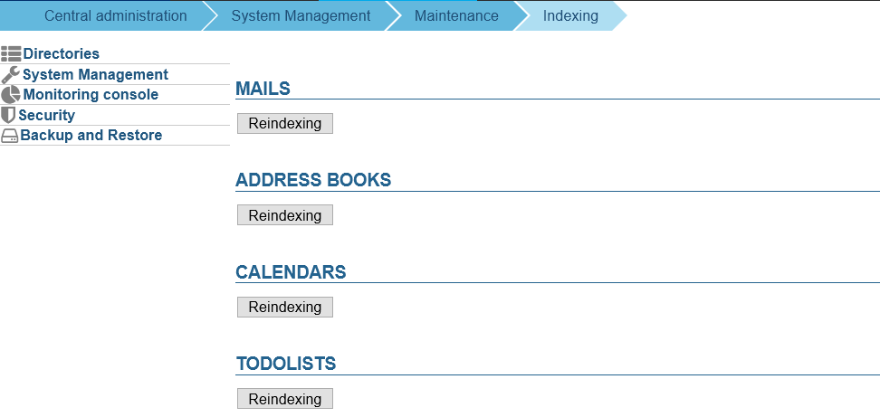

# Indexing

## Introduction

From BlueMind version 4.2.4, indexing tasks have been removed from planned tasks to alleviate resource usage. The system now runs these tasks automatically when needed and administrators can run them manually from a dedicated page in the admin console.

To troubleshoot indexing issues, please refer to the guide: [Search and indexing issues](/Guide_de_l_administrateur/Resolution_de_problemes/Problèmes_de_recherche_et_indexation/).

## Running indexing tasks

Indexing tasks can be run when many users are having issues with an application's search engine such as:

- incomplete webmail search engines (some search options are missing)
- incomplete search results
- inconsistent search results (e.g. erroneous read status)
- server error when attempting to read an email in a search result
- alphabet non-clickable in address books
- ...

To reindex data, go to the dedicated page in the admin console: System Management > Indexing.

Click the button for the application you want to reindex. This will reindex the entire system (all domains, all users) – Emails, Address Books, Calendars, To Do Lists.

