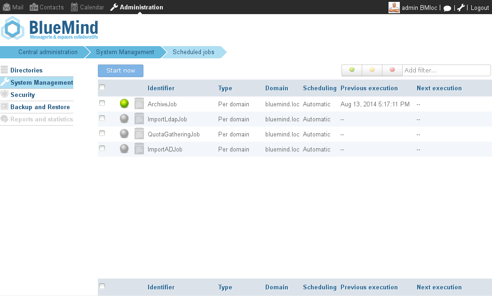
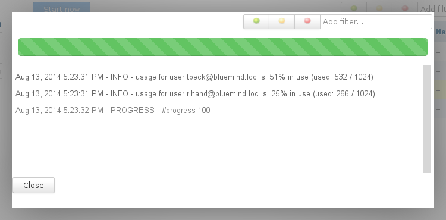
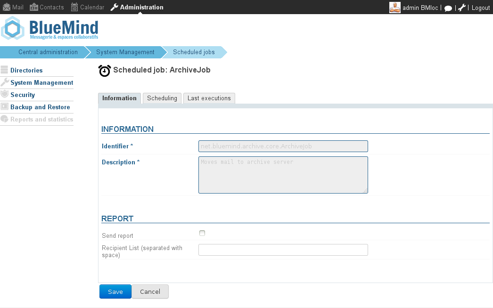
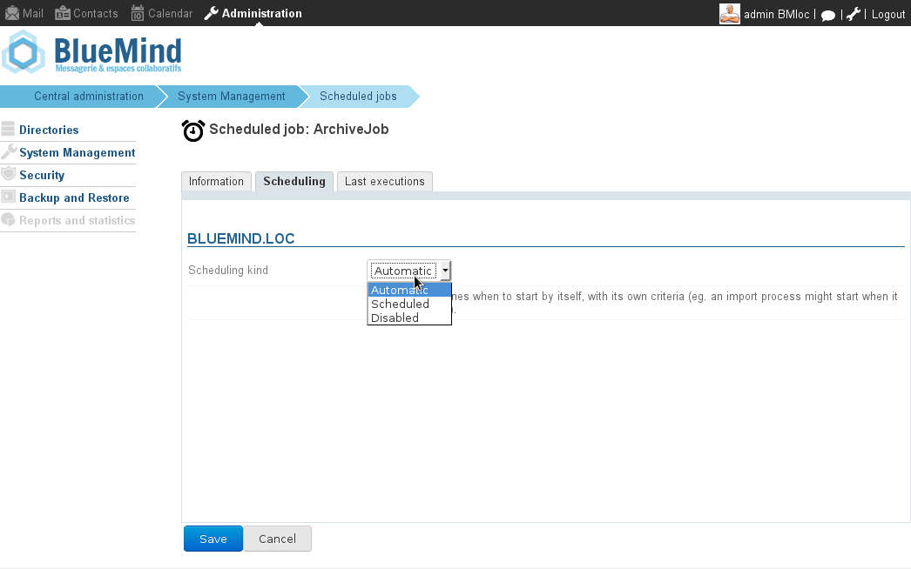
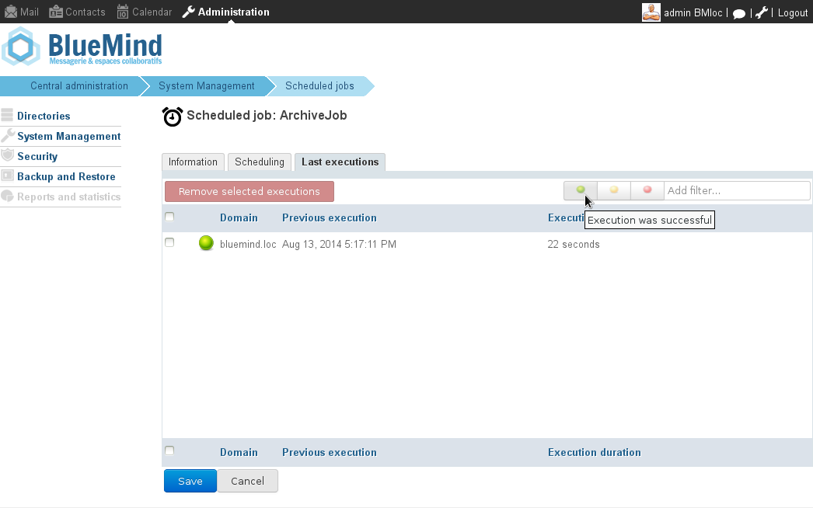

# Scheduled Jobs

# Introduction

Scheduled jobs allow you to plan specific administrative tasks to be performed automatically.

All administrators do not have access to the same jobs: the system administrator is able to see all the jobs in the domains under his supervision while the domain administrator's access is restricted to his domain's jobs.

# Administration

Scheduled jobs are managed in the System Management > Scheduled jobs section.

System administrator's scheduled jobs

The main page shows the list of scheduled jobs and key status information for each:

- last execution status icon (successful, unsuccessful...): green when the last execution was successful, orange when the last execution was successful but has emitted warning messages, and red when the last execution has failed. When a job is in progress, its corresponding icon blinks.
- log status icon: this icon is black when there are unread logs, either during or after execution. Click a log icon to open the viewing popup which shows log information in real time when the job is running:
- job identifier
- execution type
- execution domain
- scheduling type
- date of last execution
- date of next scheduled execution

Filtering tools are available at the top of the list on the right, enabling you to view jobs by status (click the status icons to enable or disable) or by word or part of a word by typing it in the text box.

## Managing jobs

Click the job you want to manage in the list. This opens the job's administration window, which has three tabs:

### Information

For safety reasons, the job identifier and description cannot be modified.

You can choose to have the execution report sent to one or several people. To do this, tick the "send report" box and enter the recipients' email addresses.

### Scheduling

Scheduling can be:

- ** automatic**: according to each job's attributes set during development. This is a scheduled job's default behavior.
- **scheduled**: you can set a periodical execution. By choosing "daily", you can specify execution dates and times during the week.

### Latest executions

This tab allows you to view a job's lastest executions. Click an execution from the list and the log popup opens.

Filtering tools are also available here, in order to view specific jobs only. For instance, the screenshot above shows successful executions only.

## Manual execution

From the jobs list:

- select the job you want to execute by ticking the box at the beginning of the row
- click "Execute now".

