# Corporate Signatures


## Introduction

BlueMind's new Signature application allows you to set common automatic signatures for all or some users based on certain criteria. 

It also allows you to set up a disclaimer message, which is added at the end of all the messages sent by domain users – in addition to the signature – and may include other information (commercial, legal, environmental, etc.).


:::info

Corporate signatures are not S/MIME compatible. Neither signatures nor disclaimers will be added to signed or encrypted emails.

:::


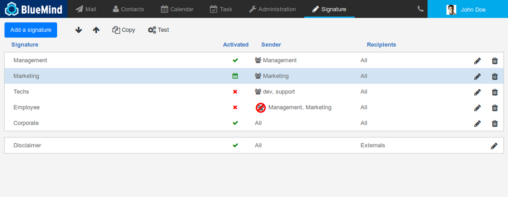

The application's homepage has three parts:

1. at the top, the key action buttons allow you to create, sort and test signatures
2. the list of signatures and their key characteristics:
    - name
    - status: activated, deactivated, scheduled
    - the senders they apply to
    - the recipients concerned
    - edit/delete buttons
3. the disclaimer: it has the same characteristics as signatures but it cannot be deleted.The disclaimer is included in the application by default when it is installed, but it remains empty and inactive until it is configured.


:::info

Who will see the signature?

The signature is added to the message body, therefore **all the message's recipients will see it**.

When a sender/recipient pair matches the signature's filter criteria, it will be added to the message and seen by all its recipients.

For instance, a signature is set for the following criteria:

- Sender: is a member of "sales"
- Recipient: external


The Sales Manager Jane (jane@bluemind.loc) writes an email message to several recipients:

- To:
    - Client: [client@domaine.swe](mailto:client@domaine.swe)
    - Colleague: [john@bluemind.loc](mailto:bernard@bluemind.loc)
- Copy:
    - Accountant: [peter@bluemind.loc](mailto:jean-claude@bluemind.loc)


 the sender is a member of the "sales" group **AND** the client has an external address  the signature is added to the message, all its recipients can see it: the client, John and Peter.

:::

## Installation and provisioning

### Installing the application

To install the new application, install the necessary packages on the BlueMind server and restart BlueMind:


**
Debian/Ubuntu


**
RedHat


```
aptitude install bm-plugin-core-signature bm-signature bm-plugin-hps-signature
bmctl restart
```


```
yum install bm-plugin-core-signature bm-signature bm-plugin-hps-signature
bmctl restart
```


### Accessing the application

#### Access rights

Signatures are managed through a dedicated application rather than the BlueMind admin console. As a result, the super administrator admin0 must appoint the users or administrators who can access (or delegate access to) the application to manage domain signatures.

Users or groups of users can be assigned the role "Manage corporate signature" using the same method as for any other role (see   [Users - Roles](/Guide_de_l_administrateur/Gestion_des_entités/Utilisateurs/#Administrationdesutilisateurs-user-roles)):

  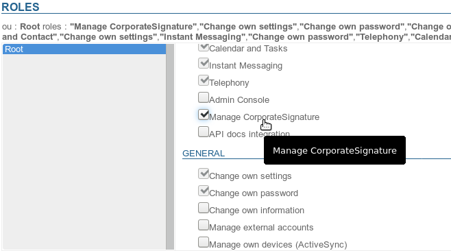  

#### Access

Once the role has been assigned -- after having logged back in if necessary – users can access the Signature application from the top ribbon along with other BlueMind applications:

    

## Creating signatures

To add a signature, click "Add a signature". 

The signature creation form opens:

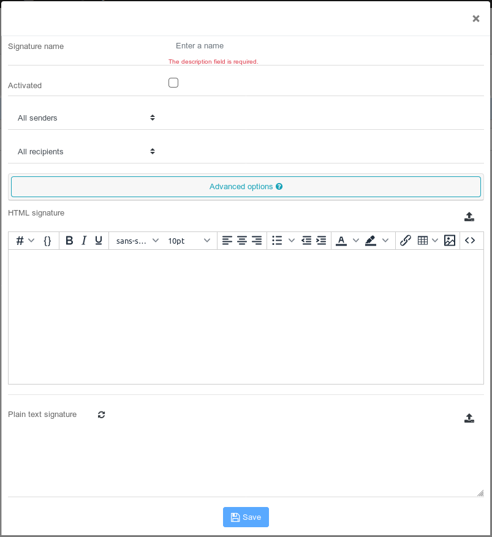

- ** **Signature name**:** the signature's name to identify it in the list. This field is mandatory.
- ** **Activated**:** check this box to activate or deactivate the signature.
- ** **Senders**:** the signature will be applied to all outgoing messages sent by the users selected:
    - **All senders**: all users in the BlueMind domain.
    - **Sender is**: a text box is added. Using auto complete, enter the name of one or several entities– users or mailboxes.** This option is available from BlueMind 4.1.**
    - **Sender is a member of: **  a text box is added, enter one or several groups' name using autocomplete. The signature will be added to the messages sent by users who belong to **one or more of these groups**.  E.g. a specific signature for members of the "support" group who reply to technical assistance requests, a signature for members of the "sales" and "communication" groups who respond to clients' requests.
    - **Sender is not a member of**: a text box is added, enter one or several groups' name using autocomplete. The signature will be added to the messages sent by users who **do not belong to these groups**.E.g. a signature for all users who are not part of the management team, a signature for all non-technical users, i.e. those that do not belong to the groups "support" and "development".
- ** **Recipients**:** the signature will be applied to all the messages sent to the type of recipients:
    - **All recipients**: will apply to all messages.
    - **Internal recipients only**: will only be added to messages sent to domain users.
    - **At least one external recipient**: will be added to messages sent (To or Cc) to at least one recipient outside the domain.
- ** **Advanced options****: clicking this bar opens a form with additional options:
    - ** **Signature validity period****: period of time for which the signature will be active:
        - **Permanent**: the signature will be applied as long as it is activated
        - **From**: the signature will be applied from the date it is set (**inclusive**) until it is deactivated
        - **Until**: the signature will be applied from the day it is activated until the set date (**inclusive)**
        - **Period**: the signature will apply from the start date to the finish date (both inclusive)
    - ** **Authorize individual signature placement****: lets users choose where to place the signature (before or after the message they reply to).
To do this, users place the string `--X-BM-SIGNATURE--` where they want the signature to go:

        - in webmail, BlueMind makes this easier as the string replaces the user's usual signature according to their set preferences [Préférences avancées](https://forge.bluemind.net/confluence/display/DA/.Preferences+avancees+vBM-4.0).
Users are then able to move the signature tag where desired. 

        - in third-party clients (Thunderbird, mobiles, etc.), users must place the signature tag manually, e.g. in place of their usual signature if they want to replace it.
This can be made easier by setting the tag as the client's default signature.

**If no signature tag is found in the message, the corporate signature will be automatically added at the bottom of the message.**    - ** **Delete all previous occurrences****: when users reply to a thread of messages, earlier occurrences of the user's signature are deleted.
- ** **HTML signature**:** signature that will be added to the messages sent in HTML format.
    - The [WYSIWYG ](https://fr.wikipedia.org/wiki/What_you_see_is_what_you_get)editor allows you to create a signature or to importe one by copying/pasting one from another source (web creation software, another html page or an email message, etc.)
        - the  button allows you to toggle to HTML editing
        - the  menu allows you to insert placeholders (see box below)
    - Theicon at the end of the row allows you to import an HTML code from a file (text file, html page, etc.)


:::tip

When you import an HTML file, a text signature is generated automatically **if one doesn't already exist**.

:::

- ** **Plain text signature**:** simple signature that is added to messages sent in plain text format.
    - The icon allows you to generate a plain text signature from the HTML signature.

    - Theicon at the end of the row allows you to import text from a file.


### Placeholders

Placeholders can be used to create sender-customised signatures, e.g. the signature looks the same for all but shows the specific sender's name, telephone number and address.

#### Using placeholders

There are two ways of adding placeholders:

1. write the corresponding code starting with "#{", autocomplete then suggests possible placeholders as you type:
2. use the drop-down list   and select the placeholder as desired: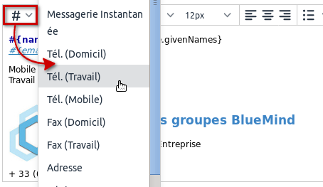


#### Conditional blocks

If a placeholder is missing in the user's information card, then an empty space is shown.

To avoid this, you can insert a conditional block: if a placeholder is missing in the user's information card, then the entire block will be left out of the signature.
To add a conditional block: select the appropriate text and click:


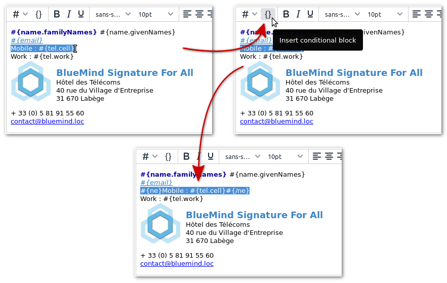


In this example, only the row "Work" will be shown if the user has no mobile phone number.


:::tip

Conditional blocks, like placeholders, can also be used in plain text signatures.

The plain text version generated from the HTML signature will show like this:

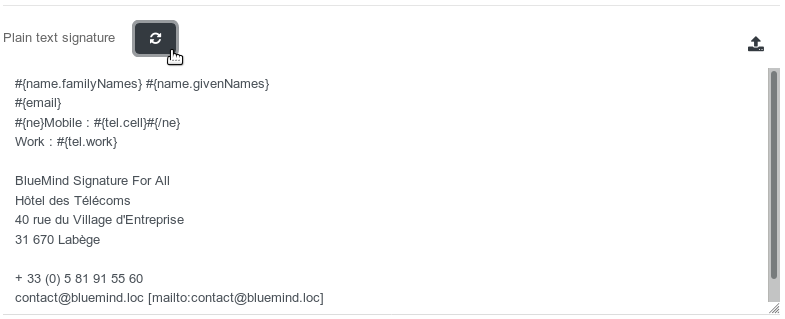

:::

#### Available placeholders

Placeholders **are the same as those in users' information cards**  (as entered by the administrator or through AD/LDAP synchronization). This is information you can see when you search the directory in your Contacts application:

- #{formattedName}: the full name, made up of prefix+given name+other name+family name+suffix
- #{gender}: gender
- #{name.prefixes}: prefix
- #{name.suffixes}: suffix
- #{name.givenNames}: given name
- #{name.familyNames}: family name
- #{name.additionalNames}: other name
- #{email}: email address
- #{impp}: instant messaging
- #{tel.home}: home phone
- #{tel.work}: work phone
- #{tel.cell}: mobile phone
- #{streetAddress}: street name
- #{region}: region
- #{postOfficeBox}: PO Box
- #{postalCode}: postal code
- #{locality}: town
- #{extendedAddress}: additional address information
- #{countryName}: country
- #{url}: website
- #{role}: position/job title
- #{title}: title
- #{division}: company division
- #{department}: company department
- #{company}: company name
- #{assistant}: assistant's name
- #{manager}: manager name
- #{fax.work}: work fax number
- #{fax.home}: home fax number


### Sorting signatures

** **Signatures are applied by sorting order.** **It may therefore be important to sort them in a specific order. 

Sometimes a message may match the criteria for several signatures, **in that case, the first signature found will be applied**.


:::info

Example

Looking at the screenshot above, the following signatures are set:

- Management: active
- Marketing: active (and scheduled)
- Techs: inactive
- Employees: inactive
- Corporate: active


If the Managing Director writes an email, he/she meets the filter criteria for Management (he/she belongs to that group) and Corporate (All senders): as Management comes first in the list, the Management signature will be used.

Technical engineers who want to write an email meet the criteria for 3 signatures: Techs, Employees and Corporate: Techs comes first, but it is deactivated. Next comes Employees, which is also deactivated, therefore the Corporate signature will be added to messages.

:::

To sort the list:

- click a signature
- use the arrows 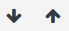 to move it up or down


### Activating signatures

Signatures are only applied when they are activated.


:::tip

By default, new signatures are deactivated. They will be applied only when they are expressly activated.

:::

To activate a signature:

- Open the editing form
- Check the "Activated" box: 
- Save


The activation statuses shown in the application's home page are:

-  signature inactive
-  signature active
-  signature active within a scheduled period
-  signature active, scheduled but not running (scheduled previously or in the future)


### Editing signatures

In the application's home page, click the arrow at the end of the row for the signature you want to edit to open the editing form. This is the same as the signature creation form (see above).

Once the changes have been made, click "Save".

### Deleting signatures

To delete a signature:

- click the icon at the end of the row for the signature you want to delete
- confirm the deletion when prompted.


### Copying signatures

Signatures can be copied to serve as a model for other signatures.

To do this:

- select the signature you want to copy
- click the 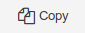 button


 A new signature is immediately created and named "Copy of..." followed by the name of the original signature.

### Testing the results

In addition to checking how an HTML signature will be displayed, you can test a signature to see how all its versions (HTML and text) will appear in a message.

To do this:

- Select the signature you want to test
- Click the 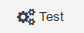 button at the top of the page an email is sent to the user, bearing the signature in both formats (HTML and plain text), followed by the disclaimer if applicable.


E.g., take the previously created signature, when you click the preview icon, the test email as viewed in webmail:

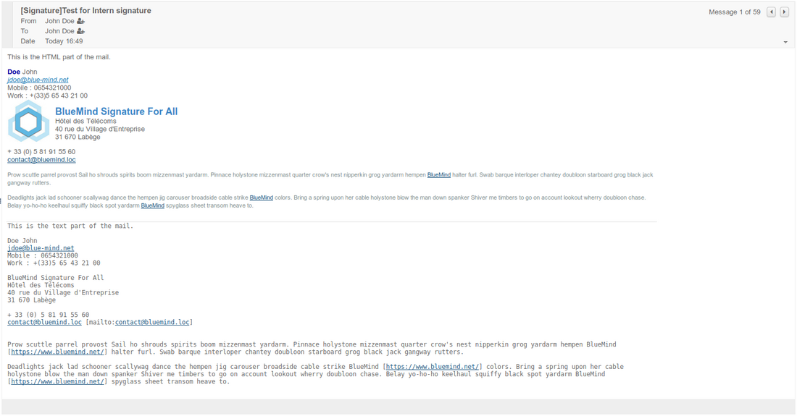

## The disclaimer

This message, if enabled, ** **is added, no conditions applied, in addition to the signature to all the messages ** **sent by domain users.

It may be a legal disclaimer (on confidentiality), a marketing message (company details or special offer) or an environmental warning (a message suggesting not to print the message).

The disclaimer is included in the application by default when it is installed, but it remains empty and disabled until it is configured.

- To open the editing form, just like for signatures, click the corresponding icon: 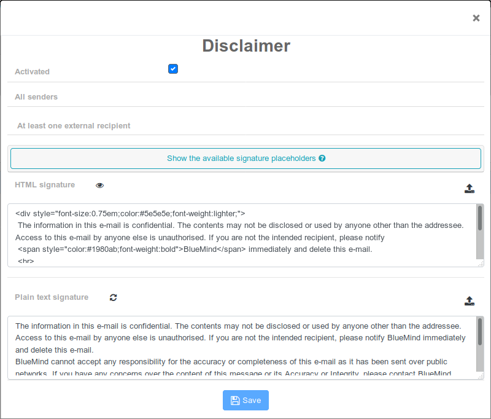 The form is almost identical to the signatures form, with two small differences:
    - the name and the senders cannot be edited, it is always called "disclaimer" and applies to all senders
    - there is no validity period, it is applied as long as it is enabled
- ** **Recipients******:** unlike signatures, the disclaimer cannot be filtered by group, only 3 choices are available:
    - All recipients
    - Internal recipients only
    - At least one external recipient
- ** **HTML signature**:** HTML code for the signature that will be added to messages sent in HTML format.
    - The  icon is used to preview the results 
    - The icon at the end of the row is used to import an HTML code from a file 


:::tip

When you import an HTML file, a plain text signature is generated automatically **if one doesn't already exist**.

:::

- ** **Plain text signature**:** simple signature that will be added to messages sent in plain text format
    - Theicon is used to generate a text signature from the HTML signature

    - Theicon at the end of the row is used to import the text from a file


## Using corporate signatures

Users can see the signature in their message compose window and can choose where to place it:

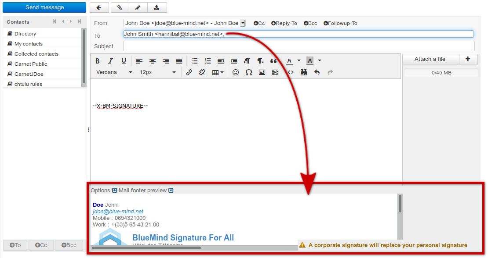

To find out more about how signatures work for users, please see our user's guide:

- [The Composer - Corporate signatures](/Guide_de_l_utilisateur/La_messagerie/Le_composeur/#Lecomposeur-signature-corp)
- [Thunderbird - Corporate ](/Guide_de_l_utilisateur/Configuration_des_clients_lourds/Configuration_de_Thunderbird/#ConfigurationdeThunderbird-signature-corp)[signatures ](/Guide_de_l_utilisateur/Configuration_des_clients_lourds/Configuration_de_Thunderbird/#ConfigurationdeThunderbird-signature-corp)


