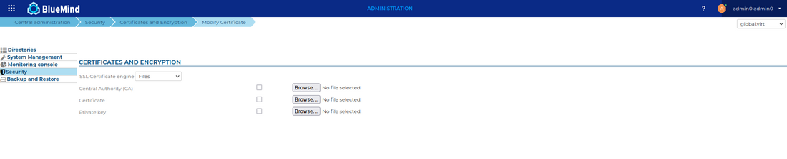
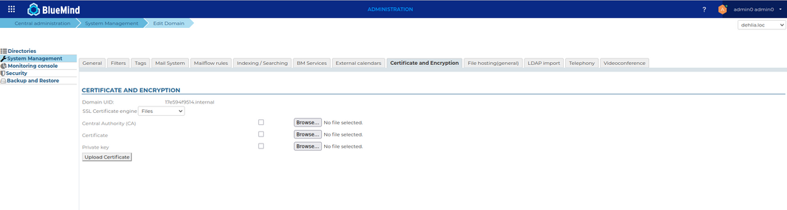
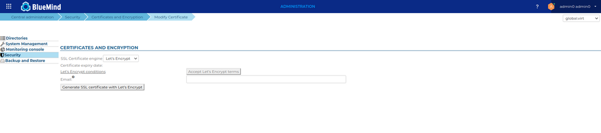
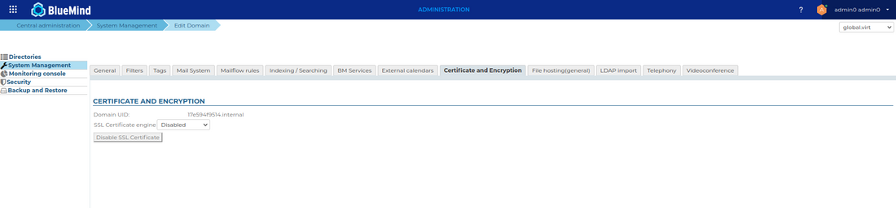

# SSL Certificates


## Introduction

The BlueMind servers use certificate-based authentication. The certificates generated during the installation of BlueMind can be replaced by customized certificates on a single-server installation.


:::info

Certificate management is not specific to BlueMind Mail. The BlueMind teams cannot carry out certificate management or configuration as part of its support packages.

:::


Prerequisites
### Environment

Email relies heavily on certificates and their proper management. For example, your email will not work if your certificates expire.
It is paramount that you know how to manage them well (please refer to the chapter on [Externals links](#CertificatsSSL-externallinks) if necessary).

You must also make sure that the certificates correspond to your email's *external-url*, otherwise this email will not work.

## Certificate installation

You must ensure an external URL has been defined for your system, or for the domain concern by this certificate installation.

You can check this in the System Management > System Configuration > Reverse Proxy for the system, and System Management, Manage Domains > *&lt;YourDomain> > *General* *for the domain.

### Files required

To set up an SSL certificate, you need the following files:

1. a file containing the new SSL certificate
2. a file containing the private key for the new certificate – it must not be password protected
3. a file containing the certificate from the certificate authority responsible for issuing the new SSL certificate. If this authority is a subordinate authority, that authority's root certificate has to be concatenated to the file. 


If your certificate is in P12 format, you must generate the certificate and the private key in PEM format using the commands:


```
openssl pkcs12  -nocerts -in cert.p12 -out privatekey.pem
openssl pkcs12 -clcerts  -nokeys -in cert.p12 -out cert.pem 
```


:::info

Warning, you must double check that the CN or alternative name is the BlueMind server's external url.  You can check the CN using the command:


```
openssl x509 -noout -subject -in cert.pem
```


:::

### Installing the certificate for the system

- Connect to BlueMind as admin0 and access the admin console 
- Go to the page Security > Modify Certificate
- Choose "Files" in the drop-down list, and use the three "Browse" ("Parcourir") buttons to find the files required and send them to the server:
- Click "Save" to upload the files and apply the new certificate.


### Installing the certificate for a domain

- Connect to BlueMind as admin0 and access the admin console
- Go to the page System Management > Managed Domains
- Select the domain you wants to configure
- Click on "Certificate and Encryption" tab
- Choose "Files" in the drop-down list
- Use the 3 "Browse..." buttons to search for the corresponding files and send them to the server





- Click "Save" to upload the files and apply the new certificate.


## Let's Encrypt certificate generation

- Connect to BlueMind as admin0 and access the admin console 
- Go to the page Security > Modify Certificate
- Choose "Let's Encrypt"  in the drop-down list


### Accept the conditions

Accepting the Let's Encrypt conditions is mandatory before being able to generate the certificate.

Click on "Let’s Encrypt conditions" will open them in a new tab, and the "Accept Let's Encrypt terms" button will automatically accept Let's Encrypt terms & conditions.




Once done, the grey-ed button allowing the creation of the certificate will be unlocked.

### Generate the certificate for your system

You may enter an email address that will be used by Let's Encrypt to communicate about the expiration date of the generated certificate.

if not provided, a default address '*no-reply@&lt;default-domain>**'* will be used (a default domain must be define in the System Management beforehand).

## 

### Generate a certificate for a domain

- Connect to BlueMind as admin0 and access the admin console
- Go to the page System Management > Managed Domains
- Select the domain you wants to configure
- Click on "Certificate and Encryption" tab


Repeat operations described in 4.1 and 4.2

### Renew a certificate

A programmed task will automatically renew the Let's Encrypt certificate, if it has already been generated once.

However, it is possible to renew the certificate manually, following the same procedure as the one used for the generation.

## Delete a domain certificate

This operation will remove the domain certificates from the servers.

- Connect to BlueMind as admin0 and access the admin console
- Go to the page System Management > Managed Domains
- Select the domain you wants to configure
- Click on "Certificate and Encryption" tab
- Choose "Disable" in the drop-down list and click "Disable SSL Certificate"





- Click on "Save" to delete the files on the server


:::info

This "Disable" option is only available for a domain, not for the system

:::

## External links

- SSL & TLS: A beginner's guide to certificates: [https://www.isicca.com/en/ssl-tls-certificate-beginner-guide/](https://www.isicca.com/en/ssl-tls-certificate-beginner-guide/)


