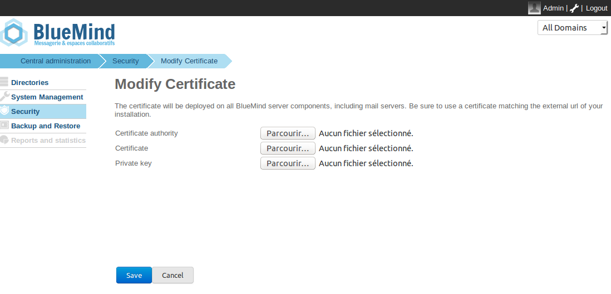

# SSL Certificates


# Introduction

The BlueMind servers use certificate-based authentication. The certificates generated during the installation of BlueMind can be replaced by customized certificates on a single-server installation.
:::important

Certificate management is not specific to BlueMind Mail. The BlueMind teams cannot carry out certificate management or configuration as part of its support packages.

:::


# Prerequisites

## Environment

Email relies heavily on certificates and their proper management. For example, your email will not work if your certificates expire.
It is paramount that you know how to manage them well (please refer to the chapter on [Externals links](#SSLCertificates-externallinks) if necessary).

You must also make sure that the certificates correspond to your email's *external-url*, otherwise this email will not work.

## Files required

To set up an SSL certificate, you need the following files:

1 a file containing the new SSL certificate
1 a file containing the private key for the new certificate – it must not be password protected
1 a file containing the certificate from the certificate authority responsible for issuing the new SSL certificate. If this authority is a subordinate authority, that authority's root certificate has to be concatenated to the file. 


If your certificate is in P12 format, you must generate the certificate and the private key in PEM format using the commands:


```
openssl pkcs12  -nocerts -in cert.p12 -out privatekey.pem
openssl pkcs12 -clcerts  -nokeys -in cert.p12 -out cert.pem 
```

:::important

Warning, you must double check that the CN or alternative name is the BlueMind server's external url.  You can check the CN using the command:


```
openssl x509 -noout -subject -in cert.pem
```


:::

# Installing the certificate

- Connect to BlueMind as admin0 and access the admin console 
- Go to the page Security > Modify Certificate
- Use the three "Browse" ("Parcourir") buttons to find the files required and send them to the server:[](../../../attachments/79862846/79862853.png)
- Click "Save" to upload the files and apply the new certificate.


# External links

- SSL & TLS: A beginner's guide to certificates: [https://www.isicca.com/en/ssl-tls-certificate-beginner-guide/](https://www.isicca.com/en/ssl-tls-certificate-beginner-guide/)


