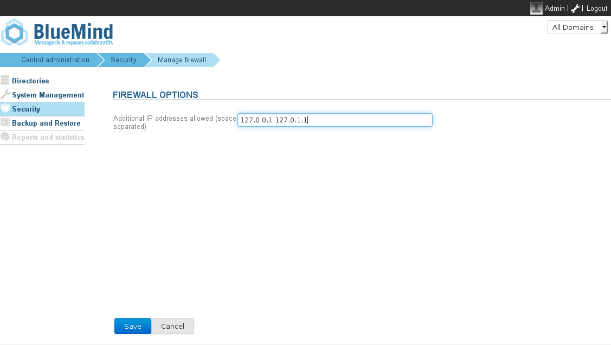

# Firewall

# Introduction

BlueMind incorporates a firewall which, by default, limits the access of internal services to the IP addresses of the installation's servers, i.e. the servers specified in the section System management > Application's servers.

ElasticSearch, for example, which is only used by other BlueMind components, is therefore not accessible outside of BlueMind services, unless the firewall's settings are modified. 

# Customization

Access to services can be extended to other IP addresses in Security > Manage firewall.

To authorize one or several IP addresses, enter them in the text box and click "Save".
:::important

No need to restart BlueMind, changes are applied immediately.

:::

 

Enregistrer

