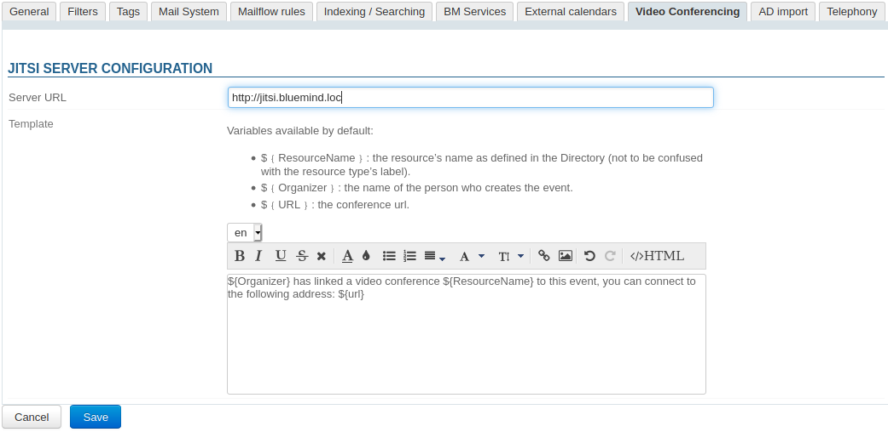

# Video-conferences with Jitsi


## Introduction

From 4.5.0, BlueMind can be connected to a Jitsi server so that users can easily create videoconferences and link them to their calendar meetings. 


## Installation

To provision this new feature, you must install the related plugin by installing the packets below on the server and then restarting BlueMind:


**
Debian/Ubuntu


**
Redhat/CentOS


```
aptitude install bm-plugin-core-videoconferencing-jitsi bm-plugin-admin-console-videoconferencing-jitsi
bmctl restart
```


```
yum install bm-plugin-core-videoconferencing-jitsi bm-plugin-admin-console-videoconferencing-jitsi
bmctl restart
```


## Administration

### Configuring the server

In the Admin Console, go to System Management > System Management > Manage Domains > select the domain > Video Conferencing tab:



Complete the general server information:

- Server URL 
- Template (optional): the content added here will be included with the link enabling users to join the meeting
- Click "Save"


 a resource named "Jitsi" is created automatically and shown in the directory. This resource will let users create video-conferences automatically. To find out more, please refer to paragraph [4. Access privileges](#VisioconferencesavecJitsi-gestion).


:::info

By default, the resource is shared with a basic right to book, all users are allowed to link a videoconference. 

:::

### Content template

Videoconference links can come with a text. This text can be added using the content template:


:::info

Participants always receive a link to the video-conference, whether a template has been created or not.

:::

- select the content language in the drop-down menu


:::tip

Earlier content created in different languages is saved, you can switch between languages and create as many templates as there are languages in the interface.

:::


:::info

When a user creates an event, the content is added depending on the organizer's language.

:::

- complete the content:

The template can contain variables which is filled in automatically by the system when the invitation is sent:

    - ${NomRessource}: the name of the resource as defined in the directory (by default "Jitsi")
    - ${Organisateur}: the name of the person who creates the event in the Calendar
    - ${URL}: the conference's access url
-  **Click **** to save the changes** 


##### Deleting a language

To delete a template in one language:

- select the language in the drown-down menu
- empty the content field (select the text and delete)
-  **Click  to save the changes** 


## Access privileges

This feature is accessed through the Jitsi resource created during [server configuration](http://forge.bluemind.net#configuration):


This resource is managed just like any other [resource](/Guide_de_l_administrateur/Gestion_des_entites/Ressources/), you just need to grant the desired users or groups the right to book it so that they can create videoconferences for their events:


:::info

As a resource, Jitsi can be assigned working hours and a booking policy. The videoconferencing link created for the meeting being unique, these will not affect the video-conference which will be available regardless. 

:::

A button is then available in the event creation window for users who have been given the required privileges:


To find out more about how this feature works, please refer to our user's guide page: [Linking a Video-Conference to an Event](/Guide_de_l_utilisateur/L_agenda/Lier_une_visioconférence_à_un_événement/).


