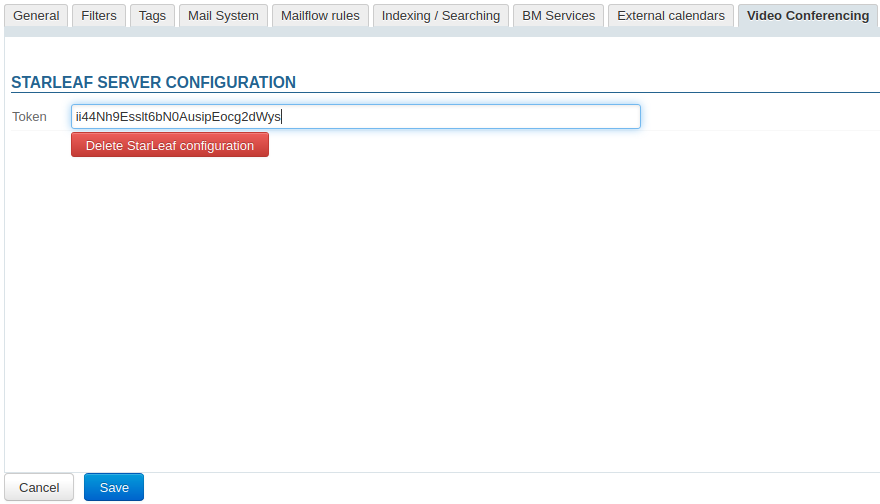
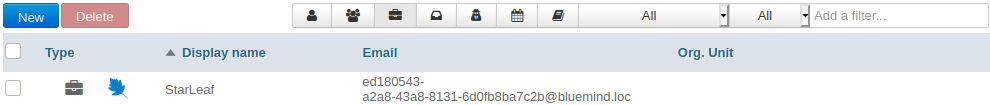
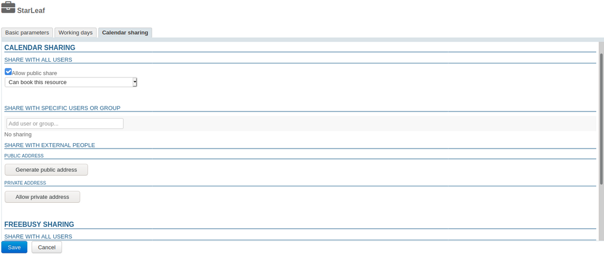
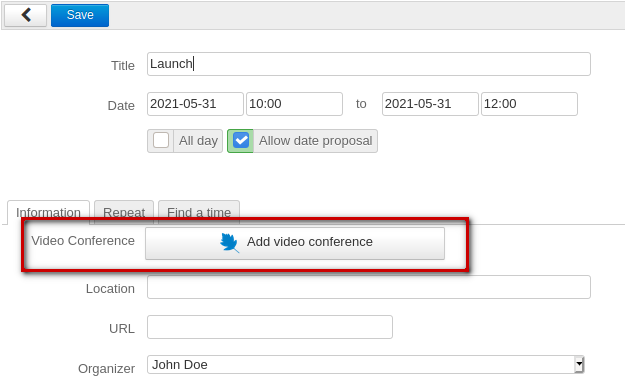

# Video-conferences with StarLeaf


## Introduction

From 4.5.3, BlueMind can be connected to a StarLeaf server so that users can easily create videoconferences and link them to their calendar meetings. 


## Installation

To provision this new feature, you must install the related plugin by installing the packets below on the server and then restarting BlueMind:


**
Debian/Ubuntu


**
Redhat/CentOS


```
aptitude install bm-plugin-admin-console-videoconferencing-starleaf bm-plugin-core-videoconferencing-starleaf
bmctl restart
```


```
yum install bm-plugin-admin-console-videoconferencing-starleaf bm-plugin-core-videoconferencing-starleaf
bmctl restart
```


## Administration

### Configuring the server

- In the Admin Console, go to System Management > Manage Domains > select the domain > Video Conferencing tab:
- Enter the access token you've generated in the StarLeaf Portal ([https://support.starleaf.com/integrating/cloud-api/authentication-using-authentication-header-method/](https://support.starleaf.com/integrating/cloud-api/authentication-using-authentication-header-method/) )
- Click "Save"


 a resource named "StarLeaf" is created and shown in the directory. This resource will let users create videoconferences automatically. To find out more, please refer to paragraph [4. Access privileges](#VisioconferencesavecStarLeaf-gestion)


:::info

By default, the resource isn't shared, users cannot link videoconferences.

:::

### Unlinking a StarLeaf installation

To unlink a Stafleaf server from the domain:

- in the Admin Console, go to System Management > Manage Domains > select the domain > Video Conferencing tab
- click "Delete StarLeaf configuration"

- confirm when prompted


:::info
There is no need to click "Save" at the bottom of the page, the request is effective as soon as it is confirmed.
:::


 The linked resource is deleted and related shares are cleared, it no longer appears in the "Entities" section and users are no longer able to book it.

### Content template
The content template is configured in the StarLeaf server.


## Access privileges

This feature is accessed through the StarLeaf resource created during [server configuration](http://forge.bluemind.net#configuration):



This resource is managed just like any other [resource](https://forge.bluemind.net/confluence/display/DA/.Administration+des+ressources+vBM-4.0) – share privileges enable you to manage booking privileges and therefore the ability to generate videoconference links. As a result, you must grant the desired users or groups the right to book the resource so that they can create videoconferences for their events:




:::tip

As a resource, StarLeaf can be assigned working hours and a booking policy. The videoconferencing link created for the meeting being unique, these will not affect the videoconference which will be available regardless.

:::

A button is then available in the event creation window for users who have been given the required privileges:



To find out more about how this feature works, please refer to our user's guide page: [Linking a Video-Conference to an Event](/Guide_de_l_utilisateur/L_agenda/Lier_une_visioconférence_à_un_événement/).

## Mobile devices and third-party software

Third-party software such as Outlook or mobile applications do not show the "Add video conference" button, but users can still book a video-conference by inviting the resource to an event just like for any other resource.


