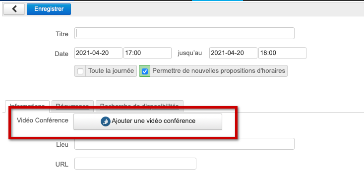

# Videoconferences with BlueMind.Video


# Introduction

BlueMind.Video is a videoconferencing SAAS based on Jitsi and built into BlueMind since version 4.6.0 – it doesn't require the installation of a third-party service.

This service is linked to your subscription. Please contact our [our sales team](mailto:commerce@bluemind.net) for service rates. Without the appropriate subscription, the instructions below will be ineffective.

To check whether your subscription includes the videoconferencing service, go to the "Subscription Management" page in the admin console:

- 
The value for the row "Maximum number of full video conferencing accounts" must be more than 0

- The value for the row "End of subscription validity" must show a current date (not expired)


# Concepts

- a new "Full account + Video conferencing" user type becomes available. The number of users of this type depends on your subscription. 
- all domain users can use the videoconferencing service if there is at least one "Full account + Video conferencing" user in the domain.
- a videoconference can be held on the spot (created immediately with a shared link) or planned in the calendar.
- there is no time limit for videoconferences that include a "Full account + Video conferencing" user and they can host up to 100 participants.
- a videoconference hosted by a "Full account" user (without a videoconferencing subscription) is limited to 45 minutes and two participants.


# Installation

This feature is built into BlueMind and does not require the installation of any extra packages.

# Administration

## Configuring videoconferencing for a domain

In the admin console, go to System management > Manage domain > select the domain > General tab:

- set the number of "Full account + Video conferencing" users you want for the domain by editing the "Maximum number of full video conferencing accounts"


Then, in the Videoconference tab, compose a videoconferencing invitation template, e.g.:


```
${Organizer} has invited you to a videoconference.
Click this link to join: ${URL}.
```


This template can be adapted into several languages using the drop-down menu.


 Once the template is saved, a resource named "BlueMind.Video" is created automatically and added to the directory. This resource will be used to create videoconferences. To find out more, go to paragraph [5. Access Privileges](#VideoconferenceswithBlueMind.Video-gestion). 


:::important

By default, the videoconferencing resource is given basic booking privileges – all users are able to add a videoconference link.

:::


# Access privileges (optional)

The new feature is accessed using the BlueMind.video resource created during [server configuration](http://forge.bluemind.net#configuration). If you want to change access privileges, this resource is managed just like any other [resource](/Guide_de_l_administrateur/Gestion_des_entités/Ressources/). By default, all domain users can create a videoconference.

An "Add video conference" button is available in the event creation form for users with the required privileges:



To find out more about how this works, got to the user's guide page: [Linking a videoconference to an event](/Guide_de_l_utilisateur/L_agenda/Lier_une_visioconférence_à_un_événement/).

# "Full account + Video conferencing" profile

This profile can be assigned to domain users (within the limit set in "Maximum number of full videoconferencing accounts") in the user's page, in the "Account information" section.


# Mobile devices and third-party applications

Third-party applications such as Outlook and mobile applications do not show this button. However, users can still book a videoconferencing resource by inviting the resource to the event, just like any other resource. 


