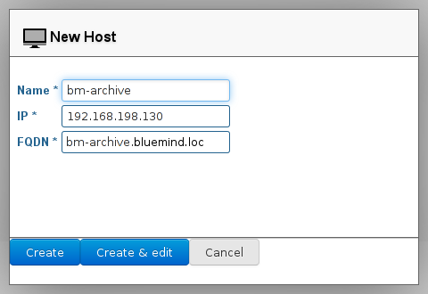
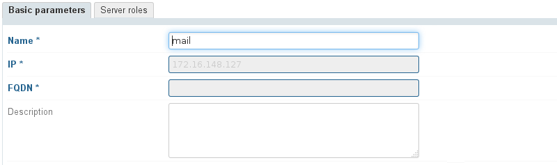
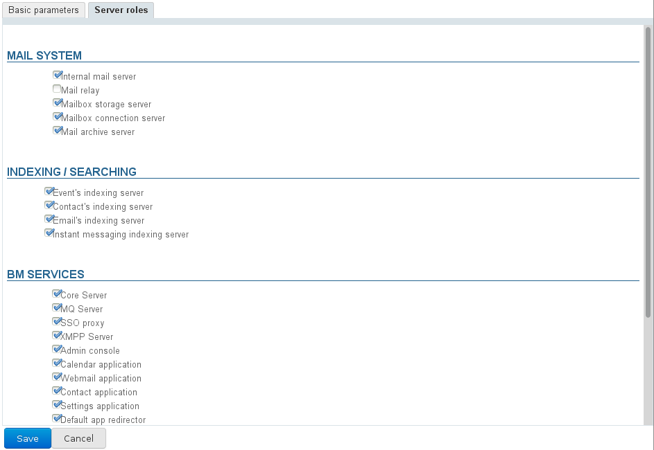

# Managing Servers

The "Servers" page in the BlueMind admin console allows you to manage the BlueMind installation servers and the services they host.

## Adding a server

To add a new server, go to the System Management page, then Application's Servers:

1. **Add the server to BlueMind**: click "New Server" and fill in the details of the server on which the service(s) have been installed:

    - **Name**: the name given to the server can be different from the name of the server in the network. You are free to choose any name.
    - **IP**: the server's IP address
    - **FQDN**: "Fully Qualified Domain Name". This is the server's full name in the domain.
The "Create" button (or &lt;Enter> key) adds a new server to BlueMind, without any specific role. The "Create & edit" button (or &lt;Ctrl-Enter> keys) adds a new server and redirects you to its administration panel so that you can assign it one or several roles.

:::info

Services must be installed and accessible during configuration, otherwise a message such as "Can't connect to Node Server..." will appear and you will not be able to add the server.

:::
1. **Enable the server's role(s)**: go to the server administration panel ("Create & edit" above, or select it from the servers list)
    - Go to the tab "Server roles", which shows all assignable roles.
    - Tick the roles corresponding to the service(s) installed.
    - Validate by clicking "Save" at the bottom of the screen to apply the changes. 

 The new server is now available and can be assigned to the corresponding services in the  [domain administration](./../Presentation_du_produit/Messagerie_multi_domaines.md) section. 

## Managing a server

To access the administration panel of the server you want to manage, click the relevant server in the list of servers.

The first tab, **"Basic parameters"**, shows the server localisation settings. Only the name and description can be modified, the IP address and the FQDN ([Fully qualified domain name](http://fr.wikipedia.org/wiki/Fully_qualified_domain_name)) can't:

  

The "**Server roles**" tab allows you to specify the mail system, indexing and services roles the server is able to perform:

