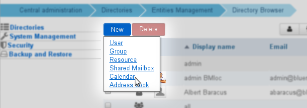
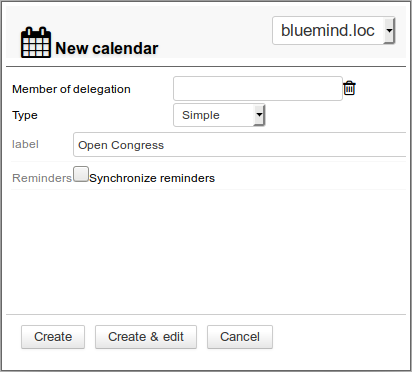
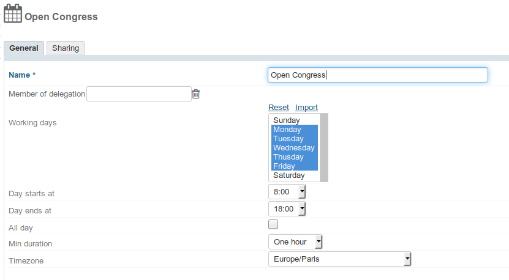
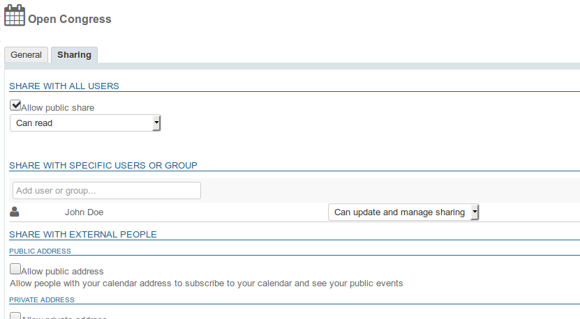
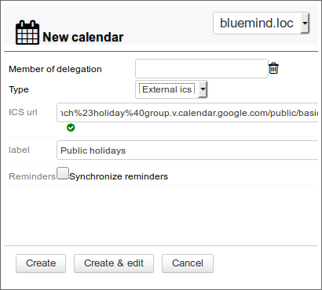

# Domain Calendars

## Introduction

Domain calendars are a calendar shared between all users. In addition to viewing rights, administrators can assign calendar editing or management rights to users or groups.

From BlueMind 3.5, domain calendars are managed as full-fledged entities: they are managed in the Directory section, they can be set as organizer (by someone with appropriate rights), they can be populated through an ICS import or exported in ICS format and their private or public url can be shared for an external synchronization.

## Usage

Domain calendars are viewed as calendars that provide information to users, such as public holidays, company holidays, sales and marketing events (trade shows, presentations, etc.) or local events (town council meeting, exhibition, school council meeting, etc.), training days, team activities, etc.

**As a result, domain calendars can not be set as event organizers or be invited. You only can create simple events in those calendars.

**

#### New practices

There used to be two instances domain calendars were used for:

- **as informational calendars**, i.e. for users to view information. **Domain calendars are still a good way of managing this type of calendar.**E.g. for a marketing calendar showing the trade shows the sales team is due to attend, or a town council's calendar showing planned meetings and events.
- **as operational calendars**, for users to manage events.** You need to use a [resource](https://forge.bluemind.net/confluence/display/DA/.Les+ressources+vBM-3.5) calendar to do this.**E.g. for an on-call duty calendar: create a weekly event "weekend duty" and each week, invite the user concerned. This allows you to centralize information and allows users to accept, reject or set their availability.

## Creating a Calendar

To create a new calendar:

1. From the directory management homepage, click "Create domain calendar"
2. or from the list of directory entries, use the New button > Calendar:

- enter a name and, if appropriate, select a domain:
- Click "Create" to quickly create a calendar
- Click "Create & edit" to create a calendar and open configuration options such as sharing.

## Configuration

### General Options

A domain calendar's general tab allows you to specify calendar characteristics: working days, day start and end time, minimum appointment duration, time zone.

### Sharing

By default, newly-created calendars are not shared with any users, which means that users can neither view nor add appointments into them.

Sharing rights can be assigned to:

- all domain users for shared public calendars, e.g. for company events
- specific users, e.g. for a management calendar
- a group, e.g. for a project calendar

The following rights can be assigned:

- **Can Read**: can view appointments
- **Can Write**: can set and edit appointments
- **Can update and manage sharing**: can, in addition to writing, administer the calendar's sharing options

#### Public Share

By checking this box, the selected sharing options are enabled for all domain users.

#### Share with specific people or group

This section allows you to select the people or groups you want to assign rights to.

Start typing the user's or group's name in the text box and confirm by typing enter or clicking on the name suggested by autocomplete.

This is useful for company calendars for example, in which the company PA can set up meetings and create company-wide events or holidays and which all users can see.

## External Calendars

Domain calendars can be a synchronized external calendar. They are created and administered like domain calendars.

### Creating an external calendar

When you create a calendar (see above):

- select "external ics" in the drop down list and paste the external calendar's url in the box that opens:
- When you leave the box (with the shift key or by clicking outside the box) BlueMind validates the url. **While url isn't validated, calendar cannot be created**.
- Fill in the calendar's name if it not found automatically
- Click "Create" to quickly create the calendar with default options (not shared) or "Create and edit" to access calendar options, including sharing.

### Sharing

Sharing rules are the same for external and BlueMind domain calendars, with one exception: like [external user calendars](/Guide_de_l_utilisateur/L_agenda/Les_calendriers_externes/), domain calendars are available for viewing only: changes are not applied or saved on the original calendar.

