# Domain Address Books

## Introduction

Domain address books are address books shared by all users. In addition to viewing rights, administrators can assign editing or management rights to users or groups.

Domain address books are managed like full-fledged entities but behave like user address books: depending on the rights they are given, users can view them, create or edit contact cards and import contacts into them or export them in vCard format.

## Internal Address Books

### Creating an Address Book

To create a new address book:

1. In the Directories homepage, click "Create domain address book"
2. Or in Directory Browser, use the "New" button > Address book: 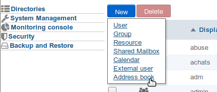

- type a name and, if appropriate, select a domain: 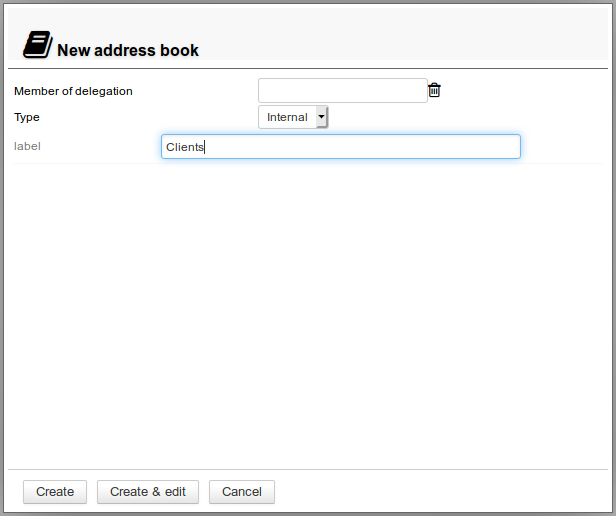
- Click "Create" to quickly create an address book
- Click "Create & edit" to create an address book and open configuration options such as sharing

### Configuration

The "General" tab in a domain address book's configuration section is used to edit its name as well as the organizational unit (delegation) it belongs to:

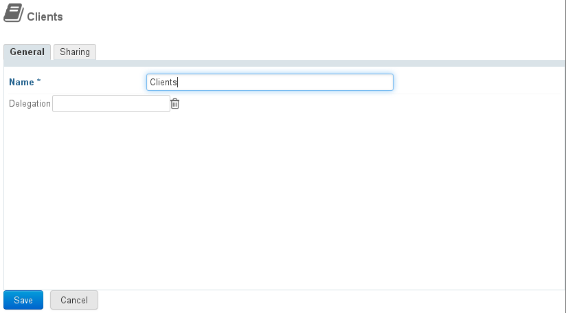

Once you've typed the name or set the delegation, click "Save" to confirm.

:::tip
The asterisk indicates that this field is mandatory. The name cannot be left empty.
:::

## Address books connected to an external directory

You can now create domain address books that synchronize with LDAP and AD directories. Among other things, this feature allows you to view large directories and filter – or not – address book contacts.

### Administration Rights

LDAP address book administration is dependent upon a specific role that needs to be assigned to administrators:

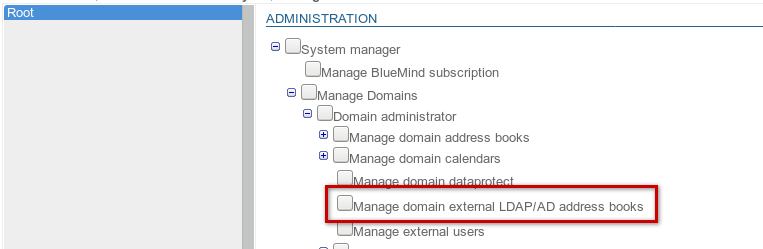

This role is independent so that selected administrators are only able to create simple domain address books.

:::info

To be able to create address books, the user must also be assigned the role "Manage domain address books".

:::

Like for other roles, this role can be delegated either to a group (e.g. to assign it to all administrators) or individually to specific users only.
To find out more, go to the page about [Delegated Administration](/Guide_de_l_administrateur/Gestion_des_entites/Utilisateurs/L_administration_déléguée/).

### Creating an external address book

External address books are created the same way as standard address books:

1. In the Directories homepage, click "**Create a domain address book**"or in Directory Browser use the **New **button** > Address book**: 
2. **Select the address book type**: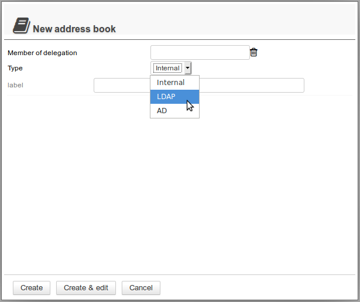
3. This opens the form: 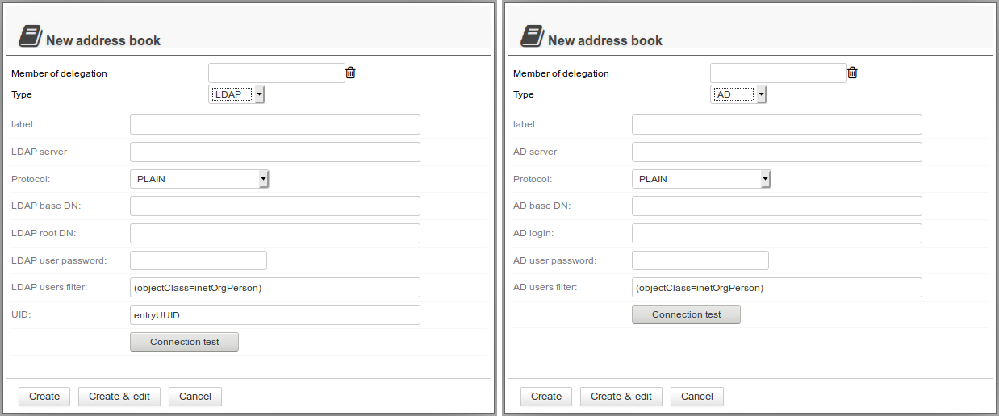
4. **Fill in the information for the directory you want to connect**, e.g. an LDAP address book:
 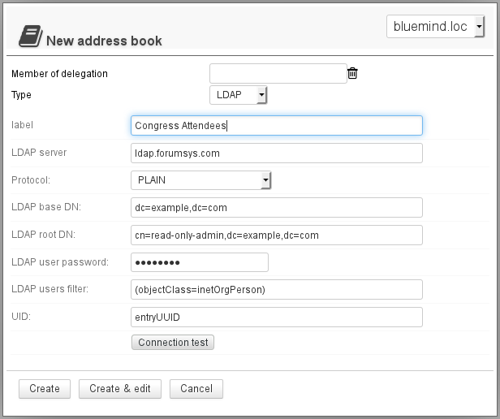

:::tip

About the UID box

This box can only contain the name of an LDAP attribute that meets the following conditions:

- text value
- single value
- value that does not vary during the entire LDAP entry's lifetime - including when it is moved in the directory tree, renamed or modified in any other way.

:::

5. **Click "Create"** to create a simple address book immediatelyor click "Create & edit" to create the address book and open configuration options, including sharing options.

### Setting Up

The "General" tab in the address book configuration page is used to:

- Edit the address book name
- Add, edit or remove the organizational unit (delegation) it belongs to
- Check the LDAP/AD directory connection information
- Force synchronization and reset the data

## Sharing

By default, newly-created address books are not shared with any users.

Address book rights can be assigned to:

- all domain users for shared public address books
- specific users, e.g. for an address book shared between a manager, an assistant manager and their PA
- a group, e.g. a client or prospects address book for sales teams

The following rights can be assigned:

- Can see this address book: the user can view and export contact cards
- Can see and update this address book: the user can create, import and edit contacts
- Can see, update this address book and manage sharing: the user has read and write rights on the address book and is able to edit its sharing configuration

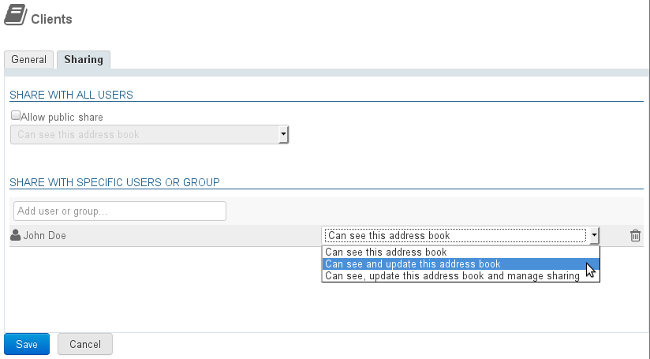

:::info

Sharing an LDAP address book: known issue

Despite the "can [...] update" mention, users cannot edit LDAP address book contacts as synchronization is restricted to viewing.

The only relevant rights are "can see this address book" and "manage sharing".

:::

#### Public share

By enabling this box, the sharing option's settings are applied to all domain users.

#### Share with specific people or group

This section is used to select people or groups you want to assign rights to.

Start typing the user's or group's name in the text box and confirm by typing enter or clicking on the name suggested by autocomplete.

This is useful for a sales address book for example, in which the whole sales team (a group) can view client contact cards while the sales manager who has write and administration privileges can create and edit contact cards and if they choose to, give one or several of their colleagues the right to edit contacts too.

:::info

For users to be able to view an address book in BlueMind, they must be subscribed to it.

There are two ways to do this:

- through the message they receive when the address book is shared with them: 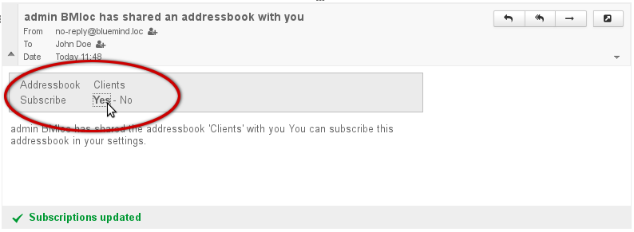
- in the "Subscriptions" section in [preferences](/Guide_de_l_utilisateur/Les_contacts/Gestion_des_carnets_d_adresses/):
 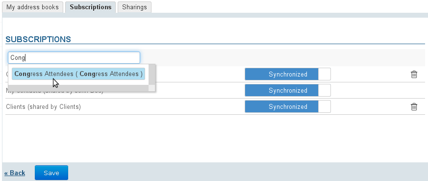

:::

The address book can then be seen in the Contacts application of the user(s) selected:

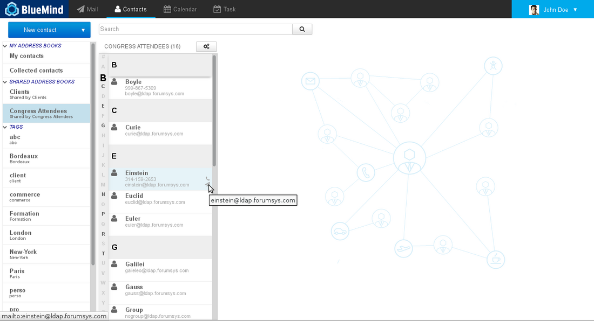

