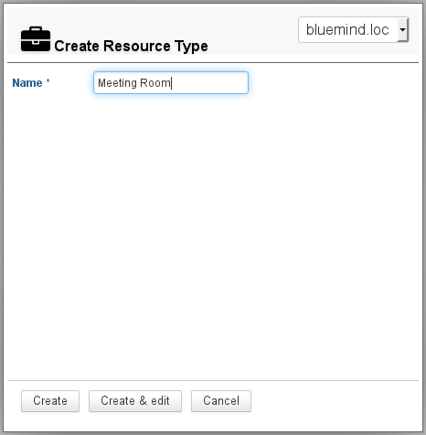
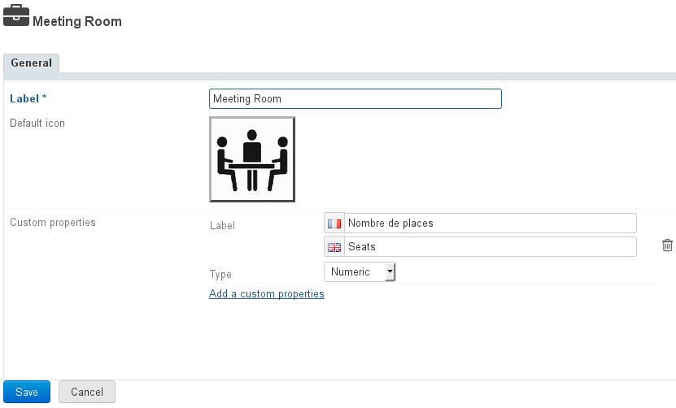
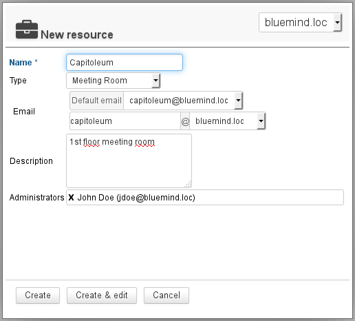
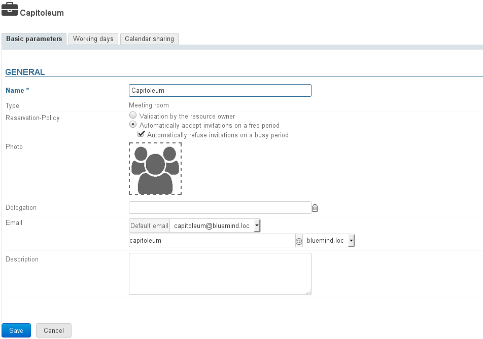
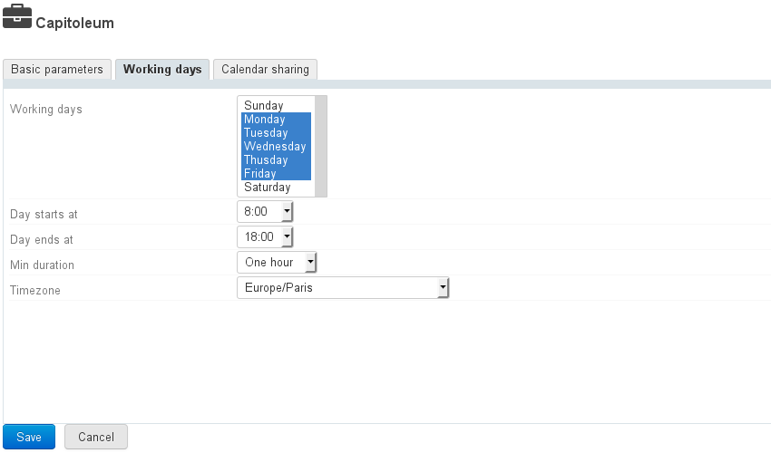
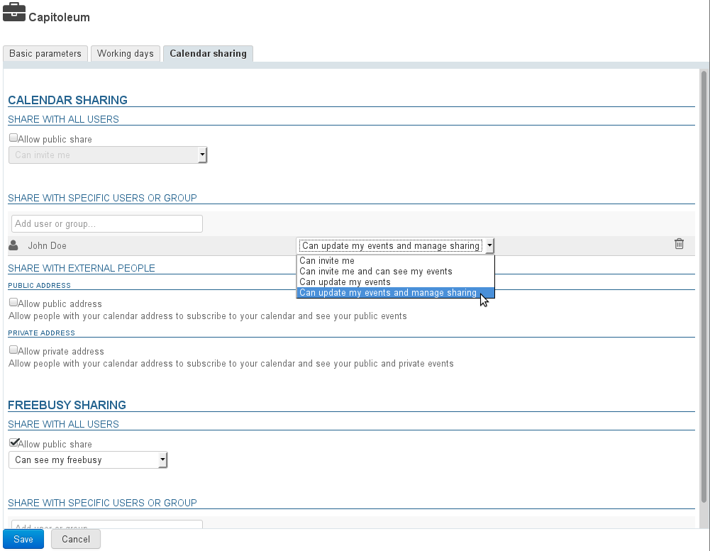

# Resources

## Introduction

BlueMind allows you to manage calendars for resources (vehicles, rooms, video-projectors, etc.) the same way you would manage user or group calendars.

You can define new types of resources and delegate their management to users. The free/busy feature allows you to search resource availability like in user calendars.

## Managing resource types

In the admin console, go to Directories > Resource types to view and manage the types of resources available.

 À partir de BlueMind 4.1, il est possible de définir des patrons de description d'événements. Lors de l'invitation d'une ressource de ce type à un événement, le patron sera automatiquement inséré dans la description de l'événement. Ces patrons peuvent contenir des variables et être définis dans plusieurs langues afin de s'adapter à la langue de l'organisateur de la réunion.

### Creating a new resource type

To add a new resource type, click the "New" button and fill in the information:

Next click "Create" to quickly create a resource type or "Create & edit" to create a resource type and access further customization options (see "Editing a resource type").

### Editing a resource type

To edit a resource type, click it in the list of available types.

The resource editing window enables you to change the label, add a default icon and edit or add custom properties.

## Managing resources

### Creating a resource

In the Directory Browser, click "New" > "Resource" and fill in the information for the resource you want to create:

- Only the name and email address are requiredNote: the address is completed automatically when a name is typed. Before you confirm, make sure it doesn't contain any special characters (uppercase, accents...)
- The managers assigned are given sharing privileges "Can edit my events and manage my shares".This can be changed later on and other managers can be assigned. See the next chapter "[Sharing a resource](#Administrationdesressources-partage-ressource)".

Next click "Create" to quickly create a resource or "Create & edit" to create a resource and access further customization options (see "[Editing a resource](/Guide_de_l_administrateur/Gestion_des_entites/Ressources/)").

### Editing a resource

To edit a resource, click its name in the list of available resources.

#### General

##### Properties

The resource editing window enables you to change the parameters set on creation and add custom fields (capacity, description, etc.):

:::tip

To add or change a resource's picture (avatar), click the blank picture box or the existing photo.

:::

##### Booking policy

Administrators can choose to allow or prevent multiple bookings (overbooking) for a resource:

- **Validation by the resource owner**: the resource's participation status remains "pending" until the manager accepts or rejects the invitation.This is how BlueMind used to work, and it still applies for old resources and resources migrated from BlueMind 3.0 during the version update.
- **Automatically accept**: the resource manager receives booking requests and participation is confirmed automatically if the resource is available for the requested timeslot (within working hours and no other booking confirmed)
**This is how bookings now work for newly-created resources.**

    - **Automatically reject**: the resource manager receives booking requests and participation is rejected automatically if the resource is not available for the requested timeslot.**This option cannot be dissociated from automatically accepting.** This allows managers to accept bookings automatically when the resource is available while choosing what to do when it is not (to organize a meeting out of working hours, to prioritize a more important request that comes in later, etc.)

:::info

Automatic booking can only be applied to one-off events. Recurring events are always subject to a manager's confirmation.

:::

:::tip

Note that only administrators have access to these settings, resource managers continue to be users who have been given the right to edit a resource calendar (accept/reject/edit events).

:::

#### Available hours

The new "Working days" tab allows you to set resource availability days and times, as well as the minimum duration they can be booked for (1hr, 2hrs, half-day, day) and time zone:

:::info

These settings are for information purposes only and will not stop users making reservations outside available hours or for a shorter period.

:::

#### Sharing a resource

By default, public share privileges for resources are set to "can book this resource and see its bookings": all domain users can see the calendar and request access to this resource by adding it to an event.

To change public share rights level and/or grant additional rights (to the resource administrator or specific users, for example), click the "Calendar sharing" tab:

Possible rights are:

- **Can book the resource**: users can make resource booking requests
- **Can book this resource and see its bookings**: in addition to the right above, users can see the resource calendar and its availability
- **Can edit its bookings**: users become resource managers, they receive booking request messages, they can accept, reject or edit the event the resource is invited to. They can also write into the resource calendar to create events.
- **Can edit its bookings and manage sharing**: in addition to the right above, users can access the resource's sharing options and edit the corresponding rights

This tab also allows you to share the calendar externally and manage its availability (freebusy).

For more information on sharing, go to [Managing shares](https://forge.bluemind.net/confluence/display/LATEST/Gestion+des+partages).

## Using a resource

To connect a resource to an event, simply add it to the list of participants (as you would a user) when creating an event.

Once the event is created, the resource's managers (those with calendar modification privileges) can accept or reject the invitation request through their calendar or the invitation message itself (provided a request was sent).

To find out more about using resources, see the user's guide page on [Resources](/Guide_de_l_utilisateur/Les_ressources/).

