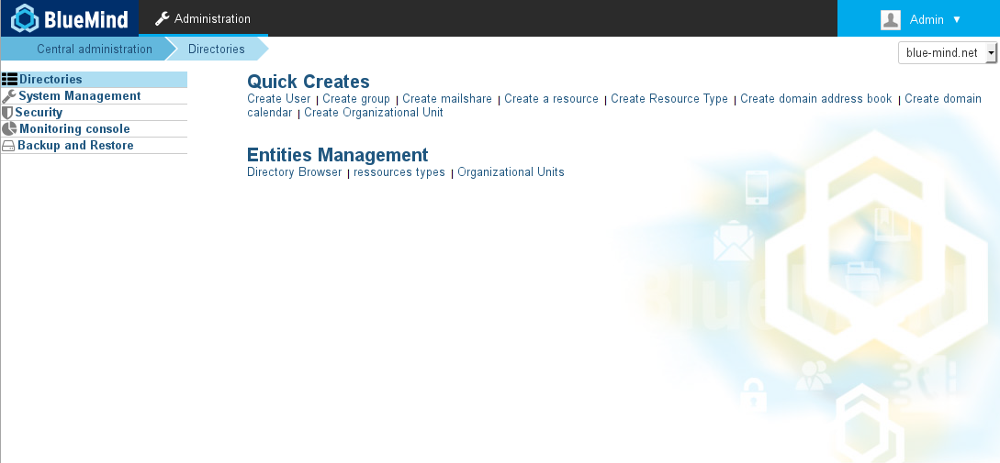

# Entities

- [Directory Browser](/Guide_de_l_administrateur/Gestion_des_entites/Entrées_d_annuaire/)
- [Users](/Guide_de_l_administrateur/Gestion_des_entites/Utilisateurs/)
- [Groups](/Guide_de_l_administrateur/Gestion_des_entites/Groupes/)
- [Shared mailboxes administration](/Guide_de_l_administrateur/Gestion_des_entites/Boites_aux_lettres_partagées/)
- [Resources administration](/Guide_de_l_administrateur/Gestion_des_entites/Ressources/)
- [Domain Calendars](/Guide_de_l_administrateur/Gestion_des_entites/Calendriers_de_domaines/)
- [Domain Address Books](/Guide_de_l_administrateur/Gestion_des_entites/Carnets_d_adresses_de_domaines/)
- [Active Directory Synchronization](/Guide_de_l_administrateur/Gestion_des_entites/Synchronisation_Active_Directory/)
- [LDAP Synchronization](/Guide_de_l_administrateur/Gestion_des_entites/Synchronisation_LDAP/)
- [LDAP Exports](/Guide_de_l_administrateur/Gestion_des_entites/Export_LDAP/)

Enregistrer

