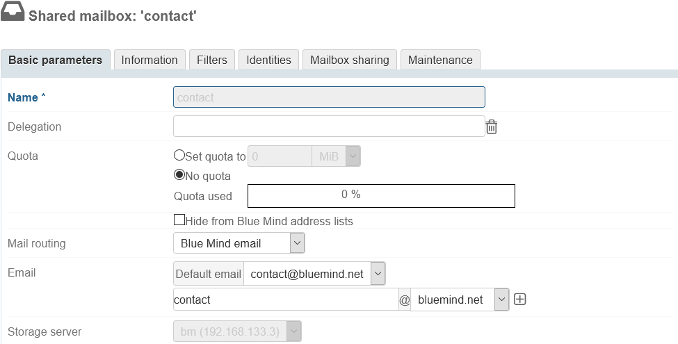
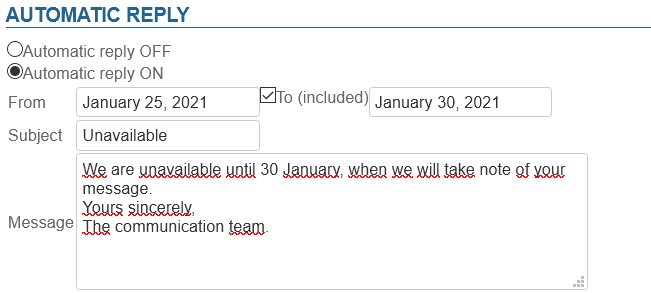
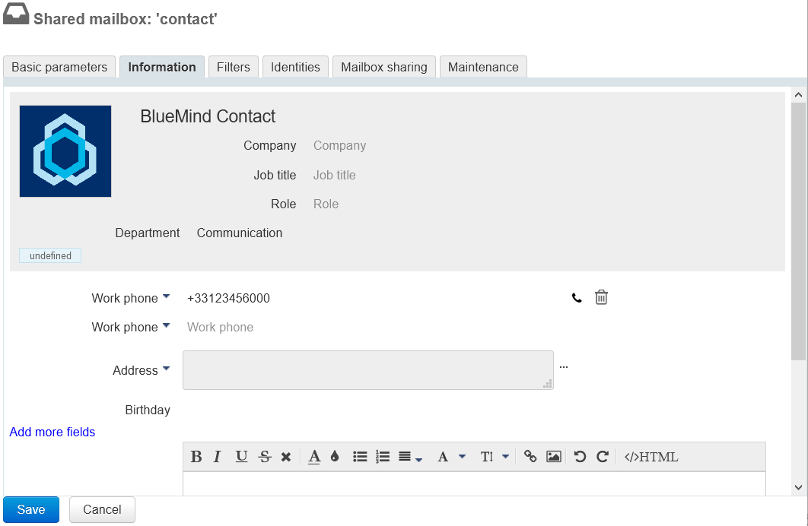
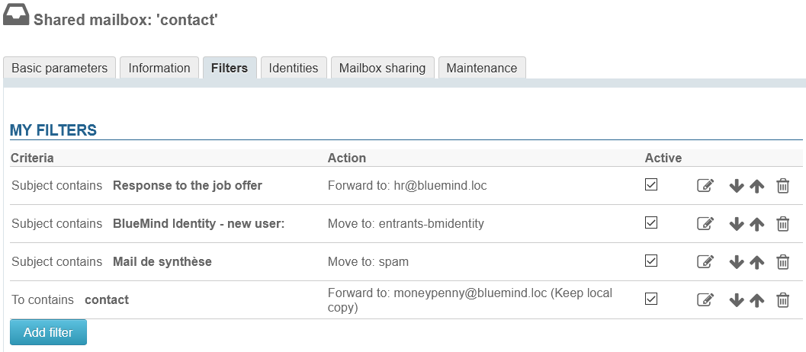
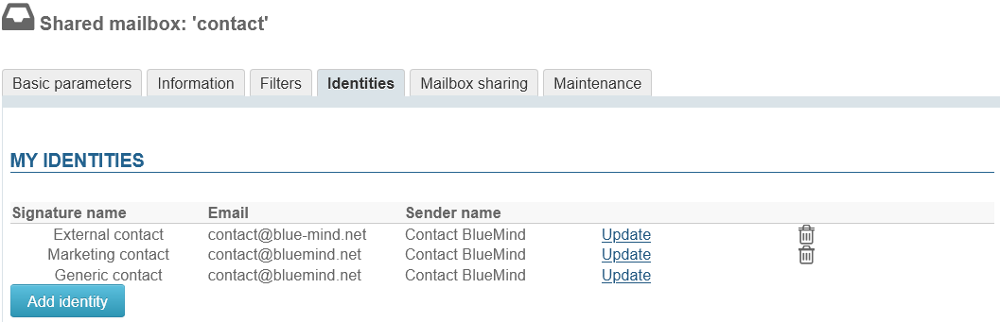
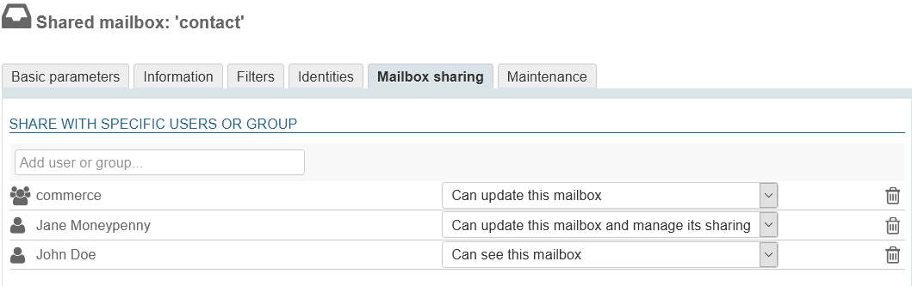
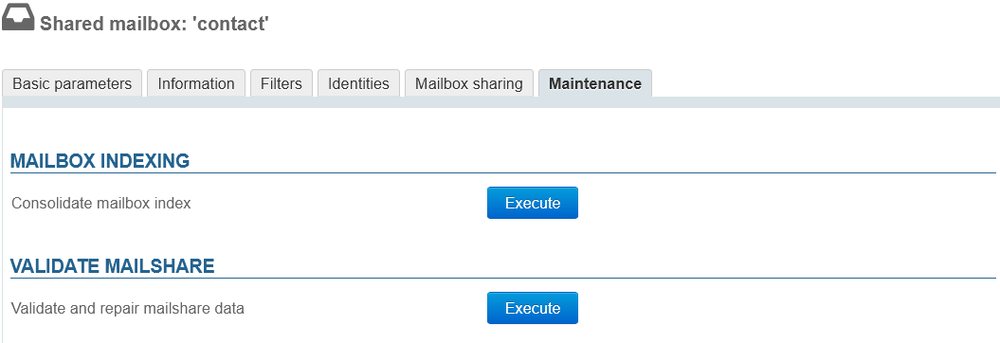

# Shared mailboxes

## Introduction

Shared mailboxes, also called "service mailboxes" or "functional mailboxes" are non-user-specific mailboxes: users are connected to them and share the messages they contain.
Users have access to the mailbox and are able to use it depending on their privilege levels:

- **read:** users can read messages;
- **write**: users can modify (add, delete, move, etc.) messages and write on behalf of the shared mailbox;
- **manage**: in addition to being able to modify messages, users are able to manage the mailbox's permissions.

Users can access shared mailboxes through their email client's folder structure (by default: "Shared folders").

*For more information, please see our user's guide page [Les boites aux lettres partagées](/Guide_de_l_utilisateur/La_messagerie/Les_boites_aux_lettres_partagées/) *

### Creating shared mailboxes

- In the "Directories" page, click "Create a shared mailbox"
- Enter a name for the mailbox, a description (optional) and an email address.

:::info

WARNING
The name you enter cannot be modified later.
:::

:::info
A shared mailbox does not have to have an email address. In that case, users are able to use it (by moving or copying messages to it, for example) but it cannot be used to send or receive mail.
:::

- As for any user or group, you can choose to have a mailbox shown in the directory. To do this, check the box "Hide from BlueMind address lists".

- Click "Create" (or press &lt;Enter>) to confirm, or "Create and edit" (&lt;Ctrl-Enter>) to create a mailbox and open the mailbox's management page.

## Managing shared mailboxes

### General

#### Mailbox

This tab houses basic settings and the auto-reply feature.

- **Name**: shared mailboxes are named when they are created. The name cannot be changed 
- **Delegation**: [organizational unit](/Guide_de_l_administrateur/Gestion_des_entités/Utilisateurs/L_administration_déléguée/) the mailbox belongs to
- **Quota**: maximum mailbox size
- **Mail routing**: type of email system or absence thereof
- **Email address**: the shared mailbox can have as many email aliases as desired on one, the other, or all available domain names.
- **Storage server**: [the server that handles the mailbox](/Guide_d_installation/Installation/Installation_avec_répartition_des_données_sur_plusieurs_serveurs/)

#### Auto-reply

Similarly as for user mailboxes, when auto-reply is enabled and for the set period of time, an email will be automatically sent to the sender when the mailbox receives a message.

- Start and end dates are not required:
    - if no start date is specified, auto-reply is enabled as soon as the new settings are saved
    - if no end date is specified, auto-reply remains enabled until the user edits the settings and selects "Automatic reply OFF"
- When the user clicks the data entry area, a calendar opens to help them choose a date
- The subject field is optional: if this field is left empty, the message is sent with an empty subject field
- Message content is required – it will be shown in the body of the email sent.

:::info

Auto-reply frequency

Just one away message is sent to reply to every single sender (email address) for a 3-day period.

If the user disables and then enables auto-reply again during that time without editing the subject or the message content, the senders who have already received an auto-reply will not receive a new one – the countdown for the period starts again where it was left off.

:::

### Information

This tab shows the information that will be displayed in the shared mailbox directory pages.

Similarly as for users, this form can be used to enter information such as telephone numbers, postal addresses or images (avatars) which will be used throughout the application (e.g. in [contacts](https://forge.bluemind.net/confluence/display/DA/.Les+contacts+vBM-4.0) or the [dialer](https://forge.bluemind.net/confluence/display/DA/.La+telephonie+vBM-4.0)).

:::info

Contact details belong to the BlueMind internal directory and can be accessed by all users of the solution. This is why **only the administrator is able to edit this information** – users, even with full share privileges on the mailbox, are not able to edit them.

:::

### Filters

This tab is used to create and organize rules for incoming mail.

Mailbox filters work the same way as user filters. For more details, please refer to our documentation page on: [Message Filters](/Guide_de_l_utilisateur/La_messagerie/Les_filtres_de_messages/)

### Identities

This tab is used to define identities which can be retrieved by users with writing privileges on the mailbox: when a user chooses one of these identities, the name, label and signature are retrieved. That way users don't have to enter the information again, which prevents errors and enables users to share a signature for a mailbox, which makes it consistent and transparent for recipients.

For more details, please refer to our User's Guide page: [Identities](/Guide_de_l_utilisateur/La_messagerie/Les_identités/)

### Shares

This tab is used to manage options for sharing mailboxes with users.

[See [User's Guide > Mail > Shared Mailboxes §3. Managing Shares](/Guide_de_l_utilisateur/La_messagerie/Les_boites_aux_lettres_partagées/)]

### Maintenance

 Version 4.4 adds the same maintenance features for shared mailboxes as for users.

- **Consolidate mailbox index**: completes the current indexing system by indexing missing items only
- **Validate and repair mailshare data**: set of verification and correction operations that repair the integrity of the mailbox and its data in the BlueMind system: verifies the mailbox in Cyrus, IMAP folder hierarchy, mail filters, etc.

